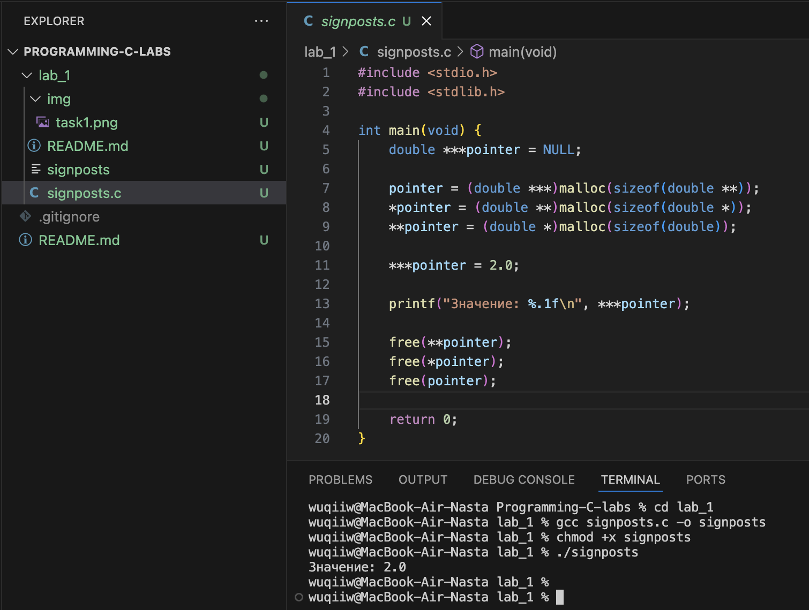
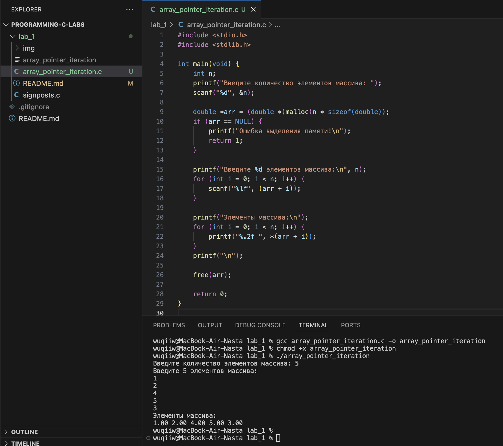
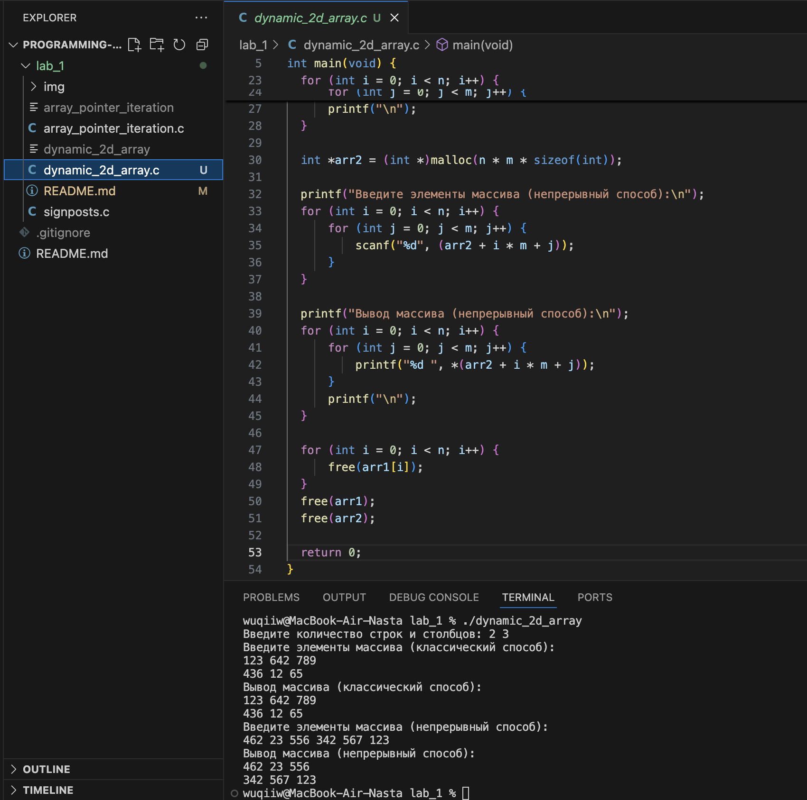
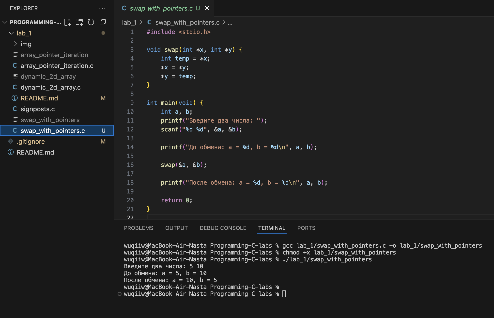
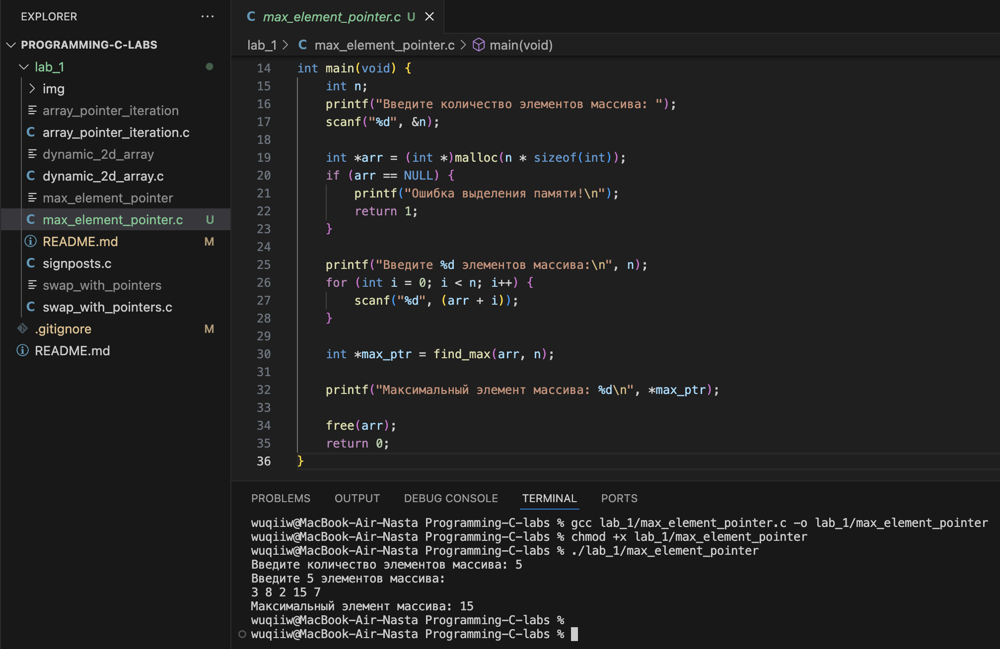
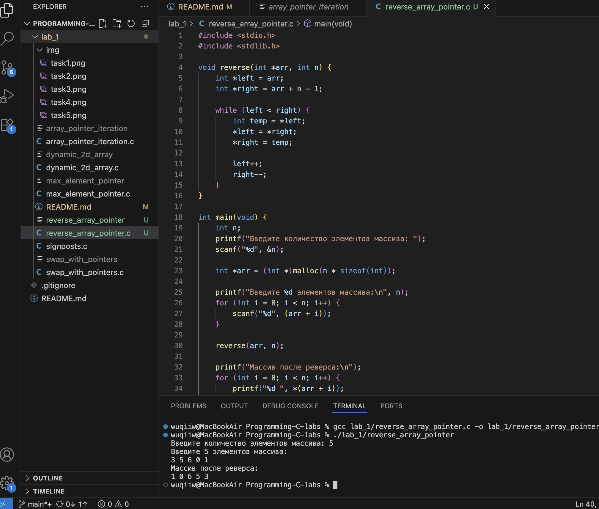
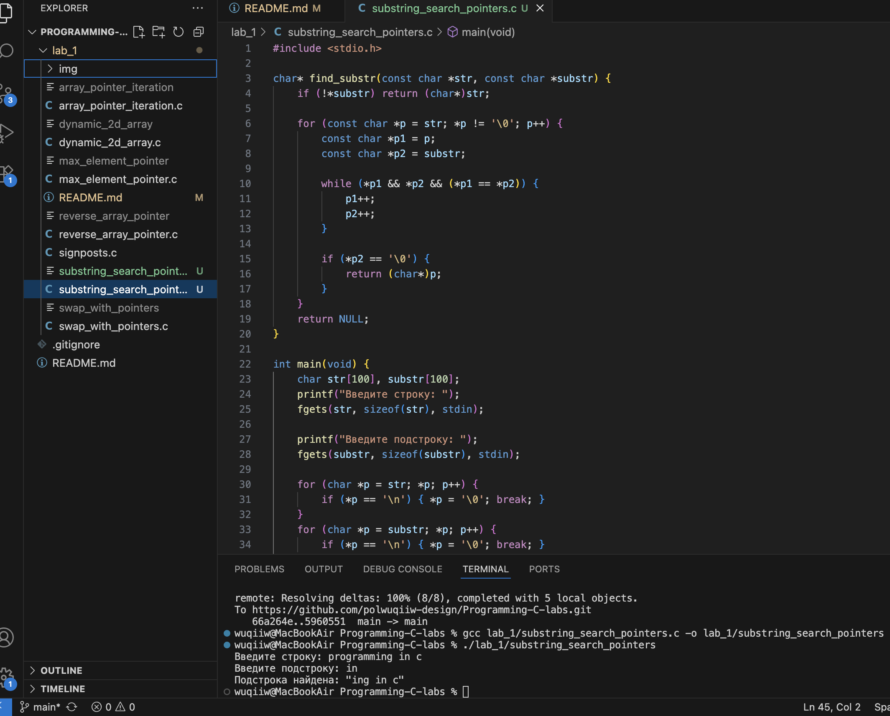
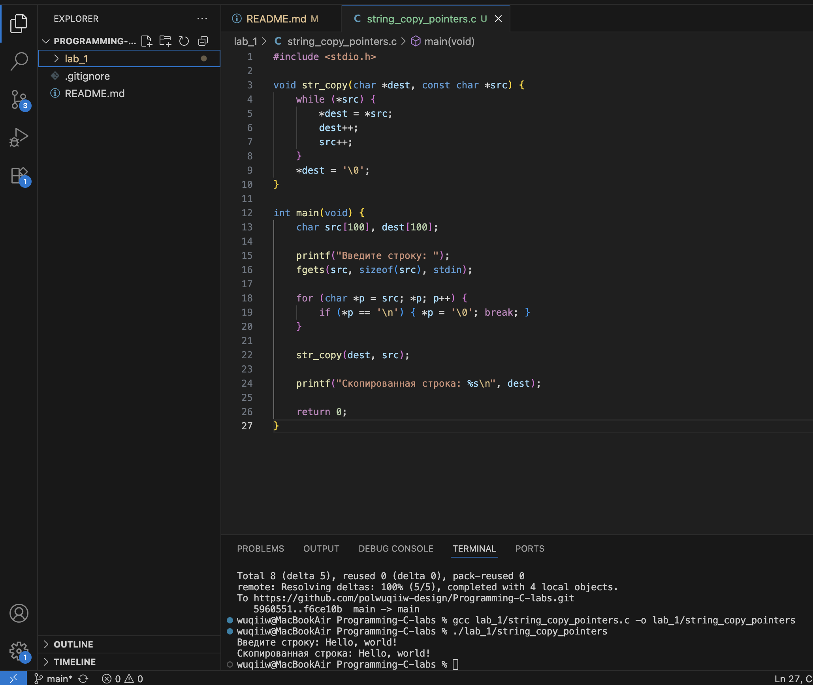
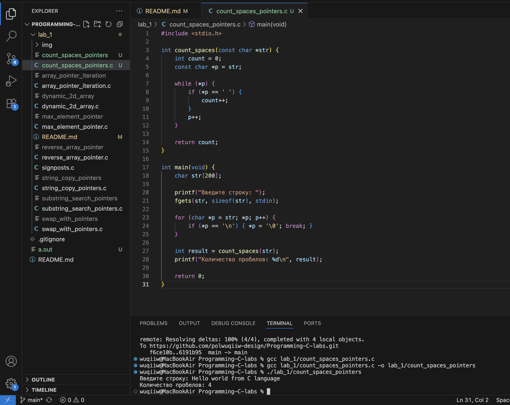
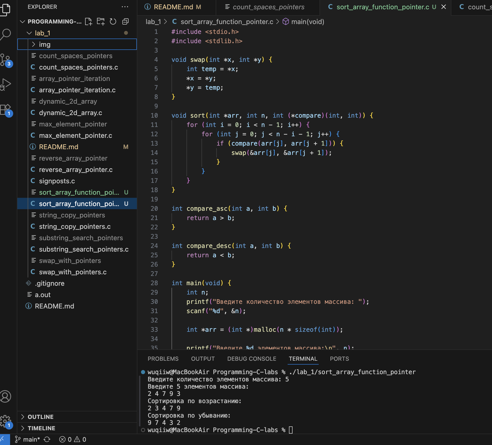

# Тема: Указатели  
## Задача 1 – упражнения с malloc и сложными однострочными выражениями в C с присваиваниями внутри  

### Постановка задачи  
Внутри функции int main(void) { /*...*/ } определите указатель:
double ***pointer = NULL;
Инициализируйте этот указатель адресом другого указателя типа double **, который указывает, в свою очередь, на
переменную double. Используйте pointer для записи и чтения в эту переменную значения 2.
При этом выполните следующее: - Используйте функции типа *alloc(...) для выделения оперативной памяти под
динамические объекты; - Запишите и выведите число 2 на экран, используя указатель double ***pointer = NULL;;
- Используйте функцию free(...) для освобождения оперативной памяти, выделенной под динамические объекты.
- Не используйте никаких идентификаторов переменных, кроме pointer.

---

### Математическая модель  
- Трёхуровневая система указателей:  
  - `pointer` → `double**` → `double*` → `double`.  
- В памяти хранится значение `2.0`.  
- Доступ к переменной и её модификация выполняется исключительно через `pointer`.  

---

### Список идентификаторов  

| Имя переменной | Тип данных  | Описание |
|----------------|-------------|----------|
| pointer        | double***   | Указатель на указатель на указатель на double |

### Код программы  

```c
#include <stdio.h>
#include <stdlib.h>

int main(void) {
    double ***pointer = NULL;

    pointer = (double ***)malloc(sizeof(double **));
    *pointer = (double **)malloc(sizeof(double *));
    **pointer = (double *)malloc(sizeof(double));

    ***pointer = 2.0;

    printf("Значение: %.1f\n", ***pointer);

    free(**pointer);
    free(*pointer);
    free(pointer);

    return 0;
}
```

### Результаты работы программы   

---

## Задача 2 - итерация массива с помощью арифметики указателей

### Постановка задачи
Напишите программу, которая создает одномерный динамический массив из чисел с плавающей точкой двойной точности, заполняет его значениями с клавиатуры и выводит все элементы массива, используя арифметику указателей
(оператор +), а не оператор доступа к элементам массива [].

### Математическая модель  
- Создаётся одномерный динамический массив элементов типа `double`.  
- Доступ к элементам массива осуществляется через арифметику указателей:  
  - `(arr + i)` — адрес элемента,  
  - `*(arr + i)` — значение элемента.  
- Таким образом, обход массива происходит без использования синтаксиса `arr[i]`.  

### Список идентификаторов  

| Имя переменной | Тип данных | Описание |
|----------------|------------|----------|
| arr            | double*    | Указатель на первый элемент динамического массива |
| n              | int        | Количество элементов массива |
| i              | int        | Счётчик цикла |

### Код программы  

```c
#include <stdio.h>
#include <stdlib.h>

int main(void) {
    int n;
    printf("Введите количество элементов массива: ");
    scanf("%d", &n);

    double *arr = (double *)malloc(n * sizeof(double));
    if (arr == NULL) {
        printf("Ошибка выделения памяти!\n");
        return 1;
    }

    printf("Введите %d элементов массива:\n", n);
    for (int i = 0; i < n; i++) {
        scanf("%lf", (arr + i));
    }

    printf("Элементы массива:\n");
    for (int i = 0; i < n; i++) {
        printf("%.2f ", *(arr + i));
    }
    printf("\n");

    free(arr);

    return 0;
}
```

### Результаты работы программы

---

## Задача 3 - динамический 2D массив

### Постановка задачи 
Выделите память под двумерный динамический массив двумя способами:
1. Классический способ: выделите память для массива указателей на строки и отдельно для каждой строки в
цикле. Это позволит гибко управлять памятью, но при этом каждая строка будет находиться в отдельной части
памяти.
2. Непрерывный способ (contiguous memory allocation): выделите память для всего массива одним вызовом
malloc, что позволит разместить весь массив в непрерывном блоке памяти, улучшая производительность и
снижая риск внешней фрагментации памяти.
После выполнения программы обязательно корректно освободите всю выделенную оперативную память с помощью
free().
Оба метода имеют свои преимущества и недостатки. При непрерывном выделении (contiguous allocation) вся память
выделяется в одном блоке, что уменьшает вероятность фрагментации, но может усложнить управление при необходимости изменения размеров массива.

### Математическая модель  
- Массив имеет форму `n x m`.  
- В классическом подходе создаётся массив указателей на строки (`int**`), каждая строка выделяется отдельно.  
- В непрерывном подходе создаётся один блок памяти размером `n*m`, а доступ к элементу осуществляется по формуле: arr[i][j] ↔ *(arr + i * m + j)

### Список идентификаторов  
| Имя переменной | Тип данных | Описание |
|----------------|------------|----------|
| n              | int        | Количество строк |
| m              | int        | Количество столбцов |
| arr1           | int**      | Двумерный массив (классический способ) |
| arr2           | int*       | Двумерный массив (непрерывный способ) |
| i, j           | int        | Счётчики циклов |


### Код программы  

```c
#include <stdio.h>
#include <stdlib.h>

int main(void) {
  int n, m;
  printf("Введите количество строк и столбцов: ");
  scanf("%d %d", &n, &m);

  int **arr1 = (int **)malloc(n * sizeof(int *));
  for (int i = 0; i < n; i++) {
      arr1[i] = (int *)malloc(m * sizeof(int));
  }

  printf("Введите элементы массива (классический способ):\n");
  for (int i = 0; i < n; i++) {
      for (int j = 0; j < m; j++) {
          scanf("%d", &arr1[i][j]);
      }
  }

  printf("Вывод массива (классический способ):\n");
  for (int i = 0; i < n; i++) {
      for (int j = 0; j < m; j++) {
          printf("%d ", arr1[i][j]);
      }
      printf("\n");
  }

  int *arr2 = (int *)malloc(n * m * sizeof(int));

  printf("Введите элементы массива (непрерывный способ):\n");
  for (int i = 0; i < n; i++) {
      for (int j = 0; j < m; j++) {
          scanf("%d", (arr2 + i * m + j));
      }
  }

  printf("Вывод массива (непрерывный способ):\n");
  for (int i = 0; i < n; i++) {
      for (int j = 0; j < m; j++) {
          printf("%d ", *(arr2 + i * m + j));
      }
      printf("\n");
  }

  for (int i = 0; i < n; i++) {
      free(arr1[i]);
  }
  free(arr1);
  free(arr2);

  return 0;
}
```

### Результаты работы программы

---

## Задача 4 - поменять местами два числа через указатели

### Постановка задачи 
Написать программу, которая использует функцию для обмена значениями двух переменных через указатели

### Математическая модель 
- Имеются две переменные `a` и `b`.  
- Через функцию `swap(int *x, int *y)` выполняется обмен значениями:  
  - временно сохраняем значение `*x` в переменную `temp`,  
  - присваиваем `*x = *y`,  
  - присваиваем `*y = temp`.  
- Таким образом, значения переменных меняются местами без прямого использования их имён в теле программы.  

### Список идентификаторов  

| Имя переменной | Тип данных | Описание |
|----------------|------------|----------|
| a              | int        | Первая переменная |
| b              | int        | Вторая переменная |
| temp           | int        | Временное хранилище при обмене |
| swap           | функция    | Функция для обмена значениями через указатели |

### Код программы  

```c
#include <stdio.h>

void swap(int *x, int *y) {
    int temp = *x;
    *x = *y;
    *y = temp;
}

int main(void) {
    int a, b;
    printf("Введите два числа: ");
    scanf("%d %d", &a, &b);

    printf("До обмена: a = %d, b = %d\n", a, b);

    swap(&a, &b);

    printf("После обмена: a = %d, b = %d\n", a, b);

    return 0;
}
```

### Результаты работы программы
 
---

## Задача 5 - поиск максимального элемента массива с помощью указателей

### Постановка задачи
Создать функцию, которая принимает массив целых чисел и его размер, а затем возвращает указатель на максимальный элемент массива.

### Математическая модель
- Задаётся массив `arr` размером `n`.  
- Используется указатель для обхода массива.  
- При сравнении элементов сохраняется адрес текущего максимального значения.  
- Функция возвращает указатель на элемент с максимальным значением.  

### Список идентификаторов  

| Имя переменной | Тип данных | Описание |
|----------------|------------|----------|
| arr            | int*       | Указатель на массив целых чисел |
| n              | int        | Размер массива |
| max_ptr        | int*       | Указатель на текущий максимальный элемент |
| i              | int        | Счётчик цикла |
| find_max       | функция    | Функция поиска максимального элемента массива |

### Код программы  

```c
#include <stdio.h>
#include <stdlib.h>

int* find_max(int *arr, int n) {
    int *max_ptr = arr; 
    for (int i = 1; i < n; i++) {
        if (*(arr + i) > *max_ptr) {
            max_ptr = arr + i;
        }
    }
    return max_ptr;
}

int main(void) {
    int n;
    printf("Введите количество элементов массива: ");
    scanf("%d", &n);

    int *arr = (int *)malloc(n * sizeof(int));

    printf("Введите %d элементов массива:\n", n);
    for (int i = 0; i < n; i++) {
        scanf("%d", (arr + i));
    }

    int *max_ptr = find_max(arr, n);

    printf("Максимальный элемент массива: %d\n", *max_ptr);

    free(arr);
    return 0;
}
```

### Результаты работы программы
 
---

## Задача 6 – реверс массива через указатели  

### Постановка задачи  
Реализовать функцию, которая переворачивает массив целых чисел, используя указатели для перемещения по элементам.  

### Математическая модель  
- Имеется массив `arr` длиной `n`.  
- Используются два указателя:  
  - `left` — указывает на первый элемент,  
  - `right` — указывает на последний элемент.  
- Меняем значения, на которые указывают `left` и `right`, затем сдвигаем указатели навстречу друг другу.  
- Алгоритм завершается, когда `left >= right`.  

### Список идентификаторов  

| Имя переменной | Тип данных | Описание |
|----------------|------------|----------|
| arr            | int*       | Указатель на массив |
| n              | int        | Размер массива |
| left, right    | int*       | Указатели на левый и правый элемент |
| temp           | int        | Временное хранилище для обмена |
| reverse        | функция    | Функция реверса массива |

### Код программы  

```c
#include <stdio.h>
#include <stdlib.h>

void reverse(int *arr, int n) {
    int *left = arr;
    int *right = arr + n - 1;

    while (left < right) {
        int temp = *left;
        *left = *right;
        *right = temp;

        left++;
        right--;
    }
}

int main(void) {
    int n;
    printf("Введите количество элементов массива: ");
    scanf("%d", &n);

    int *arr = (int *)malloc(n * sizeof(int));

    printf("Введите %d элементов массива:\n", n);
    for (int i = 0; i < n; i++) {
        scanf("%d", (arr + i));
    }

    reverse(arr, n);

    printf("Массив после реверса:\n");
    for (int i = 0; i < n; i++) {
        printf("%d ", *(arr + i));
    }
    printf("\n");

    free(arr);
    return 0;
}
```

### Результаты работы программы
 
--- 

## Задача 7 – поиск подстроки в строке через указатели  

### Постановка задачи  
Реализовать функцию, которая находит первое вхождение одной строки в другую, используя указатели вместо индексов для доступа к символам строки.  

### Математическая модель  
- Даны две строки:  
  - `str` — исходная строка,  
  - `substr` — подстрока.  
- Для поиска используется перебор:  
  - выбираем позицию в `str`,  
  - проверяем совпадение символов с `substr` с помощью указателей.  
- Если найдено совпадение — возвращается указатель на начало подстроки в строке.  
- Если совпадения нет — возвращается `NULL`.  

### Список идентификаторов  

| Имя переменной | Тип данных | Описание |
|----------------|------------|----------|
| str            | char*      | Указатель на исходную строку |
| substr         | char*      | Указатель на подстроку |
| p1, p2         | char*      | Указатели для обхода строки и подстроки |
| find_substr    | функция    | Функция поиска подстроки в строке |

### Код программы  

```c
#include <stdio.h>

char* find_substr(const char *str, const char *substr) {
    if (!*substr) return (char*)str; 

    for (const char *p = str; *p != '\0'; p++) {
        const char *p1 = p;
        const char *p2 = substr;

        while (*p1 && *p2 && (*p1 == *p2)) {
            p1++;
            p2++;
        }

        if (*p2 == '\0') {
            return (char*)p; 
        }
    }
    return NULL;
}

int main(void) {
    char str[100], substr[100];
    printf("Введите строку: ");
    fgets(str, sizeof(str), stdin);

    printf("Введите подстроку: ");
    fgets(substr, sizeof(substr), stdin);

    for (char *p = str; *p; p++) {
        if (*p == '\n') { *p = '\0'; break; }
    }
    for (char *p = substr; *p; p++) {
        if (*p == '\n') { *p = '\0'; break; }
    }

    char *res = find_substr(str, substr);
    if (res) {
        printf("Подстрока найдена: \"%s\"\n", res);
    } else {
        printf("Подстрока не найдена.\n");
    }

    return 0;
}
```

### Результаты работы программы
 
---
### Задача 8 – копирование строки через указатели  

#### Постановка задачи  
Написать функцию, которая копирует одну строку в другую, используя указатели вместо встроенной функции `strcpy`.  

### Математическая модель  
- Даны две строки:  
  - `src` — исходная строка,  
  - `dest` — строка-приёмник.  
- Используется указатель для последовательного обхода символов `src`.  
- Копирование выполняется до тех пор, пока не встретится завершающий символ `'\0'`.  
- В конце в `dest` записывается символ `'\0`.  

### Список идентификаторов  

| Имя переменной | Тип данных | Описание |
|----------------|------------|----------|
| src            | char*      | Указатель на исходную строку |
| dest           | char*      | Указатель на строку-приёмник |
| str_copy       | функция    | Функция для копирования строки через указатели |
| p1, p2         | char*      | Вспомогательные указатели для обхода строк |

### Код программы  

```c
#include <stdio.h>

void str_copy(char *dest, const char *src) {
    while (*src) {
        *dest = *src;
        dest++;
        src++;
    }
    *dest = '\0';
}

int main(void) {
    char src[100], dest[100];

    printf("Введите строку: ");
    fgets(src, sizeof(src), stdin);

    for (char *p = src; *p; p++) {
        if (*p == '\n') { *p = '\0'; break; }
    }

    str_copy(dest, src);

    printf("Скопированная строка: %s\n", dest);

    return 0;
}
``` 

### Результаты работы программы
 
---
### Задача 9 – подсчёт числа пробелов в строке  

### Постановка задачи  
Написать функцию, которая подсчитывает количество пробелов в строке, используя указатели для перемещения по символам строки.  

### Математическая модель  
- Задаётся строка `str`.  
- Указатель последовательно проходит по каждому символу.  
- Если текущий символ равен `' '`, счётчик увеличивается на 1.  
- В конце возвращается количество пробелов.  

### Список идентификаторов  

| Имя переменной | Тип данных | Описание |
|----------------|------------|----------|
| str            | char*      | Указатель на строку |
| count          | int        | Счётчик пробелов |
| p              | char*      | Указатель для обхода строки |
| count_spaces   | функция    | Функция подсчёта пробелов |

### Код программы  

```c
#include <stdio.h>

int count_spaces(const char *str) {
    int count = 0;
    const char *p = str;

    while (*p) {
        if (*p == ' ') {
            count++;
        }
        p++;
    }

    return count;
}

int main(void) {
    char str[200];

    printf("Введите строку: ");
    fgets(str, sizeof(str), stdin);

    for (char *p = str; *p; p++) {
        if (*p == '\n') { *p = '\0'; break; }
    }

    int result = count_spaces(str);
    printf("Количество пробелов: %d\n", result);

    return 0;
}
```

### Результаты работы программы
 
---
### Задача 10 – указатель на функцию: сортировка массива  

### Постановка задачи  
Реализовать функцию сортировки одномерного массива, которая принимает указатель на функцию сравнения. Эта функция сравнения должна определять порядок сортировки — по возрастанию или по убыванию.  
Внутри функции сортировки реализовать обмен элементов массива местами с помощью функции `swap`, которая работает через указатели.  

### Математическая модель  
- Используется массив `arr` длиной `n`.  
- Для сравнения элементов передаётся функция `compare(int a, int b)`, возвращающая истину при необходимости поменять местами элементы.  
- Функция сортировки перебирает элементы массива и вызывает `swap`, если порядок нарушен.  
- В результате массив сортируется либо по возрастанию, либо по убыванию.  

### Список идентификаторов  

| Имя переменной | Тип данных | Описание |
|----------------|------------|----------|
| arr            | int*       | Указатель на массив |
| n              | int        | Размер массива |
| i, j           | int        | Счётчики циклов |
| swap           | функция    | Меняет местами два значения через указатели |
| sort           | функция    | Сортирует массив с использованием указателя на функцию сравнения |
| compare        | функция    | Функция сравнения для определения порядка сортировки |
| compare_asc    | функция    | Сравнение по возрастанию |
| compare_desc   | функция    | Сравнение по убыванию |

### Код программы  

```c
#include <stdio.h>
#include <stdlib.h>

void swap(int *x, int *y) {
    int temp = *x;
    *x = *y;
    *y = temp;
}

void sort(int *arr, int n, int (*compare)(int, int)) {
    for (int i = 0; i < n - 1; i++) {
        for (int j = 0; j < n - i - 1; j++) {
            if (compare(arr[j], arr[j + 1])) {
                swap(&arr[j], &arr[j + 1]);
            }
        }
    }
}

int compare_asc(int a, int b) {
    return a > b;  
}

int compare_desc(int a, int b) {
    return a < b;  
}

int main(void) {
    int n;
    printf("Введите количество элементов массива: ");
    scanf("%d", &n);

    int *arr = (int *)malloc(n * sizeof(int));

    printf("Введите %d элементов массива:\n", n);
    for (int i = 0; i < n; i++) {
        scanf("%d", &arr[i]);
    }

    printf("Сортировка по возрастанию:\n");
    sort(arr, n, compare_asc);
    for (int i = 0; i < n; i++) {
        printf("%d ", arr[i]);
    }
    printf("\n");

    printf("Сортировка по убыванию:\n");
    sort(arr, n, compare_desc);
    for (int i = 0; i < n; i++) {
        printf("%d ", arr[i]);
    }
    printf("\n");

    free(arr);
    return 0;
}
```
### Результаты работы программы 

---
### Информация о студенте  
Полторацкая Анастасия, 1 курс, группа `1об_ПОО/25`
