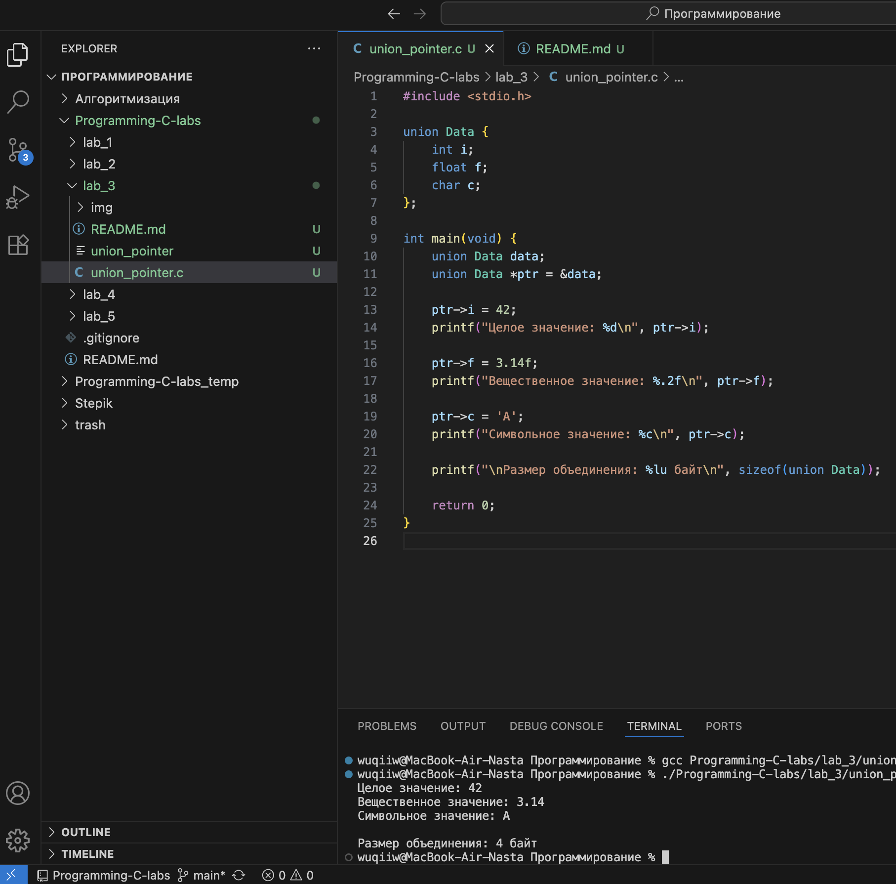
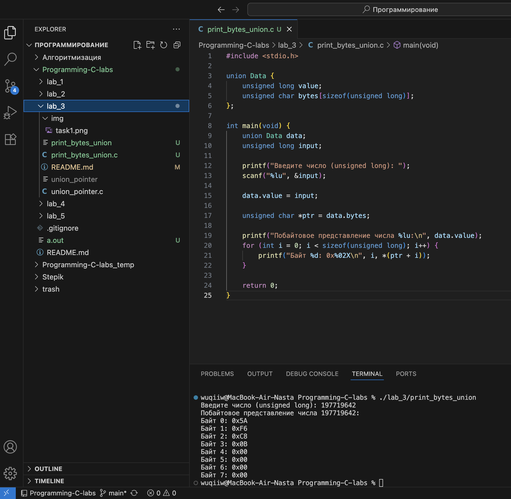
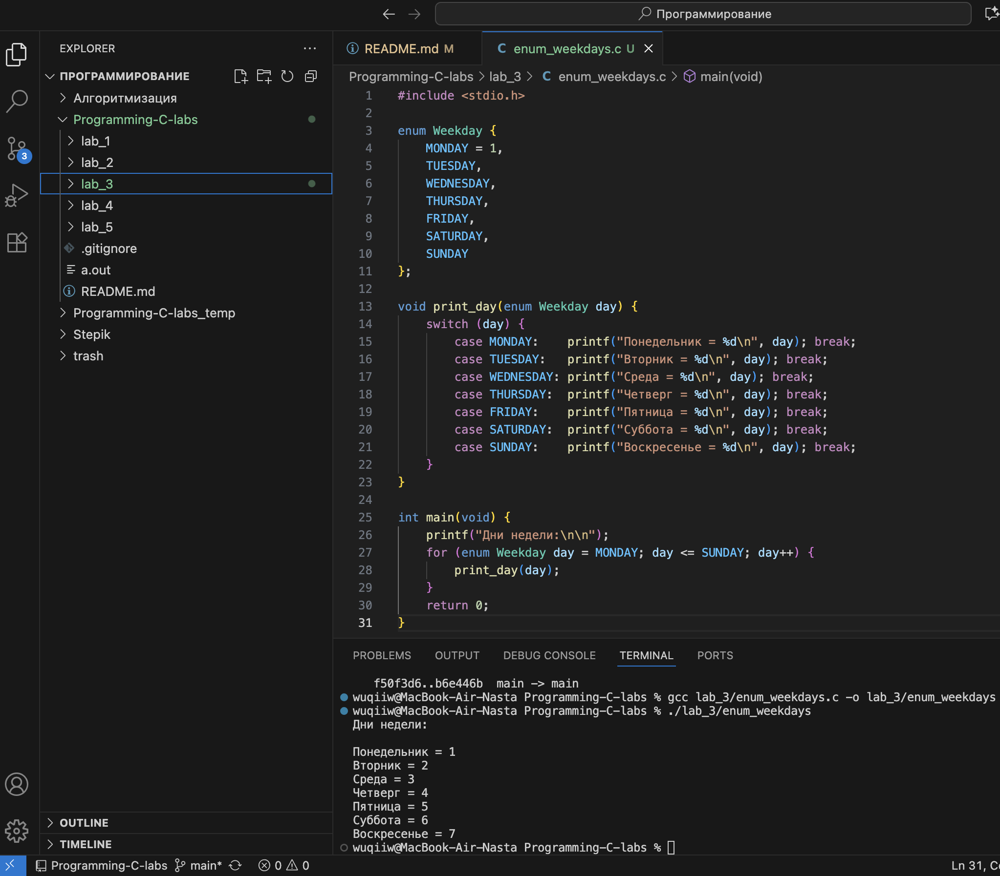
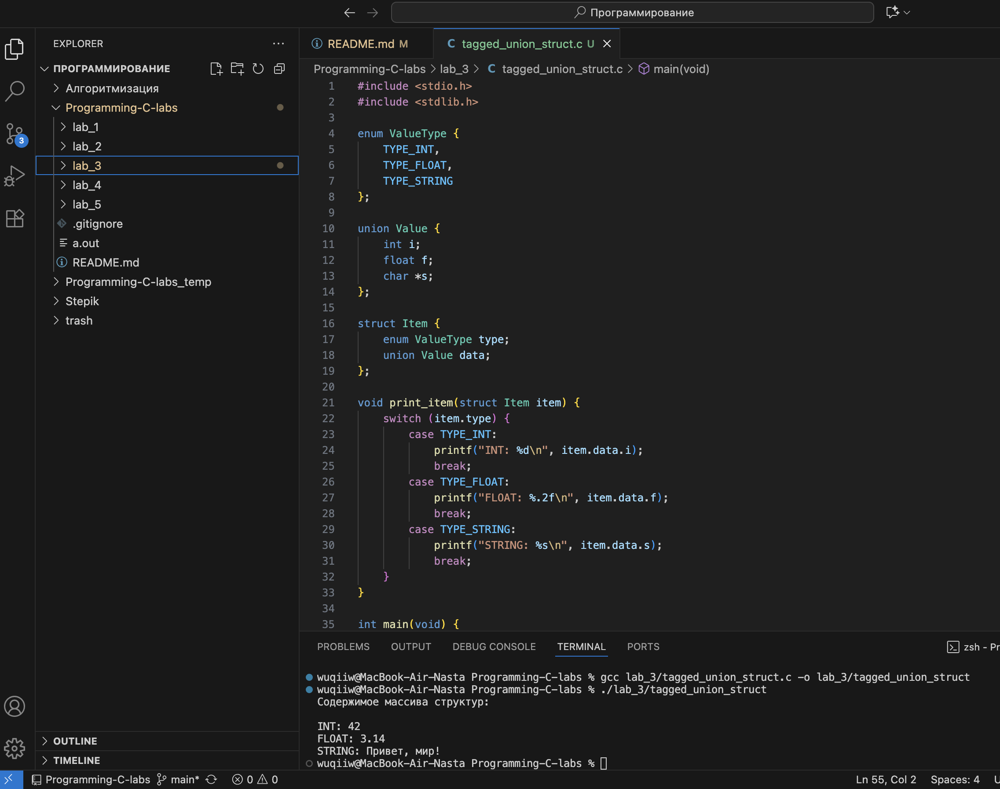
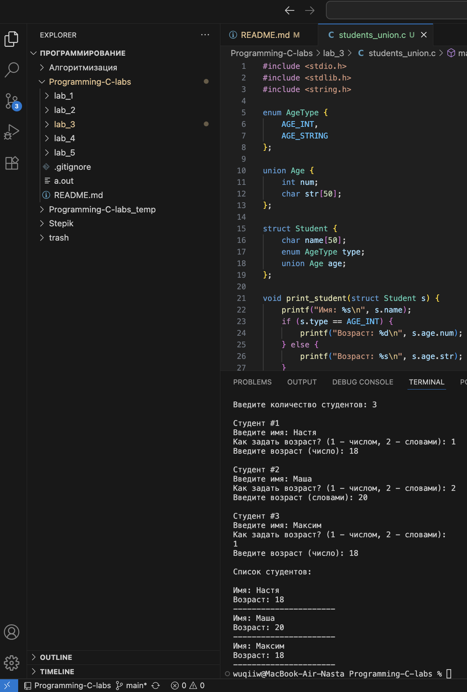
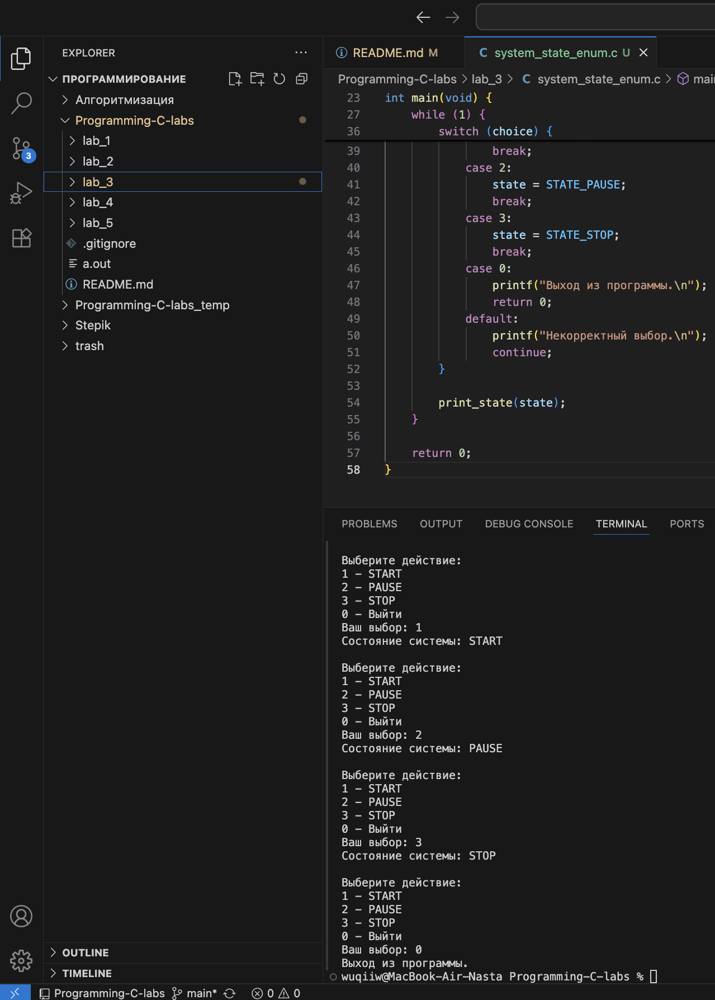
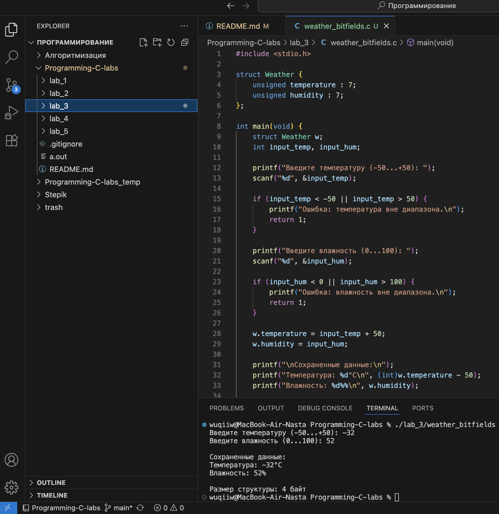
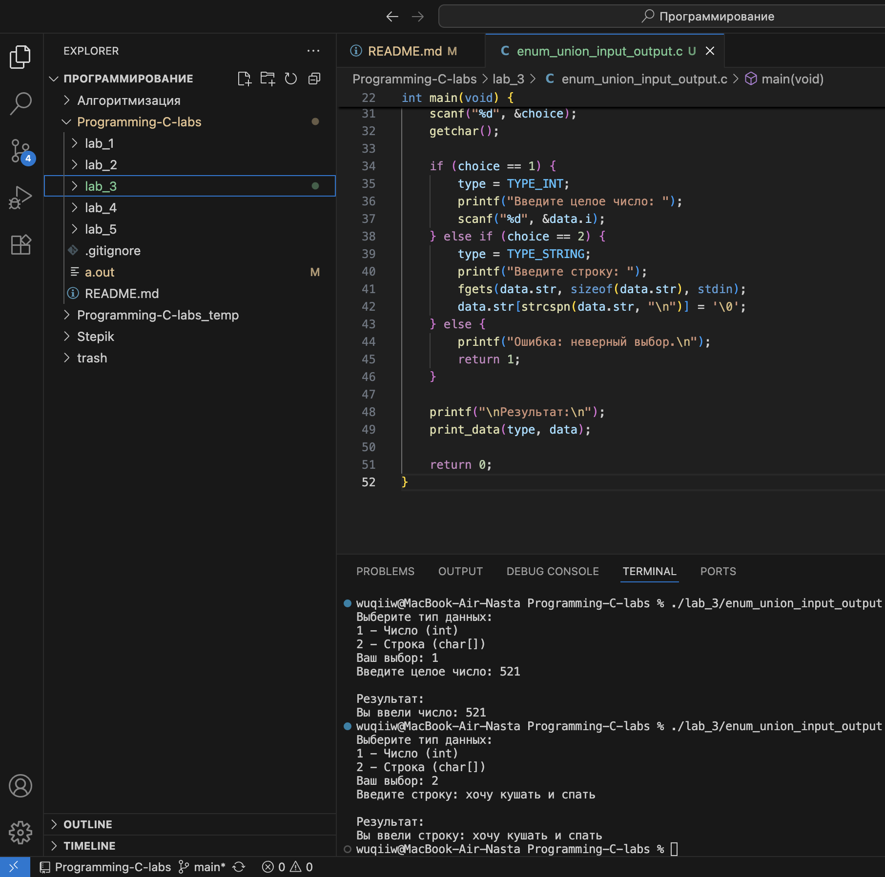

# Тема: Объединения и перечисления  
## Задача 1 – указатель на объединение  

### Постановка задачи  
Написать программу, которая использует указатель на некоторое объединение (union).  
Создать и проинициализировать переменные в объединении через указатель, затем вывести их значения на экран.  

### Математическая модель  
**Объединение (union)** позволяет хранить разные типы данных в одной и той же области памяти.  
В каждый момент времени активно только одно поле объединения.  
Обращение к данным происходит через указатель, который указывает на экземпляр объединения.  

### Список идентификаторов  

| Имя переменной | Тип данных | Описание |
|----------------|------------|----------|
| data           | union      | Объединение, содержащее разные типы данных |
| i              | int        | Целое значение |
| f              | float      | Число с плавающей точкой |
| c              | char       | Символ |
| ptr            | указатель  | Указатель на объединение |
| print_union    | функция    | Вывод текущего значения объединения |

### Код программы  

```c
#include <stdio.h>

union Data {
    int i;
    float f;
    char c;
};

int main(void) {
    union Data data;        
    union Data *ptr = &data; 

    ptr->i = 42;
    printf("Целое значение: %d\n", ptr->i);

    ptr->f = 3.14f;
    printf("Вещественное значение: %.2f\n", ptr->f);

    ptr->c = 'A';
    printf("Символьное значение: %c\n", ptr->c);

    printf("\nРазмер объединения: %lu байт\n", sizeof(union Data));

    return 0;
}
```

### Результаты работы программы  

--- 

## Задача 2 – побайтовая распечатка числа  

### Постановка задачи  
Написать программу, которая использует объединение (`union`) для побайтовой распечатки значения переменной типа `unsigned long`.  
Каждый байт должен быть выведен отдельно через указатель на `char`.  

### Математическая модель  
Объединение позволяет интерпретировать одну и ту же область памяти по-разному.  
Если объединить `unsigned long` и массив `unsigned char`, можно считывать байты числа напрямую.  

### Список идентификаторов  

| Имя переменной | Тип данных            | Описание |
|----------------|-----------------------|----------|
| value          | unsigned long         | Исходное число |
| bytes          | unsigned char[]       | Байтовое представление числа |
| data           | union                 | Объединение для хранения числа и его байтов |
| i              | int                   | Индекс для обхода байтов |
| ptr            | unsigned char*        | Указатель на байты числа |

### Код программы  

```c
#include <stdio.h>

union Data {
    unsigned long value;
    unsigned char bytes[sizeof(unsigned long)];
};

int main(void) {
    union Data data;
    unsigned long input;

    printf("Введите число (unsigned long): ");
    scanf("%lu", &input);

    data.value = input;

    unsigned char *ptr = data.bytes;

    printf("Побайтовое представление числа %lu:\n", data.value);
    for (int i = 0; i < sizeof(unsigned long); i++) {
        printf("Байт %d: 0x%02X\n", i, *(ptr + i));
    }

    return 0;
}
```

### Результаты работы программы  

---

## Задача 3 – перечисление дней недели  

### Постановка задачи  
Создать перечислимый тип данных (enum) для семи дней недели.  
Реализовать программу, которая выводит на экран значения каждого дня недели как целое число.  

### Математическая модель  
**Перечисления (enum)** используются для задания набора именованных констант.  
Каждому элементу присваивается целое значение, начиная с 0 (по умолчанию) или с заданного числа.  

### Список идентификаторов  

| Имя переменной | Тип данных | Описание |
|----------------|------------|----------|
| Weekday        | enum       | Перечисление для дней недели |
| day            | enum Weekday | Текущий день в цикле |
| print_day      | функция    | Печать дня недели и его значения |

### Код программы  

```c
#include <stdio.h>

enum Weekday {
    MONDAY = 1,
    TUESDAY,
    WEDNESDAY,
    THURSDAY,
    FRIDAY,
    SATURDAY,
    SUNDAY
};

void print_day(enum Weekday day) {
    switch (day) {
        case MONDAY:    printf("Понедельник = %d\n", day); break;
        case TUESDAY:   printf("Вторник = %d\n", day); break;
        case WEDNESDAY: printf("Среда = %d\n", day); break;
        case THURSDAY:  printf("Четверг = %d\n", day); break;
        case FRIDAY:    printf("Пятница = %d\n", day); break;
        case SATURDAY:  printf("Суббота = %d\n", day); break;
        case SUNDAY:    printf("Воскресенье = %d\n", day); break;
    }
}

int main(void) {
    printf("Дни недели:\n\n");
    for (enum Weekday day = MONDAY; day <= SUNDAY; day++) {
        print_day(day);
    }
    return 0;
}
```
### Результаты работы программы 

---

## Задача 4 – размеченное объединение  

### Постановка задачи  
Создать размеченное объединение (union), заключённое в структуру,  
которая также содержит перечисление (enum) — индикатор того,  
какой тип данных в данный момент хранится в объединении.  
Создать динамический массив таких структур и реализовать функцию для вывода их содержимого на экран.  

### Математическая модель  
- Используется структура, которая содержит:
  - поле `type` — значение перечисления (enum), определяющее активный тип данных;
  - объединение `Value`, содержащее возможные типы (`int`, `float`, `char*`).  
- В каждый момент времени активно только одно поле объединения.  
- Для вывода используется `switch(type)`, который выбирает, как интерпретировать значение.  

### Список идентификаторов  

| Имя переменной | Тип данных | Описание |
|----------------|------------|----------|
| ValueType      | enum       | Перечисление типов данных |
| Value          | union      | Объединение с различными типами |
| Item           | struct     | Структура с полем `type` и `data` |
| items          | Item*      | Динамический массив структур |
| print_item     | функция    | Вывод содержимого одной структуры |
| n              | int        | Количество элементов массива |

### Код программы  

```c
#include <stdio.h>
#include <stdlib.h>

enum ValueType {
    TYPE_INT,
    TYPE_FLOAT,
    TYPE_STRING
};

union Value {
    int i;
    float f;
    char *s;
};

struct Item {
    enum ValueType type;
    union Value data;
};

void print_item(struct Item item) {
    switch (item.type) {
        case TYPE_INT:
            printf("INT: %d\n", item.data.i);
            break;
        case TYPE_FLOAT:
            printf("FLOAT: %.2f\n", item.data.f);
            break;
        case TYPE_STRING:
            printf("STRING: %s\n", item.data.s);
            break;
    }
}

int main(void) {
    int n = 3;
    struct Item *items = malloc(n * sizeof(struct Item));

    items[0].type = TYPE_INT;
    items[0].data.i = 42;

    items[1].type = TYPE_FLOAT;
    items[1].data.f = 3.14f;

    items[2].type = TYPE_STRING;
    items[2].data.s = "Привет, мир!";

    printf("Содержимое массива структур:\n\n");
    for (int i = 0; i < n; i++) {
        print_item(items[i]);
    }

    free(items);
    return 0;
}
```

### Результаты работы программы  

---

## Задача 5 – ввод и хранение данных о студентах  

### Постановка задачи  
Создайте структуру, в которой используется объединение для хранения различных типов данных: например, структура с отдельным полем для имени студента и отдельное поле–целое число для его возраста либо строка его возраста
словами. Реализуйте программу для динамического ввода данных о студентах и вывода их на экран. 

### Математическая модель  
- Используется структура `Student`, содержащая:
  - строку `name` — имя студента;  
  - перечисление `AgeType` — тип возраста (число или строка);  
  - объединение `Age` — хранение либо целого возраста, либо строки.  
- Программа позволяет вводить несколько студентов, определяя способ хранения возраста.  

### Список идентификаторов  

| Имя переменной | Тип данных | Описание |
|----------------|------------|----------|
| AgeType        | enum       | Определяет тип возраста (число или строка) |
| Age            | union      | Хранит возраст как число или как строку |
| Student        | struct     | Структура с именем, типом возраста и объединением |
| students       | Student*   | Динамический массив студентов |
| n              | int        | Количество студентов |
| print_student  | функция    | Вывод информации о студенте |

### Код программы  

```c
#include <stdio.h>
#include <stdlib.h>
#include <string.h>

enum AgeType {
    AGE_INT,
    AGE_STRING
};

union Age {
    int num;
    char str[50];
};

struct Student {
    char name[50];
    enum AgeType type;
    union Age age;
};

void print_student(struct Student s) {
    printf("Имя: %s\n", s.name);
    if (s.type == AGE_INT) {
        printf("Возраст: %d\n", s.age.num);
    } else {
        printf("Возраст: %s\n", s.age.str);
    }
    printf("----------------------\n");
}

int main(void) {
    int n;
    printf("Введите количество студентов: ");
    scanf("%d", &n);
    getchar(); 

    struct Student *students = malloc(n * sizeof(struct Student));

    for (int i = 0; i < n; i++) {
        printf("\nСтудент #%d\n", i + 1);

        printf("Введите имя: ");
        fgets(students[i].name, sizeof(students[i].name), stdin);
        students[i].name[strcspn(students[i].name, "\n")] = '\0';

        int choice;
        printf("Как задать возраст? (1 - числом, 2 - словами): ");
        scanf("%d", &choice);
        getchar();

        if (choice == 1) {
            students[i].type = AGE_INT;
            printf("Введите возраст (число): ");
            scanf("%d", &students[i].age.num);
            getchar();
        } else {
            students[i].type = AGE_STRING;
            printf("Введите возраст (словами): ");
            fgets(students[i].age.str, sizeof(students[i].age.str), stdin);
            students[i].age.str[strcspn(students[i].age.str, "\n")] = '\0';
        }
    }

    printf("\nСписок студентов:\n\n");
    for (int i = 0; i < n; i++) {
        print_student(students[i]);
    }

    free(students);
    return 0;
}
```

### Результаты работы программы 

---

## Задача 6 – управление состояниями системы через enum  

### Постановка задачи  
Использовать перечисление (`enum`) для управления состояниями условной системы (например: старт, пауза, стоп).  
Программа должна позволять изменять состояние и выводить текущее состояние на экран.  

### Математическая модель  
- Состояния системы описываются перечислением:  
  ```
  enum SystemState { STATE_STOP, STATE_START, STATE_PAUSE };
  ```
- Для хранения текущего состояния используется переменная `state`.  
- Функция `print_state()` выводит текущее состояние в текстовом виде.  
- Программа позволяет пользователю выбирать команды для изменения состояния.  

### Список идентификаторов  

| Имя переменной | Тип данных | Описание |
|----------------|------------|----------|
| SystemState    | enum       | Перечисление возможных состояний системы |
| state          | SystemState | Текущее состояние системы |
| print_state    | функция    | Печать состояния |
| choice         | int        | Выбор пользователя |

### Код программы  

```c
#include <stdio.h>

enum SystemState {
    STATE_STOP,
    STATE_START,
    STATE_PAUSE
};

void print_state(enum SystemState state) {
    switch (state) {
        case STATE_STOP:
            printf("Состояние системы: STOP\n");
            break;
        case STATE_START:
            printf("Состояние системы: START\n");
            break;
        case STATE_PAUSE:
            printf("Состояние системы: PAUSE\n");
            break;
    }
}

int main(void) {
    enum SystemState state = STATE_STOP;
    int choice;

    while (1) {
        printf("\nВыберите действие:\n");
        printf("1 - START\n");
        printf("2 - PAUSE\n");
        printf("3 - STOP\n");
        printf("0 - Выйти\n");
        printf("Ваш выбор: ");
        scanf("%d", &choice);

        switch (choice) {
            case 1:
                state = STATE_START;
                break;
            case 2:
                state = STATE_PAUSE;
                break;
            case 3:
                state = STATE_STOP;
                break;
            case 0:
                printf("Выход из программы.\n");
                return 0;
            default:
                printf("Некорректный выбор.\n");
                continue;
        }

        print_state(state);
    }

    return 0;
}
```

### Результаты работы программы  

---

## Задача 7 – оптимизация памяти для хранения данных о температуре и влажности  

### Постановка задачи  
Создать структуру с битовыми полями для хранения показаний температуры (в градусах Цельсия) и влажности (в процентах).  
Реализовать ввод данных с клавиатуры и их корректное хранение в структуре с минимальным потреблением памяти.
- Температура может быть от -50 до +50 градусов Цельсия (нужно выделить минимальное количество бит).
- Влажность может быть от 0 до 100%.  

### Математическая модель  
- Температура изменяется от **-50 до +50**, диапазон — 101 значение → требуется **7 бит** (2⁷ = 128).  
  Чтобы удобно хранить отрицательные значения, вводимое значение сдвигается на +50 при сохранении.  
- Влажность изменяется от **0 до 100**, диапазон — 101 значение → требуется **7 бит**.  
- Таким образом, можно хранить оба значения в одной структуре всего за 14 бит (менее 2 байт).  

### Список идентификаторов  

| Имя переменной | Тип данных | Описание |
|----------------|------------|----------|
| temperature    | unsigned   | Температура (битовое поле на 7 бит) |
| humidity       | unsigned   | Влажность (битовое поле на 7 бит) |
| Weather        | struct     | Структура с битовыми полями |
| input_temp     | int        | Введённая пользователем температура |
| input_hum      | int        | Введённая пользователем влажность |

### Код программы  

```c
#include <stdio.h>

struct Weather {
    unsigned temperature : 7; 
    unsigned humidity : 7;    
};

int main(void) {
    struct Weather w;
    int input_temp, input_hum;

    printf("Введите температуру (-50...+50): ");
    scanf("%d", &input_temp);

    if (input_temp < -50 || input_temp > 50) {
        printf("Ошибка: температура вне диапазона.\n");
        return 1;
    }

    printf("Введите влажность (0...100): ");
    scanf("%d", &input_hum);

    if (input_hum < 0 || input_hum > 100) {
        printf("Ошибка: влажность вне диапазона.\n");
        return 1;
    }

    w.temperature = input_temp + 50;
    w.humidity = input_hum;

    printf("\nСохраненные данные:\n");
    printf("Температура: %d°C\n", (int)w.temperature - 50);
    printf("Влажность: %d%%\n", w.humidity);

    printf("\nРазмер структуры: %lu байт\n", sizeof(w));

    return 0;
}
```

### Результаты работы программы  

---

## Задача 8 – ввод и вывод через enum и union  

### Постановка задачи  
Создайте программу, которая позволяет пользователю вводить и выводить информацию с различными типами данных
через перечисления и объединения. Например, пользователь может выбрать ввод данных как числа или строки,и
программа корректно сохранит и отобразит эти данные

### Математическая модель  
- Используется перечисление `DataType` для указания типа данных: `TYPE_INT` или `TYPE_STRING`.  
- Объединение `Data` хранит либо целое число, либо строку.  
- В зависимости от выбора пользователя программа читает данные нужного типа, сохраняет их в объединении и выводит на экран.  

### Список идентификаторов  

| Имя переменной | Тип данных | Описание |
|----------------|------------|----------|
| DataType       | enum       | Определяет тип данных (число или строка) |
| Data           | union      | Хранит значение в виде числа или строки |
| data           | Data       | Переменная объединения |
| type           | DataType   | Текущий выбранный тип данных |
| choice         | int        | Выбор пользователя |
| print_data     | функция    | Вывод данных на экран |

### Код программы  

```c
#include <stdio.h>
#include <string.h>

enum DataType {
    TYPE_INT,
    TYPE_STRING
};

union Data {
    int i;
    char str[100];
};

void print_data(enum DataType type, union Data data) {
    if (type == TYPE_INT) {
        printf("Вы ввели число: %d\n", data.i);
    } else if (type == TYPE_STRING) {
        printf("Вы ввели строку: %s\n", data.str);
    }
}

int main(void) {
    union Data data;
    enum DataType type;
    int choice;

    printf("Выберите тип данных:\n");
    printf("1 - Число (int)\n");
    printf("2 - Строка (char[])\n");
    printf("Ваш выбор: ");
    scanf("%d", &choice);
    getchar(); 

    if (choice == 1) {
        type = TYPE_INT;
        printf("Введите целое число: ");
        scanf("%d", &data.i);
    } else if (choice == 2) {
        type = TYPE_STRING;
        printf("Введите строку: ");
        fgets(data.str, sizeof(data.str), stdin);
        data.str[strcspn(data.str, "\n")] = '\0'; 
    } else {
        printf("Ошибка: неверный выбор.\n");
        return 1;
    }

    printf("\nРезультат:\n");
    print_data(type, data);

    return 0;
}
```

### Результаты работы программы 

---

### Информация о студенте  
Полторацкая Анастасия, 1 курс, группа `1об_ПОО/25`
