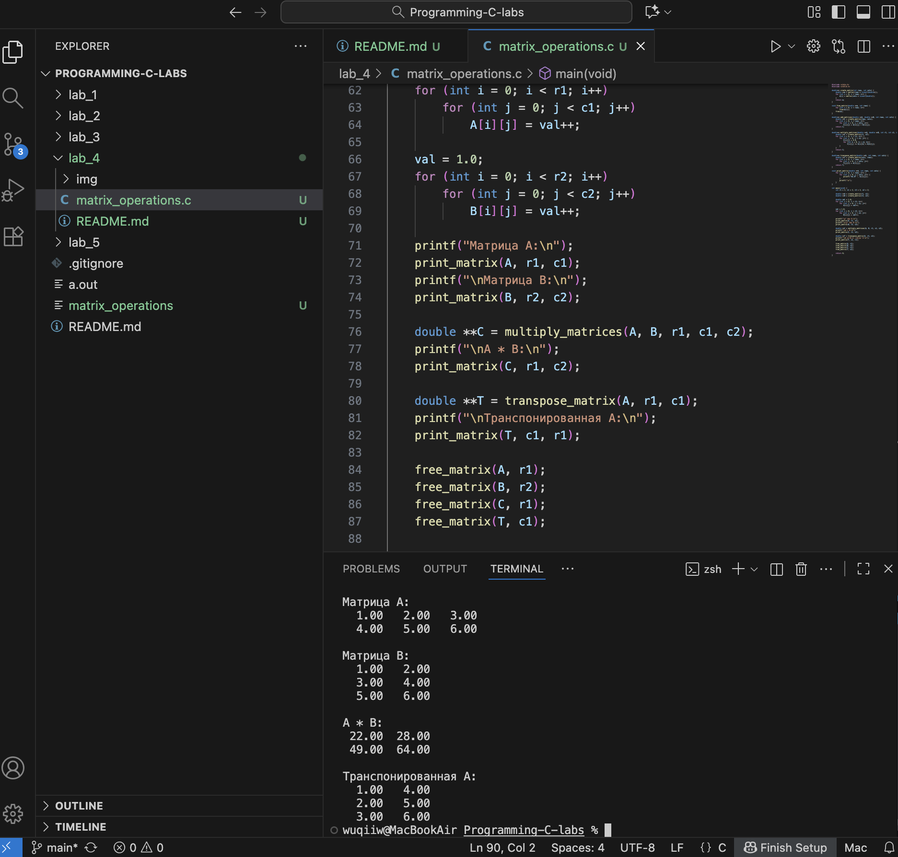

# Тема: Продвинутая работа с функциями в C  

---

## Задача 1 – операции с матрицами  

### Постановка задачи  
Реализовать функции для работы с матрицами (динамическими и с VLA).  
Реализовать три основные операции:  
- Транспонирование матрицы;  
- Сложение двух матриц;  
- Умножение двух матриц.  

Результаты возвращаются в виде новой матрицы.  

### Математическая модель  
Пусть матрицы заданы как двумерные массивы `A[m][n]` и `B[m][n]`.  
1. **Сложение:**  
   ```
   C[i][j] = A[i][j] + B[i][j]
   ```
2. **Умножение:**  
   ```
   C[i][j] = Σ(A[i][k] * B[k][j])
   ```
3. **Транспонирование:**  
   ```
   T[i][j] = A[j][i]
   ```

### Список идентификаторов  

| Имя переменной | Тип данных | Описание |
|----------------|------------|----------|
| rows, cols     | int        | Количество строк и столбцов матрицы |
| A, B, C, T     | double**   | Динамические матрицы |
| create_matrix  | функция    | Создаёт новую матрицу |
| free_matrix    | функция    | Освобождает память матрицы |
| add_matrices   | функция    | Суммирует две матрицы |
| multiply_matrices | функция | Умножает две матрицы |
| transpose_matrix  | функция | Транспонирует матрицу |
| print_matrix   | функция    | Печатает матрицу на экран |

### Код программы  

```c
#include <stdio.h>
#include <stdlib.h>

double** create_matrix(int rows, int cols) {
    double **m = malloc(rows * sizeof(double*));
    for (int i = 0; i < rows; i++) {
        m[i] = malloc(cols * sizeof(double));
    }
    return m;
}

void free_matrix(double **m, int rows) {
    for (int i = 0; i < rows; i++)
        free(m[i]);
    free(m);
}

double** add_matrices(double **A, double **B, int rows, int cols) {
    double **C = create_matrix(rows, cols);
    for (int i = 0; i < rows; i++)
        for (int j = 0; j < cols; j++)
            C[i][j] = A[i][j] + B[i][j];
    return C;
}

double** multiply_matrices(double **A, double **B, int r1, int c1, int c2) {
    double **C = create_matrix(r1, c2);
    for (int i = 0; i < r1; i++) {
        for (int j = 0; j < c2; j++) {
            C[i][j] = 0.0;
            for (int k = 0; k < c1; k++)
                C[i][j] += A[i][k] * B[k][j];
        }
    }
    return C;
}

double** transpose_matrix(double **A, int rows, int cols) {
    double **T = create_matrix(cols, rows);
    for (int i = 0; i < rows; i++)
        for (int j = 0; j < cols; j++)
            T[j][i] = A[i][j];
    return T;
}

void print_matrix(double **A, int rows, int cols) {
    for (int i = 0; i < rows; i++) {
        for (int j = 0; j < cols; j++) {
            printf("%6.2f ", A[i][j]);
        }
        printf("\n");
    }
}

int main(void) {
    int r1 = 2, c1 = 3, r2 = 3, c2 = 2;

    double **A = create_matrix(r1, c1);
    double **B = create_matrix(r2, c2);

    double val = 1.0;
    for (int i = 0; i < r1; i++)
        for (int j = 0; j < c1; j++)
            A[i][j] = val++;

    val = 1.0;
    for (int i = 0; i < r2; i++)
        for (int j = 0; j < c2; j++)
            B[i][j] = val++;

    printf("Матрица A:\n");
    print_matrix(A, r1, c1);
    printf("\nМатрица B:\n");
    print_matrix(B, r2, c2);

    double **C = multiply_matrices(A, B, r1, c1, c2);
    printf("\nA * B:\n");
    print_matrix(C, r1, c2);

    double **T = transpose_matrix(A, r1, c1);
    printf("\nТранспонированная A:\n");
    print_matrix(T, c1, r1);

    free_matrix(A, r1);
    free_matrix(B, r2);
    free_matrix(C, r1);
    free_matrix(T, c1);

    return 0;
}
```

### Результаты работы программы 

---

### Информация о студенте  
Полторацкая Анастасия, 1 курс, группа `1об_ПОО/25`