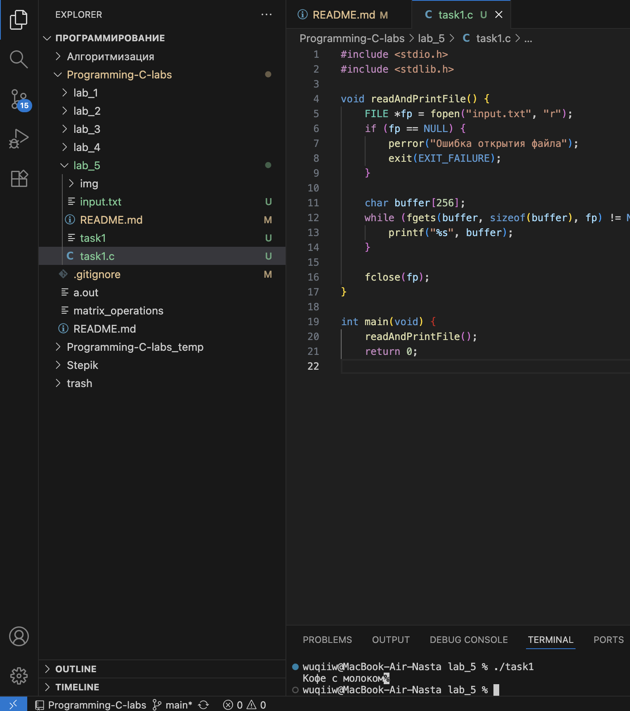
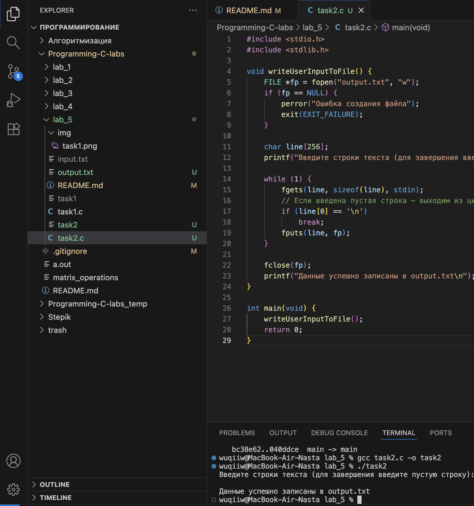
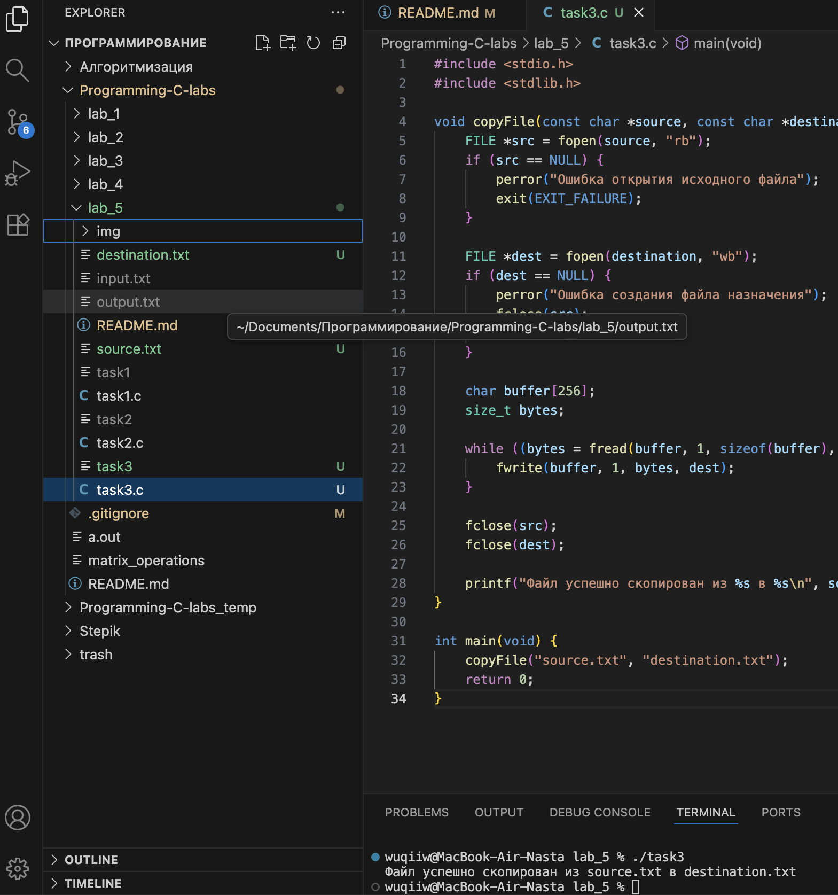
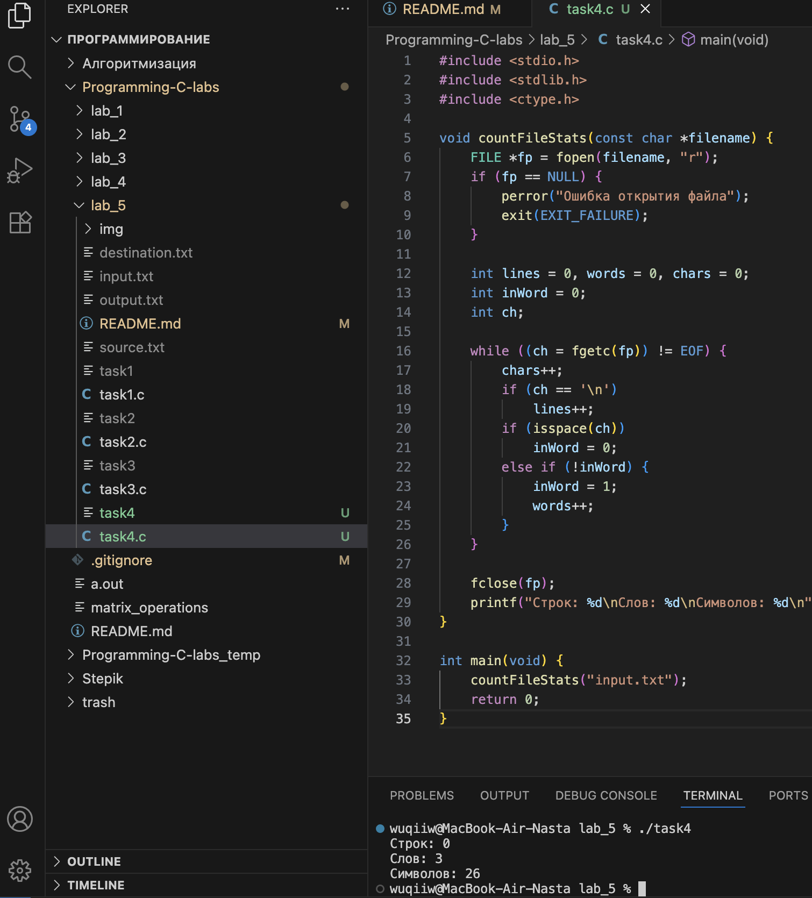
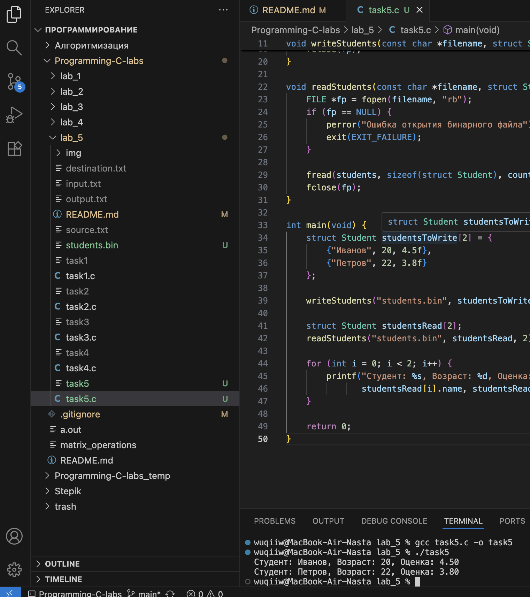
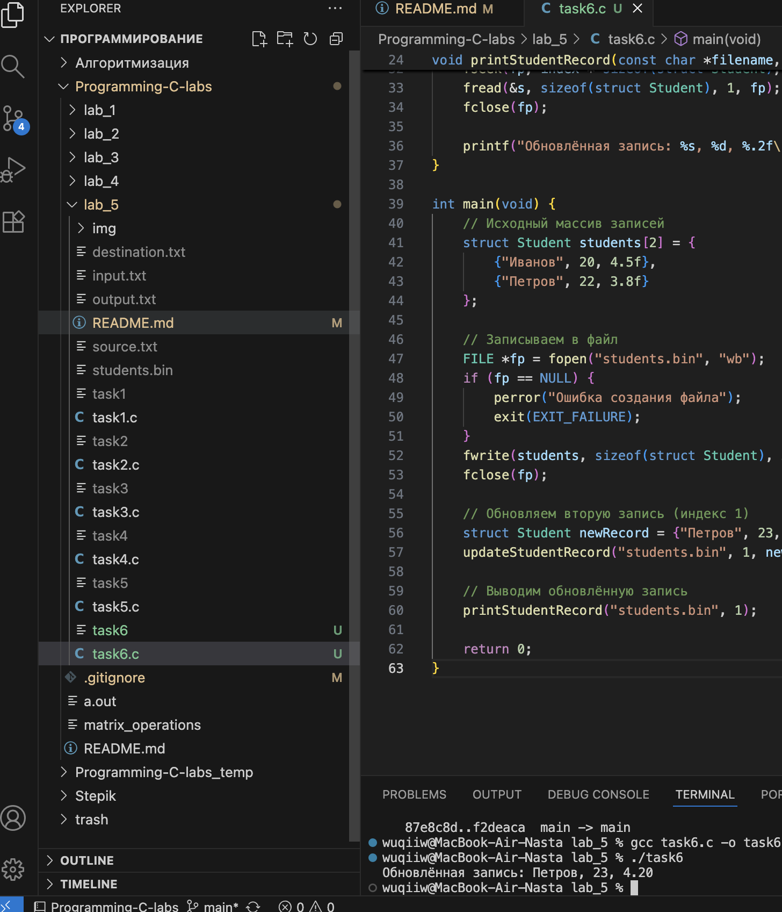
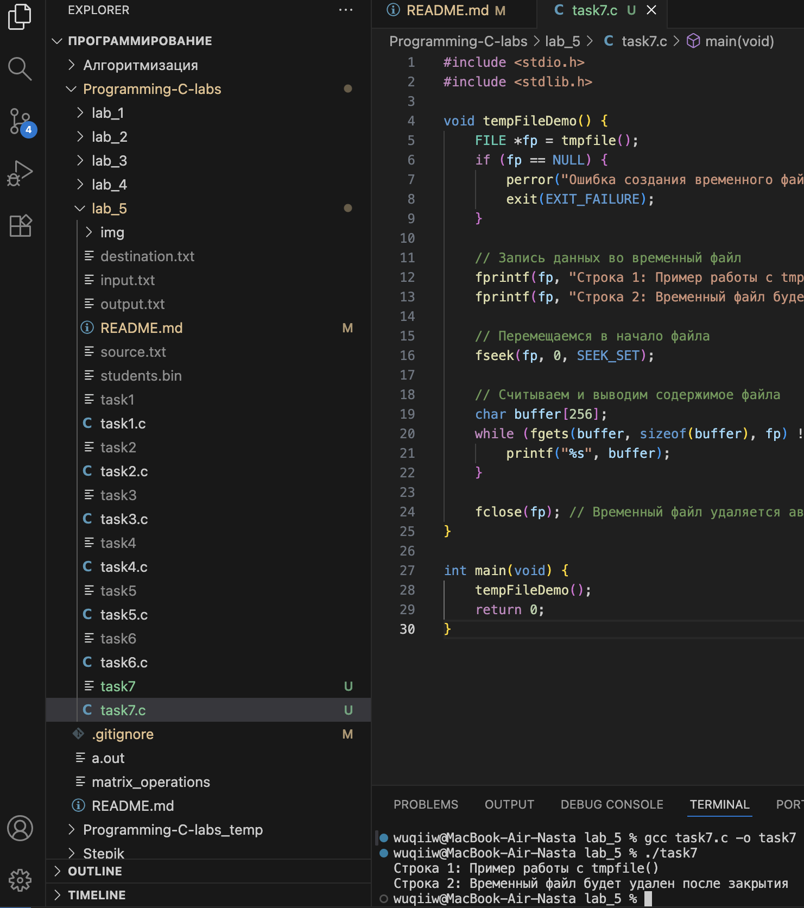

# Тема: Файловый ввод-вывод
## Задача 1 - Чтение и вывод содержимого текстового файла

### Постановка задачи
Напишите программу, которая открывает текстовый файл (например, “input.txt”) для чтения, считывает его построчно с помощью функции fgets() и выводит каждую строку на стандартный вывод. Программа должна проверять,
успешно ли открыт файл, и корректно закрывать его после чтения.

### Список идентификаторов

| Имя переменной | Тип данных | Описание |
|----------------|-------------|-----------|
| `fp` | `FILE*` | Указатель на открытый файл |
| `buffer` | `char[256]` | Буфер для хранения считанной строки |
| `readAndPrintFile()` | `void` | Функция для открытия, чтения и вывода содержимого файла |
| `main()` | `int` | Главная функция программы |

### Код программы

```c
#include <stdio.h>
#include <stdlib.h>

void readAndPrintFile() {
    FILE *fp = fopen("input.txt", "r");
    if (fp == NULL) {
        perror("Ошибка открытия файла");
        exit(EXIT_FAILURE);
    }

    char buffer[256];
    while (fgets(buffer, sizeof(buffer), fp) != NULL) {
        printf("%s", buffer);
    }

    fclose(fp);
}

int main(void) {
    readAndPrintFile();
    return 0;
}
```

### Результаты работы программы  

--- 

## Задача 2 - Запись пользовательского ввода в текстовый файл

### Постановка задачи
Создайте программу, которая запрашивает у пользователя несколько строк текста, а затем записывает введённые данные в файл “output.txt”. Используйте режим записи "w". После завершения записи файл закрывается, а программа
выводит сообщение об успешном завершении.

### Список идентификаторов

| Имя переменной | Тип данных | Описание |
|----------------|-------------|-----------|
| `fp` | `FILE*` | Указатель на открытый файл |
| `line` | `char[256]` | Буфер для хранения введённой строки |
| `writeUserInputToFile()` | `void` | Функция, выполняющая запись пользовательского ввода в файл |
| `main()` | `int` | Главная функция программы |

### Код программы

```c
#include <stdio.h>
#include <stdlib.h>

void writeUserInputToFile() {
    FILE *fp = fopen("output.txt", "w");
    if (fp == NULL) {
        perror("Ошибка создания файла");
        exit(EXIT_FAILURE);
    }

    char line[256];
    printf("Введите строки текста (для завершения введите пустую строку):\n");

    while (1) {
        fgets(line, sizeof(line), stdin);
        // Если введена пустая строка — выходим из цикла
        if (line[0] == '\n')
            break;
        fputs(line, fp);
    }

    fclose(fp);
    printf("Данные успешно записаны в output.txt\n");
}

int main(void) {
    writeUserInputToFile();
    return 0;
}
```

### Результаты работы программы  

---

## Задача 3 - Копирование содержимого одного файла в другой

### Постановка задачи
Написать программу, которая копирует содержимое файла `source.txt` в новый файл `destination.txt`.  
Программа должна открывать исходный файл в режиме чтения, а целевой — в режиме записи.  
Содержимое копируется блоками (например, по 256 байт) с использованием функций `fread()` и `fwrite()`.

### Список идентификаторов

| Имя переменной | Тип данных | Описание |
|----------------|-------------|-----------|
| `src` | `FILE*` | Указатель на исходный файл |
| `dest` | `FILE*` | Указатель на файл назначения |
| `buffer` | `char[256]` | Буфер для временного хранения блока данных |
| `bytes` | `size_t` | Количество байт, считанных из исходного файла |
| `copyFile()` | `void` | Функция для копирования содержимого из одного файла в другой |
| `main()` | `int` | Главная функция программы |

### Код программы

```c
#include <stdio.h>
#include <stdlib.h>

void copyFile(const char *source, const char *destination) {
    FILE *src = fopen(source, "rb");
    if (src == NULL) {
        perror("Ошибка открытия исходного файла");
        exit(EXIT_FAILURE);
    }

    FILE *dest = fopen(destination, "wb");
    if (dest == NULL) {
        perror("Ошибка создания файла назначения");
        fclose(src);
        exit(EXIT_FAILURE);
    }

    char buffer[256];
    size_t bytes;

    while ((bytes = fread(buffer, 1, sizeof(buffer), src)) > 0) {
        fwrite(buffer, 1, bytes, dest);
    }

    fclose(src);
    fclose(dest);

    printf("Файл успешно скопирован из %s в %s\n", source, destination);
}

int main(void) {
    copyFile("source.txt", "destination.txt");
    return 0;
}
```

### Результаты работы программы  

---

## Задача 4 - Подсчёт строк, слов и символов в текстовом файле

### Постановка задачи
Разработать программу, которая открывает текстовый файл (например, `input.txt`) и подсчитывает:
- количество строк (по числу символов новой строки);
- количество слов (слова разделены пробелами и знаками препинания);
- количество символов (включая пробелы).

После подсчёта программа должна вывести результаты на экран.

### Математическая модель
Пусть:
- \( L \) — количество строк (число символов `'\n'`);
- \( W \) — количество слов (последовательностей символов без пробелов и разделителей);
- \( C \) — общее количество символов (включая пробелы и знаки пунктуации).

Тогда программа вычисляет:
\[
L = \text{count}(\text{'\n'})
\]
\[
C = \text{count}(\text{всех символов})
\]
\[
W = \text{count}(\text{переходов из "не в слове" в "в слове"})
\]

### Список идентификаторов

| Имя переменной | Тип данных | Описание |
|----------------|-------------|-----------|
| `fp` | `FILE*` | Указатель на открытый файл |
| `lines` | `int` | Количество строк |
| `words` | `int` | Количество слов |
| `chars` | `int` | Количество символов |
| `inWord` | `int` | Флаг, указывающий, находится ли программа внутри слова |
| `ch` | `int` | Текущий считанный символ |
| `countFileStats()` | `void` | Функция подсчёта статистики файла |
| `main()` | `int` | Главная функция программы |

### Код программы

```c
#include <stdio.h>
#include <stdlib.h>
#include <ctype.h>

void countFileStats(const char *filename) {
    FILE *fp = fopen(filename, "r");
    if (fp == NULL) {
        perror("Ошибка открытия файла");
        exit(EXIT_FAILURE);
    }

    int lines = 0, words = 0, chars = 0;
    int inWord = 0;
    int ch;

    while ((ch = fgetc(fp)) != EOF) {
        chars++;
        if (ch == '\n')
            lines++;
        if (isspace(ch))
            inWord = 0;
        else if (!inWord) {
            inWord = 1;
            words++;
        }
    }

    fclose(fp);
    printf("Строк: %d\nСлов: %d\nСимволов: %d\n", lines, words, chars);
}

int main(void) {
    countFileStats("input.txt");
    return 0;
}
```

### Результаты работы программы  

---

## Задача 5 - Запись и чтение структур в бинарном файле

### Постановка задачи
Определить структуру (например, `struct Student` с полями `name`, `age` и `grade`).  
Создать массив таких структур, затем записать его в бинарный файл с помощью функции `fwrite()`.  
После этого открыть файл для чтения, восстановить массив с помощью `fread()` и вывести данные на экран.

### Список идентификаторов

| Имя переменной | Тип данных | Описание |
|----------------|-------------|-----------|
| `struct Student` | `struct` | Определение структуры студента |
| `name` | `char[50]` | Имя студента |
| `age` | `int` | Возраст студента |
| `grade` | `float` | Средний балл |
| `studentsToWrite` | `struct Student[]` | Массив структур для записи |
| `studentsRead` | `struct Student[]` | Массив структур для чтения из файла |
| `fp` | `FILE*` | Указатель на бинарный файл |
| `writeStudents()` | `void` | Функция записи структур в бинарный файл |
| `readStudents()` | `void` | Функция чтения структур из бинарного файла |
| `main()` | `int` | Главная функция программы |

### Код программы

```c
#include <stdio.h>
#include <stdlib.h>
#include <string.h>

struct Student {
    char name[50];
    int age;
    float grade;
};

void writeStudents(const char *filename, struct Student students[], int count) {
    FILE *fp = fopen(filename, "wb");
    if (fp == NULL) {
        perror("Ошибка создания бинарного файла");
        exit(EXIT_FAILURE);
    }

    fwrite(students, sizeof(struct Student), count, fp);
    fclose(fp);
}

void readStudents(const char *filename, struct Student students[], int count) {
    FILE *fp = fopen(filename, "rb");
    if (fp == NULL) {
        perror("Ошибка открытия бинарного файла");
        exit(EXIT_FAILURE);
    }

    fread(students, sizeof(struct Student), count, fp);
    fclose(fp);
}

int main(void) {
    struct Student studentsToWrite[2] = {
        {"Иванов", 20, 4.5f},
        {"Петров", 22, 3.8f}
    };

    writeStudents("students.bin", studentsToWrite, 2);

    struct Student studentsRead[2];
    readStudents("students.bin", studentsRead, 2);

    for (int i = 0; i < 2; i++) {
        printf("Студент: %s, Возраст: %d, Оценка: %.2f\n",
               studentsRead[i].name, studentsRead[i].age, studentsRead[i].grade);
    }

    return 0;
}
```

### Результаты работы программы  

---

## Задача 6 - Произвольный доступ к файлу с использованием fseek()

### Постановка задачи
Написать программу, которая открывает бинарный файл с записями (например, структура `Student` из предыдущей задачи).  
С помощью функции `fseek()` переместиться к определённой записи (например, с индексом 1), изменить её данные и записать изменения в файл.  
Затем прочитать файл заново и вывести изменённую запись.

### Математическая модель
Программа демонстрирует механизм произвольного доступа к данным в бинарных файлах.  
Используется смещение (offset), вычисляемое как:
\[
\text{offset} = \text{index} \times \text{sizeof(struct Student)}
\]
Это позволяет переходить к нужной записи без последовательного чтения предыдущих данных.

### Список идентификаторов

| Имя переменной | Тип данных | Описание |
|----------------|-------------|-----------|
| `struct Student` | `struct` | Структура, описывающая запись студента |
| `name` | `char[50]` | Имя студента |
| `age` | `int` | Возраст |
| `grade` | `float` | Средний балл |
| `fp` | `FILE*` | Указатель на бинарный файл |
| `index` | `int` | Индекс записи, которую требуется изменить |
| `newData` | `struct Student` | Новые данные для замены |
| `updateStudentRecord()` | `void` | Функция обновления записи в бинарном файле |
| `printStudentRecord()` | `void` | Функция вывода изменённой записи |
| `main()` | `int` | Главная функция программы |

### Код программы

```c
#include <stdio.h>
#include <stdlib.h>
#include <string.h>

struct Student {
    char name[50];
    int age;
    float grade;
};

void updateStudentRecord(const char *filename, int index, struct Student newData) {
    FILE *fp = fopen(filename, "rb+");
    if (fp == NULL) {
        perror("Ошибка открытия файла");
        exit(EXIT_FAILURE);
    }

    // Перемещаемся к нужной записи
    fseek(fp, index * sizeof(struct Student), SEEK_SET);
    fwrite(&newData, sizeof(struct Student), 1, fp);
    fclose(fp);
}

void printStudentRecord(const char *filename, int index) {
    FILE *fp = fopen(filename, "rb");
    if (fp == NULL) {
        perror("Ошибка открытия файла");
        exit(EXIT_FAILURE);
    }

    struct Student s;
    fseek(fp, index * sizeof(struct Student), SEEK_SET);
    fread(&s, sizeof(struct Student), 1, fp);
    fclose(fp);

    printf("Обновлённая запись: %s, %d, %.2f\n", s.name, s.age, s.grade);
}

int main(void) {
    // Исходный массив записей
    struct Student students[2] = {
        {"Иванов", 20, 4.5f},
        {"Петров", 22, 3.8f}
    };

    // Записываем в файл
    FILE *fp = fopen("students.bin", "wb");
    if (fp == NULL) {
        perror("Ошибка создания файла");
        exit(EXIT_FAILURE);
    }
    fwrite(students, sizeof(struct Student), 2, fp);
    fclose(fp);

    // Обновляем вторую запись (индекс 1)
    struct Student newRecord = {"Петров", 23, 4.2f};
    updateStudentRecord("students.bin", 1, newRecord);

    // Выводим обновлённую запись
    printStudentRecord("students.bin", 1);

    return 0;
}
```

### Результаты работы программы  

---

## Задача 7 - Использование временного файла (temporary file)

### Постановка задачи
Разработать программу, которая создаёт временный файл с помощью функции `tmpfile()`,  
записывает в него несколько строк (например, результаты промежуточных вычислений или лог),  
затем перемещается в начало файла с помощью `fseek()`, считывает содержимое и выводит его на экран.  
После закрытия временный файл удаляется автоматически.

### Список идентификаторов

| Имя переменной | Тип данных | Описание |
|----------------|-------------|-----------|
| `fp` | `FILE*` | Указатель на временный файл |
| `buffer` | `char[256]` | Буфер для чтения строк из временного файла |
| `tempFileDemo()` | `void` | Функция, демонстрирующая работу с временным файлом |
| `main()` | `int` | Главная функция программы |

### Код программы

```c
#include <stdio.h>
#include <stdlib.h>

void tempFileDemo() {
    FILE *fp = tmpfile();
    if (fp == NULL) {
        perror("Ошибка создания временного файла");
        exit(EXIT_FAILURE);
    }

    // Запись данных во временный файл
    fprintf(fp, "Строка 1: Пример работы с tmpfile()\n");
    fprintf(fp, "Строка 2: Временный файл будет удален после закрытия\n");

    // Перемещаемся в начало файла
    fseek(fp, 0, SEEK_SET);

    // Считываем и выводим содержимое файла
    char buffer[256];
    while (fgets(buffer, sizeof(buffer), fp) != NULL) {
        printf("%s", buffer);
    }

    fclose(fp); // Временный файл удаляется автоматически
}

int main(void) {
    tempFileDemo();
    return 0;
}
```

### Результаты работы программы  

---
### Информация о студенте  
Полторацкая Анастасия, 1 курс, группа `1об_ПОО/25`