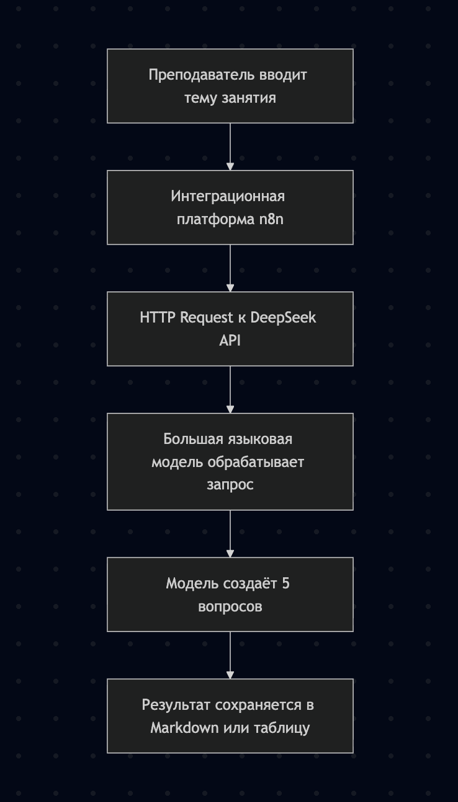
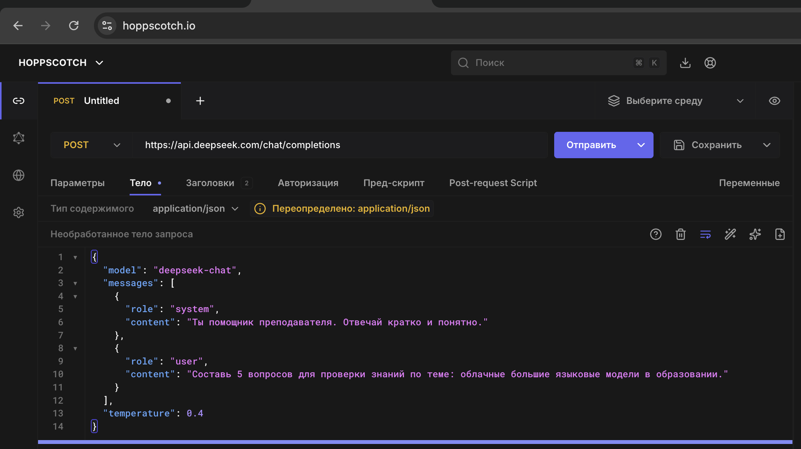
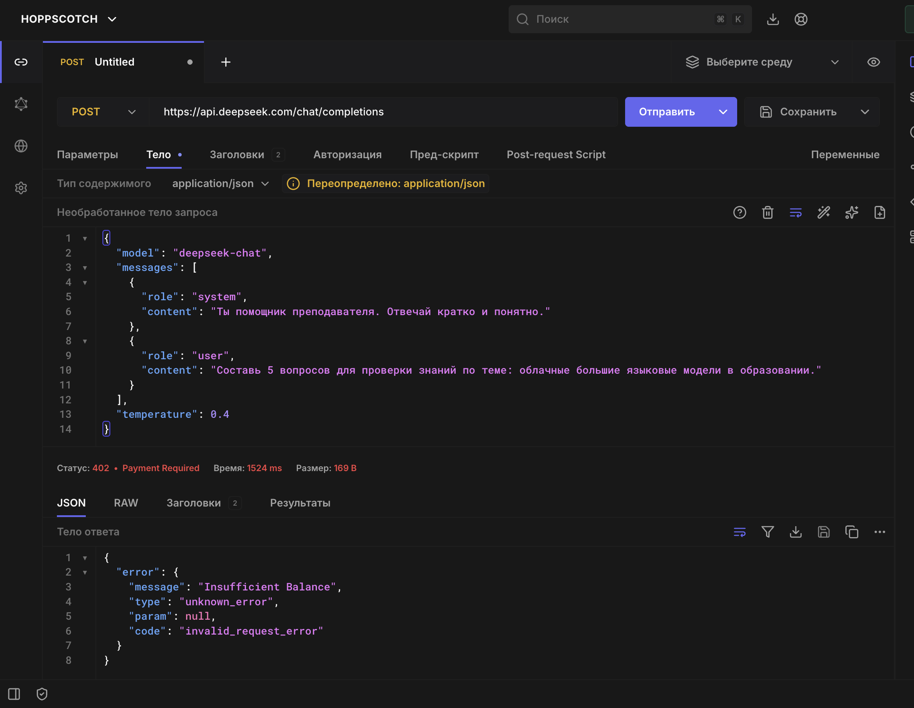
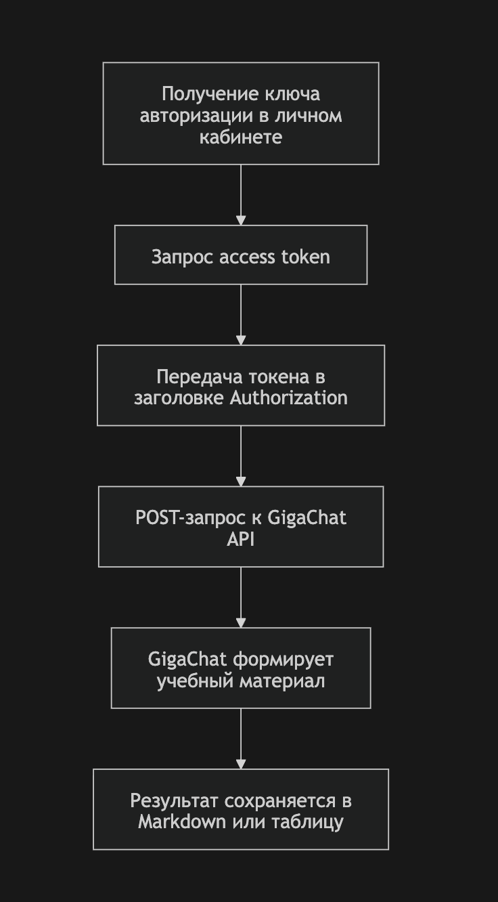

# Реферат

## Интеграционные платформы для подключения облачных больших языковых моделей в образовательных процессах

**Тема:** сравнение интеграционных платформ, позволяющих подключать облачные большие языковые модели, в том числе российские и китайские модели, для автоматизации образовательных процессов.  

**Формат работы:** Markdown.  

**Практическая часть:** пример простой автоматизации через DeepSeek API и альтернативный вариант через GigaChat API.

---

## Содержание

1. [Введение](#введение)
2. [Большие языковые модели и образовательная автоматизация](#большие-языковые-модели-и-образовательная-автоматизация)
3. [Критерии сравнения интеграционных платформ](#критерии-сравнения-интеграционных-платформ)
4. [Платформа n8n](#платформа-n8n)
5. [Платформа Dify](#платформа-dify)
6. [Платформа Flowise](#платформа-flowise)
7. [Сравнительная таблица платформ](#сравнительная-таблица-платформ)
8. [Российские и китайские большие языковые модели](#российские-и-китайские-большие-языковые-модели)
9. [Варианты автоматизации образовательных процессов](#варианты-автоматизации-образовательных-процессов)
10. [Практический отчёт по простой автоматизации](#практический-отчёт-по-простой-автоматизации)
11. [Пример автоматизации через DeepSeek API](#пример-автоматизации-через-deepseek-api)
12. [Альтернативный вариант через GigaChat API](#альтернативный-вариант-через-gigachat-api)
13. [Безопасность и этика использования LLM в образовании](#безопасность-и-этика-использования-llm-в-образовании)
14. [Вывод](#вывод)
15. [Список источников](#список-источников)

---

## Введение

В последние годы большие языковые модели стали активно применяться в разных сферах, включая образование. Они способны обрабатывать текст, отвечать на вопросы, создавать объяснения, формировать тестовые задания, анализировать ответы обучающихся и помогать преподавателю в подготовке учебных материалов.

Однако сама по себе языковая модель является только одним элементом цифровой системы. Чтобы использовать её в реальном образовательном процессе, необходимо встроить модель в определённую среду: сайт, форму, таблицу, чат-бот, систему дистанционного обучения, электронный журнал или внутреннюю информационную систему образовательной организации.

Для решения такой задачи используются интеграционные платформы. Они позволяют связывать разные сервисы между собой и автоматизировать последовательность действий. Например, можно настроить процесс, при котором студент отправляет ответ через форму, система передаёт этот ответ большой языковой модели, модель формирует обратную связь, а результат сохраняется в таблицу или отправляется преподавателю.

В данном реферате рассматриваются три интеграционные платформы:

- **n8n**
- **Dify**
- **Flowise**

Эти платформы отличаются по назначению и уровню сложности, но каждая из них может использоваться для подключения облачных больших языковых моделей. Особое внимание уделяется возможности подключения российских и китайских моделей, таких как **GigaChat**, **YandexGPT**, **DeepSeek** и **Qwen**.

Цель работы — сравнить три интеграционные платформы и показать, как с их помощью можно автоматизировать небольшие части образовательного процесса.

---

## Большие языковые модели и образовательная автоматизация

Большая языковая модель — это программная система, которая обучена на больших объёмах текстовых данных и умеет генерировать связные ответы на естественном языке. Такие модели могут не только отвечать на вопросы, но и выполнять инструкции: составлять текст, проверять формулировки, сокращать материал, объяснять сложные темы простыми словами, классифицировать обращения и создавать учебные задания.

В образовательной деятельности большие языковые модели могут использоваться в разных направлениях.

Во-первых, они помогают преподавателю готовить материалы. Например, модель может предложить вопросы для самопроверки, составить план занятия, сделать краткий конспект, подготовить примеры или объяснения для разных уровней подготовки студентов.

Во-вторых, языковые модели могут использоваться для обратной связи. Если студент написал короткий ответ, модель может проанализировать его и предложить комментарий: что получилось хорошо, что можно дополнить, какие ошибки стоит исправить. При этом итоговое решение всё равно должно оставаться за преподавателем.

В-третьих, модели полезны для создания чат-ботов и учебных помощников. Например, можно создать помощника по курсу, который отвечает на вопросы студентов по загруженным материалам: лекциям, презентациям, методическим указаниям или учебникам.

В-четвёртых, языковые модели могут помогать в организационной работе. Они могут классифицировать обращения студентов, формировать шаблоны ответов, делать краткие резюме сообщений, помогать с подготовкой объявлений и инструкций.

Но для практического применения одной модели недостаточно. Нужна система, которая будет принимать данные, отправлять их в модель, получать ответ и передавать результат дальше. Эту задачу и решают интеграционные платформы.

---

## Критерии сравнения интеграционных платформ

Для сравнения платформ были выбраны критерии, которые важны именно для образовательных задач.

### Простота освоения

Платформа должна быть достаточно понятной для пользователя, который не является профессиональным программистом. В образовательной среде важно, чтобы преподаватель или студент мог настроить простой сценарий хотя бы по инструкции.

### Поддержка HTTP API

Многие большие языковые модели подключаются через API. Поэтому платформа должна уметь отправлять HTTP-запросы, работать с заголовками, телом запроса и JSON-ответами.

### Поддержка больших языковых моделей

Платформа должна позволять подключать LLM напрямую или через API. Желательно наличие готовых блоков для моделей, промптов, агентов, инструментов и баз знаний.

### Возможность визуальной настройки

Для учебной работы особенно удобно, когда процесс можно показать в виде схемы. Это помогает понять, из каких этапов состоит автоматизация.

### Возможность самостоятельного размещения

Для образовательных организаций важна возможность установить платформу на собственный сервер. Это помогает лучше контролировать данные и настройки безопасности.

### Поддержка RAG

RAG — это подход, при котором модель отвечает с опорой на базу знаний. Для образования это очень важно, так как модель может использовать материалы конкретного курса.

### Поддержка российских и китайских моделей

Так как в задании особое внимание уделяется российским и китайским LLM, важно, чтобы платформу можно было связать с GigaChat, YandexGPT, DeepSeek, Qwen и другими моделями через API.

### Удобство демонстрации

Для отчёта и защиты важно, чтобы можно было сделать скриншоты: схему workflow, настройки запроса и результат выполнения.

---

## Платформа n8n

**n8n** — это платформа для автоматизации рабочих процессов. Она позволяет создавать сценарии из отдельных блоков, которые называются узлами. Каждый узел выполняет определённое действие: получает данные, отправляет запрос, обрабатывает результат, сохраняет информацию или передаёт её в другой сервис.

Главная особенность n8n заключается в универсальности. Эта платформа не ограничивается только искусственным интеллектом. С её помощью можно автоматизировать работу с таблицами, формами, почтой, мессенджерами, CRM, базами данных, файлами и внешними API.

Для образовательных процессов n8n удобен тем, что позволяет быстро построить цепочку действий. Например, можно создать такой сценарий:

1. Студент заполняет форму.
2. Ответ студента поступает в n8n.
3. n8n отправляет текст ответа в API языковой модели.
4. Модель формирует краткий комментарий.
5. Комментарий сохраняется в таблицу.
6. Преподаватель получает уведомление.

Даже если конкретной модели нет среди готовых интеграций, её можно подключить через HTTP-запрос. Это особенно важно для работы с российскими и китайскими моделями. Например, DeepSeek API можно подключить через HTTP Request, а GigaChat API — через последовательность запросов для получения токена и отправки сообщения.

### Преимущества n8n

- визуальная сборка процессов;
- большое количество интеграций;
- удобная работа с HTTP-запросами;
- возможность подключать почти любые API;
- подходит для автоматизации небольших образовательных процессов;
- можно использовать как учебный инструмент для демонстрации интеграций.

### Недостатки n8n

- для сложной настройки API нужны базовые технические знания;
- работа с LLM требует понимания структуры JSON-запросов;
- для сложных чат-ботов n8n может быть менее удобен, чем специализированные LLM-платформы;
- необходимо аккуратно хранить API-ключи и токены.

### Пример использования n8n в образовании

Преподаватель может настроить сценарий, который автоматически создаёт вопросы для самопроверки. Входными данными будет тема занятия, а выходом — список вопросов. Такой сценарий можно использовать для подготовки тестов, домашних заданий или повторения материала.

---

## Платформа Dify

**Dify** — это платформа для создания приложений на основе больших языковых моделей. В отличие от n8n, она изначально ориентирована именно на LLM-приложения. В Dify можно создавать чат-ботов, агентов, workflows, подключать модели, настраивать промпты и использовать базы знаний.

Для образования Dify особенно интересен тем, что позволяет создавать учебных помощников. Например, можно загрузить материалы курса и создать чат-бота, который отвечает на вопросы студентов по этим материалам. Такой подход полезен, потому что модель не просто отвечает из общих знаний, а использует конкретные документы.

Dify поддерживает сценарии RAG. Это значит, что пользователь может загрузить учебные материалы, а система будет искать нужные фрагменты и передавать их модели для формирования ответа. В образовательной практике это может использоваться для создания помощника по дисциплине, консультационного чат-бота или справочной системы по учебному курсу.

Также Dify удобен для создания прототипов AI-сервисов. Например, можно сделать приложение для генерации тестов, проверки письменных ответов, подготовки конспектов или формирования индивидуальных рекомендаций.

### Преимущества Dify

- ориентирован на LLM-приложения;
- поддерживает workflows;
- подходит для чат-ботов и AI-агентов;
- поддерживает базы знаний и RAG;
- позволяет подключать разные модели;
- удобен для создания образовательных AI-помощников.

### Недостатки Dify

- сложнее для обычной автоматизации между сервисами;
- требует понимания промптов и логики LLM-приложений;
- для некоторых моделей может потребоваться дополнительная настройка;
- самостоятельное размещение требует технических навыков.

### Пример использования Dify в образовании

Можно создать чат-бота по учебной дисциплине. В базу знаний загружаются лекции, методические указания и презентации. Студент задаёт вопрос, а бот отвечает с опорой на материалы курса. Такой помощник может снизить нагрузку на преподавателя и помочь студентам быстрее находить нужную информацию.

---

## Платформа Flowise

**Flowise** — это визуальная платформа для создания AI-агентов и LLM-workflows. Она позволяет собирать цепочки из блоков: модель, промпт, память, инструменты, база знаний, embeddings, retriever и другие элементы.

Главное преимущество Flowise — наглядность. Пользователь видит схему работы приложения в виде графа. Это удобно для обучения, потому что можно показать, как запрос проходит через разные блоки и превращается в ответ модели.

Flowise хорошо подходит для создания чат-ботов, RAG-сценариев и учебных демонстраций. Например, можно собрать цепочку, где студент задаёт вопрос, система ищет подходящий фрагмент в базе знаний, затем передаёт его модели и выводит ответ.

Для образовательных задач Flowise можно использовать как инструмент для объяснения принципов работы LLM. Студентам можно показать, из чего состоит AI-приложение: входной запрос, шаблон промпта, модель, память, база знаний и итоговый ответ.

### Преимущества Flowise

- наглядная визуальная схема;
- удобен для учебной демонстрации;
- подходит для чат-ботов и AI-агентов;
- можно использовать для RAG-сценариев;
- помогает понять архитектуру LLM-приложений;
- подходит для быстрого прототипирования.

### Недостатки Flowise

- менее удобен для общей автоматизации, чем n8n;
- для сложных сценариев нужно понимать архитектуру LLM-цепочек;
- подключение нестандартных моделей может потребовать дополнительных настроек;
- для реального использования нужно внимательно настраивать безопасность.

### Пример использования Flowise в образовании

Flowise можно использовать для создания визуального чат-бота по учебному курсу. На схеме будет видно, как вопрос студента поступает в систему, как выбирается нужный материал и как модель формирует ответ. Это удобно и для практического применения, и для объяснения работы AI-систем.

---

## Сравнительная таблица платформ

| Критерий | n8n | Dify | Flowise |
|---|---|---|---|
| Основное назначение | Автоматизация процессов и интеграции | Создание LLM-приложений | Визуальная сборка LLM-цепочек |
| Удобство для новичка | Среднее | Среднее | Среднее |
| Визуальная настройка | Да | Да | Да |
| Работа с HTTP API | Очень удобная | Возможна | Возможна |
| Поддержка LLM | Да | Да, сильная сторона | Да, сильная сторона |
| Поддержка RAG | Возможна, но сложнее | Да | Да |
| Подходит для чат-бота | Да, но не основная специализация | Да | Да |
| Подходит для образовательных workflows | Да | Да | Да |
| Подключение DeepSeek API | Удобно через HTTP-запрос | Возможно через провайдера или API | Возможно через совместимый endpoint |
| Подключение GigaChat API | Удобно через HTTP-запрос | Возможно через API или прокси | Возможно через инструмент или endpoint |
| Лучший сценарий | Автоматизация между сервисами | Учебный AI-помощник с базой знаний | Наглядная LLM-цепочка |

Из таблицы видно, что каждая платформа подходит для своего типа задач. Если нужно соединить форму, таблицу и API модели, удобнее использовать n8n. Если нужно создать интеллектуального помощника по материалам курса, лучше подойдёт Dify. Если важно показать визуальную схему работы LLM-приложения, удобнее использовать Flowise.

---

## Российские и китайские большие языковые модели

В задании особое внимание уделяется российским и китайским большим языковым моделям. Это важно, потому что образовательные организации могут выбирать модели не только по качеству ответа, но и по языковой поддержке, стоимости, доступности API и требованиям к данным.

### Российские модели

К российским моделям можно отнести:

- **GigaChat** — модель и API от Сбера;
- **YandexGPT** — семейство моделей Яндекса;
- другие корпоративные или локальные LLM-решения.

Российские модели удобны для русскоязычных образовательных сценариев. Они могут использоваться для создания учебных материалов, анализа текстов, подготовки объяснений и автоматизации обратной связи.

### Китайские модели

К китайским моделям можно отнести:

- **DeepSeek**;
- **Qwen**;
- другие модели, доступные через API.

DeepSeek удобен для интеграции, потому что его API можно использовать через OpenAI-совместимый формат. Это упрощает подключение к платформам, которые уже умеют работать с OpenAI-подобными API.

### Значение для образования

Использование российских и китайских моделей может быть полезно в учебных работах, потому что оно показывает, что интеграция AI не ограничивается одной конкретной платформой. Главное — наличие API и возможность передать запрос модели через интеграционный инструмент.

---

## Варианты автоматизации образовательных процессов

Интеграционные платформы и LLM можно использовать для автоматизации небольших частей образовательного процесса. Ниже приведены возможные примеры.

### Генерация тестовых вопросов

Преподаватель вводит тему занятия, а модель создаёт набор вопросов. Затем результат можно сохранить в Markdown, документ, таблицу или систему тестирования.

### Формирование обратной связи

Студент отправляет короткий ответ. Модель анализирует его и формирует комментарий: что хорошо, что можно дополнить, какие ошибки есть.

### Создание краткого конспекта

Модель получает текст лекции и создаёт краткий конспект, список ключевых понятий и вопросы для повторения.

### Чат-бот по учебному курсу

На основе Dify или Flowise можно создать чат-бота, который отвечает на вопросы студентов по материалам курса.

### Классификация вопросов студентов

Если студенты отправляют вопросы через форму, модель может автоматически распределять их по категориям: домашнее задание, техническая проблема, расписание, оценивание.

### Подготовка индивидуальных рекомендаций

Модель может анализировать ошибки в ответе студента и предлагать темы для повторения.

---

## Практический отчёт по простой автоматизации

В качестве практической части рассмотрим простую автоматизацию, которая может быть полезна преподавателю. Задача автоматизации — получить учебный запрос, передать его в облачную языковую модель и получить готовый текст для использования в образовательном процессе.

В качестве примера можно использовать платформу n8n и DeepSeek API. Это удобный вариант, потому что n8n позволяет отправлять HTTP-запросы, а DeepSeek API можно вызывать через JSON-запрос.

### Цель автоматизации

Цель автоматизации — создать небольшой сценарий, который помогает преподавателю быстро подготовить учебное задание.

Сценарий выполняет следующие действия:

1. Получает тему занятия.
2. Отправляет тему в DeepSeek API.
3. Просит модель создать мини-тест.
4. Получает результат.
5. Сохраняет или выводит результат для преподавателя.

### Логика работы

Преподаватель вводит тему, например:

```text
Облачные большие языковые модели в образовании
```

После этого модель получает инструкцию:

```text
Составь 5 вопросов для проверки знаний по теме.
Сделай вопросы понятными для студентов первого курса.
Добавь критерии оценивания.
```

Модель возвращает список вопросов и критерии. Преподаватель может проверить результат и использовать его как черновик задания.

---

## Пример автоматизации через DeepSeek API

### Схема автоматизации

Простейшая цепочка может выглядеть так:

1. **Manual Trigger** — ручной запуск сценария.
2. **HTTP Request** — отправка запроса в DeepSeek API.
3. **Function / Set** — форматирование результата в Markdown.
4. **Save / Export** — сохранение результата в файл или таблицу.

### Скриншот 1. Схема автоматизации

На скриншоте показана простая схема автоматизации образовательной задачи: преподаватель задаёт тему, интеграционная платформа отправляет запрос к DeepSeek API, а модель возвращает готовые вопросы для проверки знаний.



### Пример запроса к DeepSeek API

```bash
curl https://api.deepseek.com/chat/completions \
  -H "Authorization: Bearer <DEEPSEEK_API_KEY>" \
  -H "Content-Type: application/json" \
  -d '{
    "model": "deepseek-chat",
    "messages": [
      {
        "role": "system",
        "content": "Ты помощник преподавателя. Отвечай кратко и понятно."
      },
      {
        "role": "user",
        "content": "Составь 5 вопросов для проверки знаний по теме: облачные большие языковые модели в образовании."
      }
    ],
    "temperature": 0.4
  }'
```

### Скриншот 2. Пример HTTP-запроса

На скриншотах показана настройка POST-запроса к DeepSeek API в Hoppscotch. Скриншот демонстрирует JSON-тело запроса.



### Пример результата

```text
Автоматически созданный мини-тест

Тема: облачные большие языковые модели в образовании

1. Что такое большая языковая модель?
2. Для чего в образовательном процессе можно использовать LLM?
3. Почему важно проверять ответы, созданные нейросетью?
4. Чем отличается интеграционная платформа от самой языковой модели?
5. Какие риски возникают при передаче учебных данных в облачный API?

Критерии оценивания:
- 1 балл за корректное определение;
- 1 балл за пример применения;
- 1 балл за указание ограничения или риска.
```

### Скриншот 3. Результат попытки выполнения запроса

На скриншоте показан результат отправки POST-запроса к DeepSeek API через сервис Hoppscotch. Запрос был сформирован корректно: указан метод `POST`, выбран тип тела `application/json`, задан адрес API и передано тело запроса с темой для генерации мини-теста.

При выполнении запроса сервис вернул ошибку `402 Payment Required` с сообщением `Insufficient Balance`. Это означает, что запрос дошёл до API и был обработан сервисом, но выполнение не завершилось из-за отсутствия баланса на аккаунте. Таким образом, автоматизация была настроена корректно, однако для получения полноценного ответа модели требуется пополнение баланса DeepSeek.



### Пример ожидаемого результата после успешного выполнения запроса

После успешного выполнения запроса модель должна вернуть текст примерно следующего вида:

```text
Автоматически созданный мини-тест

Тема: облачные большие языковые модели в образовании

1. Что такое большая языковая модель?
2. Для чего в образовательном процессе можно использовать LLM?
3. Почему важно проверять ответы, созданные нейросетью?
4. Чем отличается интеграционная платформа от самой языковой модели?
5. Какие риски возникают при передаче учебных данных в облачный API?

Критерии оценивания:
- 1 балл за корректное определение;
- 1 балл за пример применения;
- 1 балл за указание ограничения или риска.

### Вывод по автоматизации

Данная автоматизация показывает, как можно использовать большую языковую модель для подготовки учебных материалов. Она не заменяет преподавателя, но помогает быстрее получить черновик задания, который затем можно проверить и отредактировать.

---

## Альтернативный вариант через GigaChat API

Аналогичную автоматизацию можно построить через российскую модель GigaChat. Общая логика будет похожей:

1. Получить access token.
2. Сформировать учебный prompt.
3. Отправить запрос в GigaChat API.
4. Получить ответ модели.
5. Сохранить результат.

### Пример тела запроса

```json
{
  "model": "GigaChat",
  "messages": [
    {
      "role": "system",
      "content": "Ты помощник преподавателя. Давай краткую обратную связь по ответу студента."
    },
    {
      "role": "user",
      "content": "Составь 5 вопросов по теме: интеграционные платформы и большие языковые модели."
    }
  ],
  "temperature": 0.3
}
```

### Скриншот 4. Схема через GigaChat API

На скриншоте показана альтернативная схема автоматизации через GigaChat API. В отличие от простого запроса к DeepSeek API, здесь сначала выполняется получение access token, а затем этот токен используется для авторизации запроса к модели.

 

### Особенности варианта с GigaChat

При использовании GigaChat важно учитывать авторизацию. Обычно сначала необходимо получить токен доступа, а затем использовать его в запросе к модели. Также нельзя публиковать реальные API-ключи и токены в отчёте, скриншотах или публичном репозитории.

---

## Безопасность и этика использования LLM в образовании

Использование больших языковых моделей в образовании требует внимательности. Даже небольшая автоматизация должна учитывать безопасность данных и этические ограничения.

### Нельзя передавать персональные данные без необходимости

Если в ответе студента есть фамилия, номер группы, телефон или другая личная информация, её нельзя отправлять во внешний API без разрешения и правового основания. Для учебных примеров лучше использовать вымышленные данные.

### Нельзя полностью доверять модели

Языковая модель может ошибаться, придумывать факты или давать слишком общий ответ. Поэтому результат работы модели должен проверяться преподавателем.

### Нельзя публиковать API-ключи

API-ключи от DeepSeek, GigaChat или других сервисов нельзя хранить в README, скриншотах, публичных репозиториях и открытых отчётах.

### Нужно указывать роль AI

Если студент получает автоматическую обратную связь, желательно указывать, что она была сгенерирована с помощью AI и может быть уточнена преподавателем.

### Преподаватель должен сохранять контроль

LLM может быть помощником, но не должна полностью заменять преподавателя. Особенно это важно при оценивании, принятии решений и работе с персональными данными.

---

## Вывод

В ходе работы были рассмотрены три интеграционные платформы: n8n, Dify и Flowise. Все они могут использоваться для подключения облачных больших языковых моделей и автоматизации образовательных процессов.

n8n лучше всего подходит для автоматизации действий между разными сервисами. Его удобно использовать, если нужно связать форму, таблицу, почту, API и языковую модель.

Dify лучше подходит для создания образовательных LLM-приложений, чат-ботов и помощников с базой знаний. Он особенно полезен для сценариев, где модель должна отвечать по материалам курса.

Flowise удобен для визуального построения LLM-цепочек. Он хорошо подходит для учебных демонстраций, так как позволяет наглядно показать работу модели, промпта, базы знаний и инструментов.

Российские и китайские модели, такие как GigaChat, YandexGPT, DeepSeek и Qwen, могут быть подключены через API. Это позволяет использовать их в образовательных сценариях: для подготовки тестов, анализа ответов, создания конспектов, генерации обратной связи и разработки учебных помощников.

Практическая часть показала пример простой автоматизации через DeepSeek API. Такая автоматизация помогает преподавателю быстрее получить черновик учебного задания. При этом результат должен проверяться человеком, а персональные данные и API-ключи должны быть защищены.

Таким образом, интеграционные платформы и большие языковые модели могут быть полезны для образования, если применять их осознанно, безопасно и под контролем преподавателя.

---

## Список источников

1. Официальная документация n8n.  
   https://docs.n8n.io/

2. HTTP Request node в n8n.  
   https://docs.n8n.io/integrations/builtin/core-nodes/n8n-nodes-base.httprequest/

3. Официальный сайт Dify.  
   https://dify.ai/

4. Документация Dify.  
   https://docs.dify.ai/

5. Документация Flowise.  
   https://docs.flowiseai.com/

6. Официальный сайт Flowise.  
   https://flowiseai.com/

7. Документация DeepSeek API.  
   https://api-docs.deepseek.com/

8. Документация GigaChat API.  
   https://developers.sber.ru/docs/ru/gigachat/api/overview

9. Документация Yandex Cloud AI Studio.  
   https://yandex.cloud/ru/docs/foundation-models/

---

## Информация о студенте

Полторацкая Анастасия Александровна  
1 курс, группа `1об_ПОО/25`