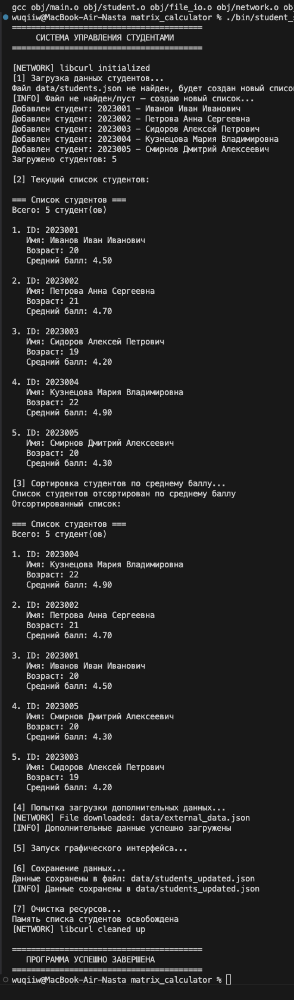

# Лабораторная работа №4  
## Система управления студентами на языке C

---

## Цель работы

Целью данной лабораторной работы является разработка модульного приложения на языке C
для управления списком студентов с использованием:
- динамических структур данных,
- работы с файлами (JSON),
- сетевого взаимодействия,
- графического интерфейса (SDL2),
- сборки проекта с помощью Makefile.

---

## Условия задачи

В рамках лабораторной работы необходимо:

- реализовать структуру данных для хранения информации о студентах;
- обеспечить загрузку и сохранение данных в JSON-файл;
- реализовать сортировку студентов по среднему баллу;
- реализовать сетевую загрузку внешних данных;
- подключить графический интерфейс;
- обеспечить корректное освобождение ресурсов.

---

## Структура проекта

matrix_calculator/
├── bin/ # Скомпилированный исполняемый файл
├── data/ # JSON-файлы с данными
│ ├── external_data.json
│ └── students_updated.json
├── include/ # Заголовочные файлы
│ ├── student.h
│ ├── file_io.h
│ ├── network.h
│ └── gui.h
├── lib/ # Сторонние библиотеки
│ ├── cJSON.c
│ └── cJSON.h
├── obj/ # Объектные файлы
├── src/ # Исходные файлы
│ ├── main.c
│ ├── student.c
│ ├── file_io.c
│ ├── network.c
│ └── gui.c
├── Makefile
└── README.md


---

## Инструкция по сборке и запуску

### Сборка проекта
```bash
make
make clean
./bin/student_system

Описание работы программы

После запуска программа:

Инициализирует сетевой модуль.

Загружает список студентов из JSON-файла.

При отсутствии файла создаёт новый список студентов.

Выводит список студентов в консоль.

Сортирует студентов по среднему баллу.

Загружает дополнительные данные из сети.

Запускает графический интерфейс (SDL).

Сохраняет обновлённые данные в файл.

Освобождает все используемые ресурсы.

Список идентификаторов
Файл student.h / student.c

| Имя идентификатора       | Тип данных     | Описание               |
| ------------------------ | -------------- | ---------------------- |
| `Student`                | `struct`       | Структура студента     |
| `id`                     | `char[]`       | Идентификатор студента |
| `name`                   | `char[]`       | ФИО студента           |
| `age`                    | `int`          | Возраст                |
| `gpa`                    | `float`        | Средний балл           |
| `StudentList`            | `struct`       | Список студентов       |
| `create_student_list()`  | `StudentList*` | Создание списка        |
| `add_student()`          | `void`         | Добавление студента    |
| `print_students()`       | `void`         | Вывод списка           |
| `sort_students_by_gpa()` | `void`         | Сортировка по GPA      |
| `free_student_list()`    | `void`         | Освобождение памяти    |


Файл file_io.h / file_io.c

| Имя идентификатора          | Тип данных     | Описание                    |
| --------------------------- | -------------- | --------------------------- |
| `load_students_from_json()` | `StudentList*` | Загрузка студентов из JSON  |
| `save_students_to_json()`   | `int`          | Сохранение студентов в JSON |
| `filename`                  | `const char*`  | Имя файла                   |
| `cJSON`                     | `struct`       | JSON-объект                 |


Файл network.h / network.c

| Имя идентификатора  | Тип данных | Описание                 |
| ------------------- | ---------- | ------------------------ |
| `init_network()`    | `int`      | Инициализация libcurl    |
| `download_file()`   | `int`      | Загрузка файла по URL    |
| `cleanup_network()` | `void`     | Очистка сетевых ресурсов |


Файл gui.h / gui.c

| Имя идентификатора  | Тип данных | Описание          |
| ------------------- | ---------- | ----------------- |
| `init_gui()`        | `int`      | Инициализация SDL |
| `create_window()`   | `int`      | Создание окна     |
| `render_students()` | `void`     | Отрисовка списка  |
| `close_window()`    | `void`     | Закрытие окна     |
| `cleanup_gui()`     | `void`     | Очистка SDL       |


Файл main.c

| Имя идентификатора | Тип данных     | Описание                      |
| ------------------ | -------------- | ----------------------------- |
| `main()`           | `int`          | Главная функция программы     |
| `students`         | `StudentList*` | Указатель на список студентов |

## Скриншот работы программы




Вывод
В ходе выполнения лабораторной работы была разработана модульная программа на языке C,
реализующая управление списком студентов с использованием файлов, сети и графического интерфейса.
Программа успешно компилируется, корректно выполняет поставленные задачи и соответствует требованиям лабораторной работы.

### Информация о студенте  
Полторацкая Анастасия, 1 курс, группа `1об_ПОО/25`