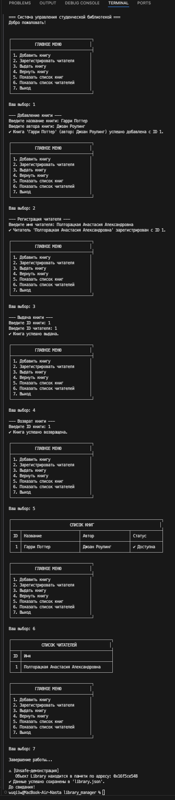
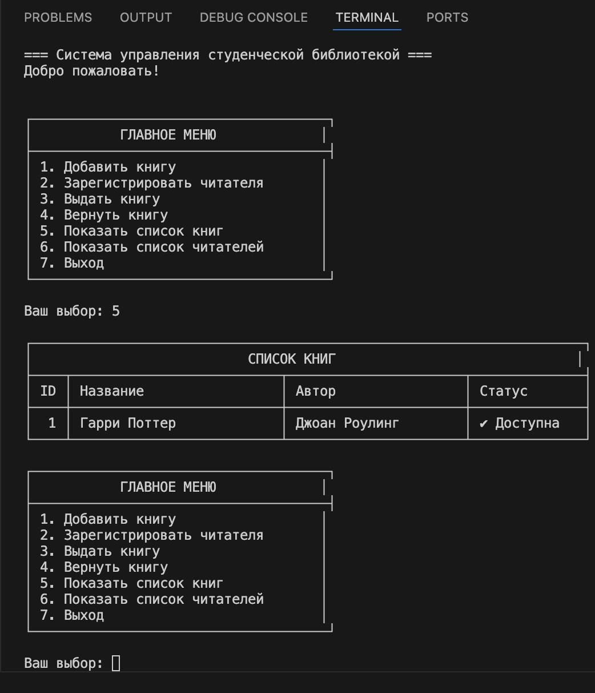
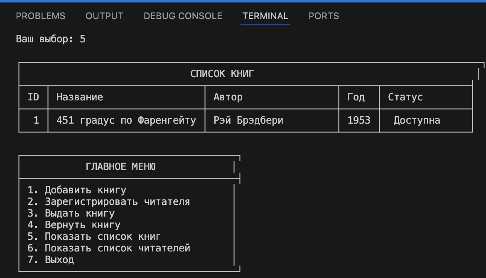
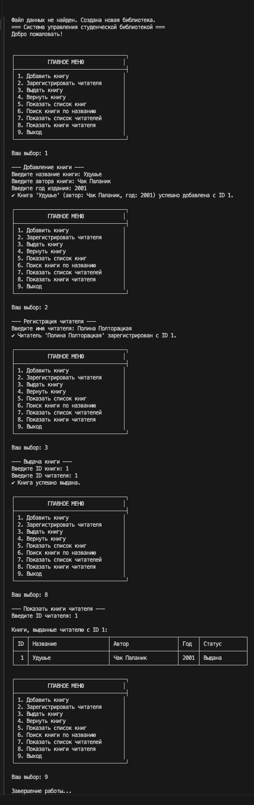
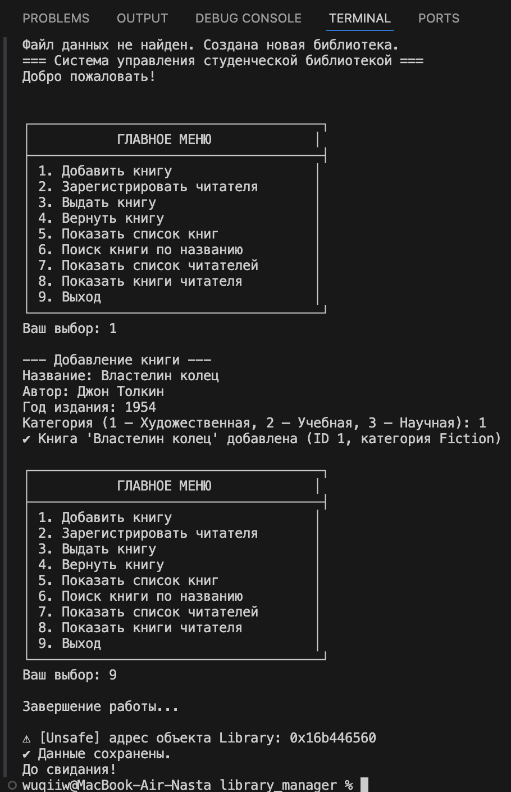
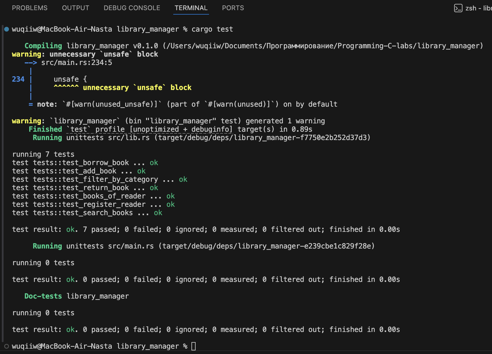

# Лабораторная работа №3

## 1. Цель работы
Целью данной лабораторной работы является практическое освоение ключевых концепций языка программирования Rust путем создания полноценного консольного приложения. В процессе выполнения работы студенты научатся
применять коллекции, модульную систему, обработку ошибок, систему сборки Cargo, организацию ввода-вывода и
познакомятся с небезопасным кодом.

### Код файла src/models.rs

```c
use serde::{Serialize, Deserialize};

#[derive(Serialize, Deserialize, Debug, Clone)]
pub struct Book {
    pub id: u32,
    pub title: String,
    pub author: String,
    pub is_available: bool,
}

#[derive(Serialize, Deserialize, Debug, Clone)]
pub struct Reader {
    pub id: u32,
    pub name: String,
}
```

### Код файла src/lib.rs

```c
use std::collections::HashMap;
use std::fmt;
use std::fs::File;
use std::io::{Read, Write};
use serde::{Serialize, Deserialize};

pub mod models;
use models::{Book, Reader};

#[derive(Debug)]
pub enum LibraryError {
    BookNotFound,
    BookNotAvailable,
    ReaderNotFound,
    InvalidInput,
}

impl fmt::Display for LibraryError {
    fn fmt(&self, f: &mut fmt::Formatter) -> fmt::Result {
        match self {
            LibraryError::BookNotFound => write!(f, "Книга не найдена."),
            LibraryError::BookNotAvailable => write!(f, "Книга уже выдана."),
            LibraryError::ReaderNotFound => write!(f, "Читатель не найден."),
            LibraryError::InvalidInput => write!(f, "Некорректный ввод."),
        }
    }
}

#[derive(Serialize, Deserialize)]
pub struct Library {
    books: Vec<Book>,                     
    readers: HashMap<u32, Reader>,      
    next_book_id: u32,                   
    next_reader_id: u32,                  
}

impl Library {
    pub fn new() -> Self {
        Self {
            books: Vec::new(),
            readers: HashMap::new(),
            next_book_id: 1,
            next_reader_id: 1,
        }
    }

    pub fn add_book(&mut self, title: String, author: String) -> &Book {
        let new_book = Book {
            id: self.next_book_id,
            title,
            author,
            is_available: true,
        };

        self.books.push(new_book);
        self.next_book_id += 1;

        self.books.last().unwrap()
    }

    pub fn register_reader(&mut self, name: String) -> &Reader {
        let new_reader = Reader {
            id: self.next_reader_id,
            name,
        };

        self.readers.insert(new_reader.id, new_reader);
        self.next_reader_id += 1;

        self.readers.get(&(self.next_reader_id - 1)).unwrap()
    }

    pub fn find_book_by_id(&mut self, id: u32) -> Option<&mut Book> {
        self.books.iter_mut().find(|b| b.id == id)
    }

    pub fn borrow_book(&mut self, book_id: u32, reader_id: u32) -> Result<(), LibraryError> {
        if !self.readers.contains_key(&reader_id) {
            return Err(LibraryError::ReaderNotFound);
        }

        let book = self.find_book_by_id(book_id).ok_or(LibraryError::BookNotFound)?;

        if !book.is_available {
            return Err(LibraryError::BookNotAvailable);
        }

        book.is_available = false;
        Ok(())
    }

    pub fn return_book(&mut self, book_id: u32) -> Result<(), LibraryError> {
        let book = self.find_book_by_id(book_id).ok_or(LibraryError::BookNotFound)?;
        book.is_available = true;
        Ok(())
    }

    pub fn list_books(&self) -> &Vec<Book> {
        &self.books
    }

    pub fn list_readers(&self) -> Vec<&Reader> {
        self.readers.values().collect()
    }

    pub fn save_to_file(&self, path: &str) -> Result<(), std::io::Error> {
        let data = serde_json::to_string_pretty(self)?;
        let mut file = File::create(path)?;
        file.write_all(data.as_bytes())?;
        Ok(())
    }

    pub fn load_from_file(path: &str) -> Result<Self, std::io::Error> {
        let mut file = File::open(path)?;
        let mut data = String::new();
        file.read_to_string(&mut data)?;
        let library = serde_json::from_str(&data)?;
        Ok(library)
    }
}
```

### Код файла  src/main.rs 

```c
use std::io::{self, Write};
use library_manager::Library;

// Константа с именем файла для хранения данных
const DB_FILE: &str = "library.json";

fn main() {
    // Пытаемся загрузить библиотеку из файла
    // Если файл не существует или поврежден, создаем новую библиотеку
    let mut library = Library::load_from_file(DB_FILE).unwrap_or_else(|_| {
        println!("Файл данных не найден. Создана новая библиотека.");
        Library::new()
    });

    println!("=== Система управления студенческой библиотекой ===");
    println!("Добро пожаловать!\n");

    // Основной цикл приложения
    loop {
        print_menu();
        let choice = read_line().trim().to_string();

        match choice.as_str() {
            "1" => add_book(&mut library),
            "2" => register_reader(&mut library),
            "3" => borrow_book(&mut library),
            "4" => return_book(&mut library),
            "5" => list_books(&library),
            "6" => list_readers(&library),
            "7" => {
                println!("\nЗавершение работы...");
                break;
            }
            _ => println!("\n⚠ Неверный выбор. Пожалуйста, выберите пункт от 1 до 7."),
        }
    }

    // Демонстрация unsafe (опционально)
    show_library_memory_address(&library);

    // Сохранение данных перед выходом
    match library.save_to_file(DB_FILE) {
        Ok(_) => println!("✔ Данные успешно сохранены в '{}'.", DB_FILE),
        Err(e) => eprintln!("⚠ Ошибка при сохранении данных: {}", e),
    }

    println!("До свидания!");
}

/// Выводит главное меню
fn print_menu() {
    println!("\n┌─────────────────────────────────────┐");
    println!("│           ГЛАВНОЕ МЕНЮ             │");
    println!("├─────────────────────────────────────┤");
    println!("│ 1. Добавить книгу                  │");
    println!("│ 2. Зарегистрировать читателя       │");
    println!("│ 3. Выдать книгу                    │");
    println!("│ 4. Вернуть книгу                   │");
    println!("│ 5. Показать список книг            │");
    println!("│ 6. Показать список читателей       │");
    println!("│ 7. Выход                           │");
    println!("└─────────────────────────────────────┘");

    print!("\nВаш выбор: ");
    io::stdout().flush().unwrap();
}

/// Читает строку из стандартного ввода
fn read_line() -> String {
    let mut input = String::new();
    io::stdin()
        .read_line(&mut input)
        .expect("Не удалось прочитать строку");
    input
}

/// Функция добавления книги
fn add_book(library: &mut Library) {
    println!("\n--- Добавление книги ---");
    print!("Введите название книги: ");
    io::stdout().flush().unwrap();
    let title = read_line().trim().to_string();

    print!("Введите автора книги: ");
    io::stdout().flush().unwrap();
    let author = read_line().trim().to_string();

    if title.is_empty() || author.is_empty() {
        println!("⚠ Ошибка: название и автор не могут быть пустыми.");
        return;
    }

    let book = library.add_book(title, author);
    println!("✔ Книга '{}' (автор: {}) успешно добавлена с ID {}.",
        book.title, book.author, book.id);
}

/// Функция регистрации читателя
fn register_reader(library: &mut Library) {
    println!("\n--- Регистрация читателя ---");
    print!("Введите имя читателя: ");
    io::stdout().flush().unwrap();
    let name = read_line().trim().to_string();

    if name.is_empty() {
        println!("⚠ Ошибка: имя не может быть пустым.");
        return;
    }

    let reader = library.register_reader(name);
    println!("✔ Читатель '{}' зарегистрирован с ID {}.", reader.name, reader.id);
}

/// Функция выдачи книги
fn borrow_book(library: &mut Library) {
    println!("\n--- Выдача книги ---");
    print!("Введите ID книги: ");
    io::stdout().flush().unwrap();

    let book_id: u32 = match read_line().trim().parse() {
        Ok(id) => id,
        Err(_) => {
            println!("⚠ Ошибка: некорректный ID книги.");
            return;
        }
    };

    print!("Введите ID читателя: ");
    io::stdout().flush().unwrap();

    let reader_id: u32 = match read_line().trim().parse() {
        Ok(id) => id,
        Err(_) => {
            println!("⚠ Ошибка: некорректный ID читателя.");
            return;
        }
    };

    match library.borrow_book(book_id, reader_id) {
        Ok(_) => println!("✔ Книга успешно выдана."),
        Err(e) => println!("⚠ Ошибка: {}", e),
    }
}

/// Функция возврата книги
fn return_book(library: &mut Library) {
    println!("\n--- Возврат книги ---");
    print!("Введите ID книги: ");
    io::stdout().flush().unwrap();

    let book_id: u32 = match read_line().trim().parse() {
        Ok(id) => id,
        Err(_) => {
            println!("⚠ Ошибка: некорректный ID книги.");
            return;
        }
    };

    match library.return_book(book_id) {
        Ok(_) => println!("✔ Книга успешно возвращена."),
        Err(e) => println!("⚠ Ошибка: {}", e),
    }
}

/// Функция вывода списка книг
fn list_books(library: &Library) {
    let books = library.list_books();

    if books.is_empty() {
        println!("\n⚠ В библиотеке пока нет книг.");
        return;
    }

    println!("\n┌─────────────────────────────────────────────────────────────────────┐");
    println!("│                           СПИСОК КНИГ                              │");
    println!("├────┬──────────────────────────┬──────────────────────┬──────────────┤");
    println!("│ ID │ Название                 │ Автор                │ Статус       │");
    println!("├────┼──────────────────────────┼──────────────────────┼──────────────┤");

    for book in books {
        let status = if book.is_available { "✔ Доступна" } else { "✖ Выдана" };

        println!("│ {:2} │ {:<24} │ {:<20} │ {:<12} │",
            book.id,
            truncate(&book.title, 24),
            truncate(&book.author, 20),
            status);
    }

    println!("└────┴──────────────────────────┴──────────────────────┴──────────────┘");
}

/// Функция вывода списка читателей
fn list_readers(library: &Library) {
    let readers = library.list_readers();

    if readers.is_empty() {
        println!("\n⚠ Нет зарегистрированных читателей.");
        return;
    }

    println!("\n┌──────────────────────────────────────────────┐");
    println!("│              СПИСОК ЧИТАТЕЛЕЙ               │");
    println!("├────┬─────────────────────────────────────────┤");
    println!("│ ID │ Имя                                     │");
    println!("├────┼─────────────────────────────────────────┤");

    for reader in readers {
        println!("│ {:2} │ {:<39} │",
            reader.id,
            truncate(&reader.name, 39));
    }

    println!("└────┴─────────────────────────────────────────┘");
}

/// Вспомогательная функция обрезки строк
fn truncate(s: &str, max_len: usize) -> String {
    // считаем символы, а не байты
    if s.chars().count() <= max_len {
        s.to_string()
    } else {
        let mut result = String::new();
        for (i, c) in s.chars().enumerate() {
            if i >= max_len - 3 {
                break;
            }
            result.push(c);
        }
        result.push_str("...");
        result
    }
}

/// Unsafe-демонстрация
fn show_library_memory_address(library: &Library) {
    let raw_ptr: *const Library = library;

    unsafe {
        println!("\n⚠ [Unsafe-демонстрация]");
        println!("   Объект Library находится в памяти по адресу: {:p}", raw_ptr);
    }
}


```

### Результаты работы программы  

--- 

# Здадания для самостоятельной работы

## Задача 1 

### Постановка задачи
Добавьте поле year: u32 (год издания) в структуру Book и отобразите его в списке книг.

### Список идентификаторов

| Имя            | Тип данных   | Описание                        |
| -------------- | ------------ | ------------------------------- |
| `Book`         | `struct`     | Структура, представляющая книгу |
| `id`           | `u32`        | Уникальный идентификатор книги  |
| `title`        | `String`     | Название книги                  |
| `author`       | `String`     | Автор книги                     |
| `year`         | `u32`        | Год издания книги               |
| `is_available` | `bool`       | Статус доступности книги        |
| `add_book()`   | `&Book`      | Функция добавления книги        |
| `list_books()` | `&Vec<Book>` | Получение списка всех книг      |
| `books`        | `Vec<Book>`  | Коллекция всех книг библиотеки  |


### Код файла src/models.rs

```c
use serde::{Serialize, Deserialize};

#[derive(Serialize, Deserialize, Debug, Clone)]
pub struct Book {
    pub id: u32,
    pub title: String,
    pub author: String,
    pub year: u32,        
    pub is_available: bool,
}

#[derive(Serialize, Deserialize, Debug, Clone)]
pub struct Reader {
    pub id: u32,
    pub name: String,
}
```

### Код файла src/lib.rs

```c
use std::collections::HashMap;
use std::fmt;
use std::fs::File;
use std::io::{Read, Write};
use serde::{Serialize, Deserialize};

pub mod models;
use models::{Book, Reader};

#[derive(Debug)]
pub enum LibraryError {
    BookNotFound,
    BookNotAvailable,
    ReaderNotFound,
    InvalidInput,
}

impl fmt::Display for LibraryError {
    fn fmt(&self, f: &mut fmt::Formatter) -> fmt::Result {
        match self {
            LibraryError::BookNotFound => write!(f, "Книга не найдена."),
            LibraryError::BookNotAvailable => write!(f, "Книга уже выдана."),
            LibraryError::ReaderNotFound => write!(f, "Читатель не найден."),
            LibraryError::InvalidInput => write!(f, "Некорректный ввод."),
        }
    }
}

#[derive(Serialize, Deserialize)]
pub struct Library {
    books: Vec<Book>,                    
    readers: HashMap<u32, Reader>,        
    next_book_id: u32,                
    next_reader_id: u32,                
}

impl Library {
    pub fn new() -> Self {
        Self {
            books: Vec::new(),
            readers: HashMap::new(),
            next_book_id: 1,
            next_reader_id: 1,
        }
    }

pub fn add_book(&mut self, title: String, author: String, year: u32) -> &Book {
    let new_book = Book {
        id: self.next_book_id,
        title,
        author,
        year,
        is_available: true,
    };
    self.books.push(new_book);
    self.next_book_id += 1;
    self.books.last().unwrap()
}


    pub fn register_reader(&mut self, name: String) -> &Reader {
        let new_reader = Reader {
            id: self.next_reader_id,
            name,
        };

        self.readers.insert(new_reader.id, new_reader);
        self.next_reader_id += 1;

        self.readers.get(&(self.next_reader_id - 1)).unwrap()
    }

    pub fn find_book_by_id(&mut self, id: u32) -> Option<&mut Book> {
        self.books.iter_mut().find(|b| b.id == id)
    }

    pub fn borrow_book(&mut self, book_id: u32, reader_id: u32) -> Result<(), LibraryError> {
        if !self.readers.contains_key(&reader_id) {
            return Err(LibraryError::ReaderNotFound);
        }

        let book = self.find_book_by_id(book_id).ok_or(LibraryError::BookNotFound)?;

        if !book.is_available {
            return Err(LibraryError::BookNotAvailable);
        }

        book.is_available = false;
        Ok(())
    }

    pub fn return_book(&mut self, book_id: u32) -> Result<(), LibraryError> {
        let book = self.find_book_by_id(book_id).ok_or(LibraryError::BookNotFound)?;
        book.is_available = true;
        Ok(())
    }

    pub fn list_books(&self) -> &Vec<Book> {
        &self.books
    }

    pub fn list_readers(&self) -> Vec<&Reader> {
        self.readers.values().collect()
    }

    pub fn save_to_file(&self, path: &str) -> Result<(), std::io::Error> {
        let data = serde_json::to_string_pretty(self)?;
        let mut file = File::create(path)?;
        file.write_all(data.as_bytes())?;
        Ok(())
    }

    pub fn load_from_file(path: &str) -> Result<Self, std::io::Error> {
        let mut file = File::open(path)?;
        let mut data = String::new();
        file.read_to_string(&mut data)?;
        let library = serde_json::from_str(&data)?;
        Ok(library)
    }
}
```

### Код файла  src/main.rs 

```c
use std::io::{self, Write};
use library_manager::Library;

const DB_FILE: &str = "library.json";

fn main() {
    let mut library = Library::load_from_file(DB_FILE).unwrap_or_else(|_| {
        println!("Файл данных не найден. Создана новая библиотека.");
        Library::new()
    });

    println!("=== Система управления студенческой библиотекой ===");
    println!("Добро пожаловать!\n");

    loop {
        print_menu();
        let choice = read_line().trim().to_string();

        match choice.as_str() {
            "1" => add_book(&mut library),
            "2" => register_reader(&mut library),
            "3" => borrow_book(&mut library),
            "4" => return_book(&mut library),
            "5" => list_books(&library),
            "6" => list_readers(&library),
            "7" => {
                println!("\nЗавершение работы...");
                break;
            }
            _ => println!("\n⚠ Неверный выбор. Пожалуйста, выберите пункт от 1 до 7."),
        }
    }

    show_library_memory_address(&library);

    match library.save_to_file(DB_FILE) {
        Ok(_) => println!("✔ Данные успешно сохранены в '{}'.", DB_FILE),
        Err(e) => eprintln!("⚠ Ошибка при сохранении данных: {}", e),
    }

    println!("До свидания!");
}

fn print_menu() {
    println!("\n┌─────────────────────────────────────┐");
    println!("│           ГЛАВНОЕ МЕНЮ             │");
    println!("├─────────────────────────────────────┤");
    println!("│ 1. Добавить книгу                  │");
    println!("│ 2. Зарегистрировать читателя       │");
    println!("│ 3. Выдать книгу                    │");
    println!("│ 4. Вернуть книгу                   │");
    println!("│ 5. Показать список книг            │");
    println!("│ 6. Показать список читателей       │");
    println!("│ 7. Выход                           │");
    println!("└─────────────────────────────────────┘");

    print!("\nВаш выбор: ");
    io::stdout().flush().unwrap();
}

fn read_line() -> String {
    let mut input = String::new();
    io::stdin()
        .read_line(&mut input)
        .expect("Не удалось прочитать строку");
    input
}

fn add_book(library: &mut Library) {
    println!("\n--- Добавление книги ---");

    print!("Введите название книги: ");
    io::stdout().flush().unwrap();
    let title = read_line().trim().to_string();

    print!("Введите автора книги: ");
    io::stdout().flush().unwrap();
    let author = read_line().trim().to_string();

    print!("Введите год издания: ");
    io::stdout().flush().unwrap();
    let year: u32 = match read_line().trim().parse() {
        Ok(y) => y,
        Err(_) => {
            println!("⚠ Ошибка: некорректный год издания.");
            return;
        }
    };

    if title.is_empty() || author.is_empty() {
        println!("⚠ Ошибка: название и автор не могут быть пустыми.");
        return;
    }

    let book = library.add_book(title, author, year);
    println!(
        " Книга '{}' (автор: {}, год: {}) успешно добавлена с ID {}.",
        book.title, book.author, book.year, book.id
    );
}


fn register_reader(library: &mut Library) {
    println!("\n--- Регистрация читателя ---");
    print!("Введите имя читателя: ");
    io::stdout().flush().unwrap();
    let name = read_line().trim().to_string();

    if name.is_empty() {
        println!("⚠ Ошибка: имя не может быть пустым.");
        return;
    }

    let reader = library.register_reader(name);
    println!("✔ Читатель '{}' зарегистрирован с ID {}.", reader.name, reader.id);
}

fn borrow_book(library: &mut Library) {
    println!("\n--- Выдача книги ---");
    print!("Введите ID книги: ");
    io::stdout().flush().unwrap();

    let book_id: u32 = match read_line().trim().parse() {
        Ok(id) => id,
        Err(_) => {
            println!("⚠ Ошибка: некорректный ID книги.");
            return;
        }
    };

    print!("Введите ID читателя: ");
    io::stdout().flush().unwrap();

    let reader_id: u32 = match read_line().trim().parse() {
        Ok(id) => id,
        Err(_) => {
            println!("⚠ Ошибка: некорректный ID читателя.");
            return;
        }
    };

    match library.borrow_book(book_id, reader_id) {
        Ok(_) => println!("✔ Книга успешно выдана."),
        Err(e) => println!("⚠ Ошибка: {}", e),
    }
}

fn return_book(library: &mut Library) {
    println!("\n--- Возврат книги ---");
    print!("Введите ID книги: ");
    io::stdout().flush().unwrap();

    let book_id: u32 = match read_line().trim().parse() {
        Ok(id) => id,
        Err(_) => {
            println!("⚠ Ошибка: некорректный ID книги.");
            return;
        }
    };

    match library.return_book(book_id) {
        Ok(_) => println!("✔ Книга успешно возвращена."),
        Err(e) => println!("⚠ Ошибка: {}", e),
    }
}

fn list_books(library: &Library) {
    let books = library.list_books();

    if books.is_empty() {
        println!("\n⚠ В библиотеке пока нет книг.");
        return;
    }

    println!("\n┌───────────────────────────────────────────────────────────────────────────────┐");
    println!("│                             СПИСОК КНИГ                                      │");
    println!("├────┬──────────────────────────┬──────────────────────┬──────┬───────────────┤");
    println!("│ ID │ Название                 │ Автор                │ Год  │ Статус        │");
    println!("├────┼──────────────────────────┼──────────────────────┼──────┼───────────────┤");

    for book in books {
        let status = if book.is_available {
            " Доступна"
        } else {
            " Выдана"
        };

        println!(
            "│ {:2} │ {:<24} │ {:<20} │ {:4} │ {:<13} │",
            book.id,
            truncate(&book.title, 24),
            truncate(&book.author, 20),
            book.year,
            status
        );
    }

    println!("└────┴──────────────────────────┴──────────────────────┴──────┴───────────────┘");
}


fn list_readers(library: &Library) {
    let readers = library.list_readers();

    if readers.is_empty() {
        println!("\n⚠ Нет зарегистрированных читателей.");
        return;
    }

    println!("\n┌──────────────────────────────────────────────┐");
    println!("│              СПИСОК ЧИТАТЕЛЕЙ               │");
    println!("├────┬─────────────────────────────────────────┤");
    println!("│ ID │ Имя                                     │");
    println!("├────┼─────────────────────────────────────────┤");

    for reader in readers {
        println!("│ {:2} │ {:<39} │",
            reader.id,
            truncate(&reader.name, 39));
    }

    println!("└────┴─────────────────────────────────────────┘");
}

fn truncate(s: &str, max_len: usize) -> String {
    if s.chars().count() <= max_len {
        s.to_string()
    } else {
        let mut result = String::new();
        for (i, c) in s.chars().enumerate() {
            if i >= max_len - 3 {
                break;
            }
            result.push(c);
        }
        result.push_str("...");
        result
    }
}

fn show_library_memory_address(library: &Library) {
    let raw_ptr: *const Library = library;

    unsafe {
        println!("\n⚠ [Unsafe-демонстрация]");
        println!("   Объект Library находится в памяти по адресу: {:p}", raw_ptr);
    }
}
```

### Результаты работы программы  

---


## Задача 2

### Постановка задачи
Реализуйте функцию поиска книг по названию (частичное совпадение, без учета регистра).

### Список идентификаторов

| Имя                   | Тип данных   | Описание                                   |
| --------------------- | ------------ | ------------------------------------------ |
| `search_books()`      | `Vec<&Book>` | Функция поиска книг по части названия      |
| `search_books_menu()` | `void`       | Меню поиска книг                           |
| `query`               | `String`     | Строка, введённая пользователем для поиска |
| `results`             | `Vec<&Book>` | Найденные книги                            |
| `q`                   | `String`     | Строка запроса в нижнем регистре           |
| `title`               | `String`     | Поле книги, используемое для поиска        |


### Код файла src/models.rs

```c
use serde::{Serialize, Deserialize};

#[derive(Serialize, Deserialize, Debug, Clone)]
pub struct Book {
    pub id: u32,
    pub title: String,
    pub author: String,
    pub year: u32,        
    pub is_available: bool,
}

#[derive(Serialize, Deserialize, Debug, Clone)]
pub struct Reader {
    pub id: u32,
    pub name: String,
}
```

### Код файла src/lib.rs

```c
use std::collections::HashMap;
use std::fmt;
use std::fs::File;
use std::io::{Read, Write};
use serde::{Serialize, Deserialize};

pub mod models;
use models::{Book, Reader};

#[derive(Debug)]
pub enum LibraryError {
    BookNotFound,
    BookNotAvailable,
    ReaderNotFound,
    InvalidInput,
}

impl fmt::Display for LibraryError {
    fn fmt(&self, f: &mut fmt::Formatter) -> fmt::Result {
        match self {
            LibraryError::BookNotFound => write!(f, "Книга не найдена."),
            LibraryError::BookNotAvailable => write!(f, "Книга уже выдана."),
            LibraryError::ReaderNotFound => write!(f, "Читатель не найден."),
            LibraryError::InvalidInput => write!(f, "Некорректный ввод."),
        }
    }
}

#[derive(Serialize, Deserialize)]
pub struct Library {
    books: Vec<Book>,                    
    readers: HashMap<u32, Reader>,       
    next_book_id: u32,                
    next_reader_id: u32,                
}

impl Library {
    pub fn new() -> Self {
        Self {
            books: Vec::new(),
            readers: HashMap::new(),
            next_book_id: 1,
            next_reader_id: 1,
        }
    }

pub fn add_book(&mut self, title: String, author: String, year: u32) -> &Book {
    let new_book = Book {
        id: self.next_book_id,
        title,
        author,
        year,
        is_available: true,
    };
    self.books.push(new_book);
    self.next_book_id += 1;
    self.books.last().unwrap()
}


    pub fn register_reader(&mut self, name: String) -> &Reader {
        let new_reader = Reader {
            id: self.next_reader_id,
            name,
        };

        self.readers.insert(new_reader.id, new_reader);
        self.next_reader_id += 1;

        self.readers.get(&(self.next_reader_id - 1)).unwrap()
    }

    pub fn find_book_by_id(&mut self, id: u32) -> Option<&mut Book> {
        self.books.iter_mut().find(|b| b.id == id)
    }

    pub fn borrow_book(&mut self, book_id: u32, reader_id: u32) -> Result<(), LibraryError> {
        if !self.readers.contains_key(&reader_id) {
            return Err(LibraryError::ReaderNotFound);
        }

        let book = self.find_book_by_id(book_id).ok_or(LibraryError::BookNotFound)?;

        if !book.is_available {
            return Err(LibraryError::BookNotAvailable);
        }

        book.is_available = false;
        Ok(())
    }

    pub fn return_book(&mut self, book_id: u32) -> Result<(), LibraryError> {
        let book = self.find_book_by_id(book_id).ok_or(LibraryError::BookNotFound)?;
        book.is_available = true;
        Ok(())
    }

    pub fn list_books(&self) -> &Vec<Book> {
        &self.books
    }

pub fn search_books(&self, query: &str) -> Vec<&Book> {
    let query = query.to_lowercase();
    self.books
        .iter()
        .filter(|b| b.title.to_lowercase().contains(&query))
        .collect()
}


    pub fn list_readers(&self) -> Vec<&Reader> {
        self.readers.values().collect()
    }

    pub fn save_to_file(&self, path: &str) -> Result<(), std::io::Error> {
        let data = serde_json::to_string_pretty(self)?;
        let mut file = File::create(path)?;
        file.write_all(data.as_bytes())?;
        Ok(())
    }

    pub fn load_from_file(path: &str) -> Result<Self, std::io::Error> {
        let mut file = File::open(path)?;
        let mut data = String::new();
        file.read_to_string(&mut data)?;
        let library = serde_json::from_str(&data)?;
        Ok(library)
    }
}
```

### Код файла  src/main.rs 

```c
use std::io::{self, Write};
use library_manager::Library;

const DB_FILE: &str = "library.json";

fn main() {
    let mut library = Library::load_from_file(DB_FILE).unwrap_or_else(|_| {
        println!("Файл данных не найден. Создана новая библиотека.");
        Library::new()
    });

    println!("=== Система управления студенческой библиотекой ===");
    println!("Добро пожаловать!\n");

    loop {
        print_menu();
        let choice = read_line().trim().to_string();

        match choice.as_str() {
            "1" => add_book(&mut library),
            "2" => register_reader(&mut library),
            "3" => borrow_book(&mut library),
            "4" => return_book(&mut library),
            "5" => list_books(&library),
            "6" => search_books_menu(&library),
            "7" => list_readers(&library),
            "8" => {
                println!("\nЗавершение работы...");
                break;
            }
            _ => println!("\n⚠ Неверный выбор. Пожалуйста, выберите пункт от 1 до 8."),
        }
    }

    show_library_memory_address(&library);

    match library.save_to_file(DB_FILE) {
        Ok(_) => println!("✔ Данные успешно сохранены в '{}'.", DB_FILE),
        Err(e) => eprintln!("⚠ Ошибка при сохранении данных: {}", e),
    }

    println!("До свидания!");
}

fn print_menu() {
    println!("\n┌─────────────────────────────────────┐");
    println!("│           ГЛАВНОЕ МЕНЮ             │");
    println!("├─────────────────────────────────────┤");
    println!("│ 1. Добавить книгу                  │");
    println!("│ 2. Зарегистрировать читателя       │");
    println!("│ 3. Выдать книгу                    │");
    println!("│ 4. Вернуть книгу                   │");
    println!("│ 5. Показать список книг            │");
    println!("│ 6. Поиск книги по названию         │");
    println!("│ 7. Показать список читателей       │");
    println!("│ 8. Выход                           │");
    println!("└─────────────────────────────────────┘");
    print!("\nВаш выбор: ");
    io::stdout().flush().unwrap();
}

fn read_line() -> String {
    let mut input = String::new();
    io::stdin().read_line(&mut input).expect("Ошибка ввода");
    input
}

fn add_book(library: &mut Library) {
    println!("\n--- Добавление книги ---");

    print!("Введите название книги: ");
    io::stdout().flush().unwrap();
    let title = read_line().trim().to_string();

    print!("Введите автора книги: ");
    io::stdout().flush().unwrap();
    let author = read_line().trim().to_string();

    print!("Введите год издания: ");
    io::stdout().flush().unwrap();
    let year: u32 = match read_line().trim().parse() {
        Ok(y) => y,
        Err(_) => {
            println!("⚠ Некорректный год.");
            return;
        }
    };

    if title.is_empty() || author.is_empty() {
        println!("⚠ Название и автор не могут быть пустыми.");
        return;
    }

    let book = library.add_book(title, author, year);
    println!(
        "✔ Книга '{}' ({} — {}) добавлена с ID {}.",
        book.title, book.author, book.year, book.id
    );
}

fn register_reader(library: &mut Library) {
    println!("\n--- Регистрация читателя ---");
    print!("Введите имя: ");
    io::stdout().flush().unwrap();

    let name = read_line().trim().to_string();

    if name.is_empty() {
        println!("⚠ Имя не может быть пустым.");
        return;
    }

    let reader = library.register_reader(name);
    println!("✔ Читатель '{}' зарегистрирован с ID {}.", reader.name, reader.id);
}

fn borrow_book(library: &mut Library) {
    println!("\n--- Выдача книги ---");
    print!("Введите ID книги: ");
    io::stdout().flush().unwrap();

    let book_id: u32 = match read_line().trim().parse() {
        Ok(id) => id,
        Err(_) => {
            println!("⚠ Некорректный ID.");
            return;
        }
    };

    print!("Введите ID читателя: ");
    io::stdout().flush().unwrap();

    let reader_id: u32 = match read_line().trim().parse() {
        Ok(id) => id,
        Err(_) => {
            println!("⚠ Некорректный ID читателя.");
            return;
        }
    };

    match library.borrow_book(book_id, reader_id) {
        Ok(_) => println!("✔ Книга выдана."),
        Err(e) => println!("⚠ Ошибка: {}", e),
    }
}

fn return_book(library: &mut Library) {
    println!("\n--- Возврат книги ---");
    print!("Введите ID книги: ");
    io::stdout().flush().unwrap();

    let book_id: u32 = match read_line().trim().parse() {
        Ok(id) => id,
        Err(_) => {
            println!("⚠ Некорректный ID.");
            return;
        }
    };

    match library.return_book(book_id) {
        Ok(_) => println!("✔ Книга возвращена."),
        Err(e) => println!("⚠ Ошибка: {}", e),
    }
}

fn list_books(library: &Library) {
    let books = library.list_books();

    if books.is_empty() {
        println!("\n⚠ В библиотеке нет книг.");
        return;
    }

    println!("\n┌────┬──────────────────────────┬──────────────────────┬──────┬────────────┐");
    println!("│ ID │ Название                 │ Автор                │ Год  │ Статус     │");
    println!("├────┼──────────────────────────┼──────────────────────┼──────┼────────────┤");

    for book in books {
        let status = if book.is_available { "Доступна" } else { "Выдана" };
        println!(
            "│ {:2} │ {:<24} │ {:<20} │ {:4} │ {:<10} │",
            book.id,
            truncate(&book.title, 24),
            truncate(&book.author, 20),
            book.year,
            status
        );
    }

    println!("└────┴──────────────────────────┴──────────────────────┴──────┴────────────┘");
}

fn search_books_menu(library: &Library) {
    println!("\n--- Поиск книги по названию ---");
    print!("Введите часть названия: ");
    io::stdout().flush().unwrap();

    let query = read_line().trim().to_lowercase();

    if query.is_empty() {
        println!("⚠ Строка поиска не может быть пустой.");
        return;
    }

    let results = library.search_books(&query);

    if results.is_empty() {
        println!("⚠ Книги с таким фрагментом не найдены.");
        return;
    }

    println!("\nНайденные книги:");
    println!("┌────┬──────────────────────────┬──────────────────────┬──────┬────────────┐");
    println!("│ ID │ Название                 │ Автор                │ Год  │ Статус     │");
    println!("├────┼──────────────────────────┼──────────────────────┼──────┼────────────┤");

    for book in results {
        let status = if book.is_available { "Доступна" } else { "Выдана" };
        println!(
            "│ {:2} │ {:<24} │ {:<20} │ {:4} │ {:<10} │",
            book.id,
            truncate(&book.title, 24),
            truncate(&book.author, 20),
            book.year,
            status
        );
    }

    println!("└────┴──────────────────────────┴──────────────────────┴──────┴────────────┘");
}

fn list_readers(library: &Library) {
    let readers = library.list_readers();

    if readers.is_empty() {
        println!("\n⚠ Нет зарегистрированных читателей.");
        return;
    }

    println!("\n┌────┬─────────────────────────────────────────┐");
    println!("│ ID │ Имя                                     │");
    println!("├────┼─────────────────────────────────────────┤");

    for reader in readers {
        println!(
            "│ {:2} │ {:<39} │",
            reader.id,
            truncate(&reader.name, 39)
        );
    }

    println!("└────┴─────────────────────────────────────────┘");
}

fn truncate(s: &str, max_len: usize) -> String {
    let chars: Vec<char> = s.chars().collect();
    if chars.len() <= max_len {
        s.to_string()
    } else {
        chars[..(max_len - 3)].iter().collect::<String>() + "..."
    }
}

fn show_library_memory_address(library: &Library) {
    let raw_ptr: *const Library = library;
    unsafe {
        println!("\n⚠ [Unsafe-демонстрация]");
        println!("   Объект Library находится по адресу: {:p}", raw_ptr);
    }
}
```

### Результаты работы программы  

---


## Задача 3

### Постановка задачи
Добавьте отслеживание того, какие книги выданы каждому читателю. Создайте пункт меню “Показать книги читателя”.

### Список идентификаторов

| Имя                        | Тип данных                         | Описание                              |
| -------------------------- | ---------------------------------- | ------------------------------------- |
| `Reader`                   | `struct`                           | Структура читателя                    |
| `id`                       | `u32`                              | Уникальный идентификатор читателя     |
| `name`                     | `String`                           | Имя читателя                          |
| `borrowed_books`           | `Vec<u32>`                         | ID книг, взятых читателем             |
| `borrow_book()`            | `Result<(), LibraryError>`         | Выдать книгу читателю                 |
| `return_book()`            | `Result<(), LibraryError>`         | Вернуть книгу в библиотеку            |
| `list_books_of_reader()`   | `Result<Vec<&Book>, LibraryError>` | Получение всех книг, взятых читателем |
| `show_reader_books_menu()` | `void`                             | Меню отображения книг читателя        |
| `reader_id`                | `u32`                              | Введённый ID читателя                 |


### Код файла src/models.rs

```c
use serde::{Serialize, Deserialize};

#[derive(Serialize, Deserialize, Debug, Clone)]
pub struct Book {
    pub id: u32,
    pub title: String,
    pub author: String,
    pub year: u32,         
    pub is_available: bool,
}

#[derive(Serialize, Deserialize, Debug, Clone)]
pub struct Reader {
    pub id: u32,
    pub name: String,
    pub borrowed_books: Vec<u32>,
}
```

### Код файла src/lib.rs

```c
use std::collections::HashMap;
use std::fmt;
use std::fs::File;
use std::io::{Read, Write};
use serde::{Serialize, Deserialize};

pub mod models;
use models::{Book, Reader};

#[derive(Debug)]
pub enum LibraryError {
    BookNotFound,
    BookNotAvailable,
    ReaderNotFound,
    InvalidInput,
}

impl fmt::Display for LibraryError {
    fn fmt(&self, f: &mut fmt::Formatter) -> fmt::Result {
        match self {
            LibraryError::BookNotFound => write!(f, "Книга не найдена."),
            LibraryError::BookNotAvailable => write!(f, "Книга уже выдана."),
            LibraryError::ReaderNotFound => write!(f, "Читатель не найден."),
            LibraryError::InvalidInput => write!(f, "Некорректный ввод."),
        }
    }
}

#[derive(Serialize, Deserialize)]
pub struct Library {
    books: Vec<Book>,                    
    readers: HashMap<u32, Reader>,        
    next_book_id: u32,                    
    next_reader_id: u32,                  
}

impl Library {
    pub fn new() -> Self {
        Self {
            books: Vec::new(),
            readers: HashMap::new(),
            next_book_id: 1,
            next_reader_id: 1,
        }
    }


    pub fn add_book(&mut self, title: String, author: String, year: u32) -> &Book {
        let new_book = Book {
            id: self.next_book_id,
            title,
            author,
            year,
            is_available: true,
        };
        self.books.push(new_book);
        self.next_book_id += 1;
        self.books.last().unwrap()
    }

    pub fn register_reader(&mut self, name: String) -> &Reader {
        let new_reader = Reader {
            id: self.next_reader_id,
            name,
            borrowed_books: Vec::new(),
        };

        self.readers.insert(new_reader.id, new_reader);
        self.next_reader_id += 1;

        self.readers.get(&(self.next_reader_id - 1)).unwrap()
    }

    pub fn find_book_by_id(&mut self, id: u32) -> Option<&mut Book> {
        self.books.iter_mut().find(|b| b.id == id)
    }


    pub fn borrow_book(&mut self, book_id: u32, reader_id: u32) -> Result<(), LibraryError> {
        if !self.readers.contains_key(&reader_id) {
            return Err(LibraryError::ReaderNotFound);
        }

        {
            let book = self
                .find_book_by_id(book_id)
                .ok_or(LibraryError::BookNotFound)?;

            if !book.is_available {
                return Err(LibraryError::BookNotAvailable);
            }

            book.is_available = false;
        }

        if let Some(reader) = self.readers.get_mut(&reader_id) {
            if !reader.borrowed_books.contains(&book_id) {
                reader.borrowed_books.push(book_id);
            }
            Ok(())
        } else {
            Err(LibraryError::ReaderNotFound)
        }
    }


    pub fn return_book(&mut self, book_id: u32) -> Result<(), LibraryError> {
        {
            let book = self
                .find_book_by_id(book_id)
                .ok_or(LibraryError::BookNotFound)?;
            book.is_available = true;
        }

        for reader in self.readers.values_mut() {
            if let Some(pos) = reader.borrowed_books.iter().position(|&id| id == book_id) {
                reader.borrowed_books.remove(pos);
                break;
            }
        }

        Ok(())
    }

    pub fn list_books(&self) -> &Vec<Book> {
        &self.books
    }

    pub fn search_books(&self, query: &str) -> Vec<&Book> {
        let query = query.to_lowercase();
        self.books
            .iter()
            .filter(|b| b.title.to_lowercase().contains(&query))
            .collect()
    }

    pub fn list_readers(&self) -> Vec<&Reader> {
        self.readers.values().collect()
    }

    pub fn get_reader_books(&self, reader_id: u32) -> Result<Vec<&Book>, LibraryError> {
        let reader = self
            .readers
            .get(&reader_id)
            .ok_or(LibraryError::ReaderNotFound)?;

        let mut result = Vec::new();

        for book_id in &reader.borrowed_books {
            if let Some(book) = self.books.iter().find(|b| b.id == *book_id) {
                result.push(book);
            }
        }

        Ok(result)
    }

    pub fn save_to_file(&self, path: &str) -> Result<(), std::io::Error> {
        let data = serde_json::to_string_pretty(self)?;
        let mut file = File::create(path)?;
        file.write_all(data.as_bytes())?;
        Ok(())
    }

    pub fn load_from_file(path: &str) -> Result<Self, std::io::Error> {
        let mut file = File::open(path)?;
        let mut data = String::new();
        file.read_to_string(&mut data)?;
        let library = serde_json::from_str(&data)?;
        Ok(library)
    }
}
```

### Код файла  src/main.rs 

```c
use std::io::{self, Write};
use library_manager::Library;

const DB_FILE: &str = "library.json";

fn main() {
    let mut library = Library::load_from_file(DB_FILE).unwrap_or_else(|_| {
        println!("Файл данных не найден. Создана новая библиотека.");
        Library::new()
    });

    println!("=== Система управления студенческой библиотекой ===");
    println!("Добро пожаловать!\n");

    loop {
        print_menu();
        let choice = read_line().trim().to_string();

        match choice.as_str() {
            "1" => add_book(&mut library),
            "2" => register_reader(&mut library),
            "3" => borrow_book(&mut library),
            "4" => return_book(&mut library),
            "5" => list_books(&library),
            "6" => search_books_menu(&library),
            "7" => list_readers(&library),
            "8" => list_reader_books(&library),
            "9" => {
                println!("\nЗавершение работы...");
                break;
            }
            _ => println!("\n⚠ Неверный выбор. Пожалуйста, выберите пункт от 1 до 9."),
        }
    }

    show_library_memory_address(&library);

    match library.save_to_file(DB_FILE) {
        Ok(_) => println!("✔ Данные успешно сохранены в '{}'.", DB_FILE),
        Err(e) => eprintln!("⚠ Ошибка при сохранении данных: {}", e),
    }

    println!("До свидания!");
}

fn print_menu() {
    println!("\n┌─────────────────────────────────────┐");
    println!("│           ГЛАВНОЕ МЕНЮ             │");
    println!("├─────────────────────────────────────┤");
    println!("│ 1. Добавить книгу                  │");
    println!("│ 2. Зарегистрировать читателя       │");
    println!("│ 3. Выдать книгу                    │");
    println!("│ 4. Вернуть книгу                   │");
    println!("│ 5. Показать список книг            │");
    println!("│ 6. Поиск книги по названию         │");
    println!("│ 7. Показать список читателей       │");
    println!("│ 8. Показать книги читателя         │");
    println!("│ 9. Выход                           │");
    println!("└─────────────────────────────────────┘");
    print!("\nВаш выбор: ");
    io::stdout().flush().unwrap();
}

fn read_line() -> String {
    let mut input = String::new();
    io::stdin()
        .read_line(&mut input)
        .expect("Не удалось прочитать строку");
    input
}

fn add_book(library: &mut Library) {
    println!("\n--- Добавление книги ---");

    print!("Введите название книги: ");
    io::stdout().flush().unwrap();
    let title = read_line().trim().to_string();

    print!("Введите автора книги: ");
    io::stdout().flush().unwrap();
    let author = read_line().trim().to_string();

    print!("Введите год издания: ");
    io::stdout().flush().unwrap();
    let year: u32 = match read_line().trim().parse() {
        Ok(y) => y,
        Err(_) => {
            println!("⚠ Ошибка: некорректный год издания.");
            return;
        }
    };

    if title.is_empty() || author.is_empty() {
        println!("⚠ Ошибка: название и автор не могут быть пустыми.");
        return;
    }

    let book = library.add_book(title, author, year);
    println!(
        "✔ Книга '{}' (автор: {}, год: {}) успешно добавлена с ID {}.",
        book.title, book.author, book.year, book.id
    );
}

fn register_reader(library: &mut Library) {
    println!("\n--- Регистрация читателя ---");
    print!("Введите имя читателя: ");
    io::stdout().flush().unwrap();
    let name = read_line().trim().to_string();

    if name.is_empty() {
        println!("⚠ Ошибка: имя не может быть пустым.");
        return;
    }

    let reader = library.register_reader(name);
    println!("✔ Читатель '{}' зарегистрирован с ID {}.", reader.name, reader.id);
}

fn borrow_book(library: &mut Library) {
    println!("\n--- Выдача книги ---");
    print!("Введите ID книги: ");
    io::stdout().flush().unwrap();

    let book_id: u32 = match read_line().trim().parse() {
        Ok(id) => id,
        Err(_) => {
            println!("⚠ Ошибка: некорректный ID книги.");
            return;
        }
    };

    print!("Введите ID читателя: ");
    io::stdout().flush().unwrap();

    let reader_id: u32 = match read_line().trim().parse() {
        Ok(id) => id,
        Err(_) => {
            println!("⚠ Ошибка: некорректный ID читателя.");
            return;
        }
    };

    match library.borrow_book(book_id, reader_id) {
        Ok(_) => println!("✔ Книга успешно выдана."),
        Err(e) => println!("⚠ Ошибка: {}", e),
    }
}

fn return_book(library: &mut Library) {
    println!("\n--- Возврат книги ---");
    print!("Введите ID книги: ");
    io::stdout().flush().unwrap();

    let book_id: u32 = match read_line().trim().parse() {
        Ok(id) => id,
        Err(_) => {
            println!("⚠ Ошибка: некорректный ID книги.");
            return;
        }
    };

    match library.return_book(book_id) {
        Ok(_) => println!("✔ Книга успешно возвращена."),
        Err(e) => println!("⚠ Ошибка: {}", e),
    }
}

fn list_books(library: &Library) {
    let books = library.list_books();

    if books.is_empty() {
        println!("\n⚠ В библиотеке пока нет книг.");
        return;
    }

    println!("\n┌───────────────────────────────────────────────────────────────────────────────┐");
    println!("│                             СПИСОК КНИГ                                      │");
    println!("├────┬──────────────────────────┬──────────────────────┬──────┬───────────────┤");
    println!("│ ID │ Название                 │ Автор                │ Год  │ Статус        │");
    println!("├────┼──────────────────────────┼──────────────────────┼──────┼───────────────┤");

    for book in books {
        let status = if book.is_available {
            "Доступна"
        } else {
            "Выдана"
        };

        println!(
            "│ {:2} │ {:<24} │ {:<20} │ {:4} │ {:<13} │",
            book.id,
            truncate(&book.title, 24),
            truncate(&book.author, 20),
            book.year,
            status
        );
    }

    println!("└────┴──────────────────────────┴──────────────────────┴──────┴───────────────┘");
}

fn search_books_menu(library: &Library) {
    println!("\n--- Поиск книги по названию ---");
    print!("Введите часть названия: ");
    io::stdout().flush().unwrap();

    let query = read_line().trim().to_string();

    if query.is_empty() {
        println!("⚠ Ошибка: строка поиска не может быть пустой.");
        return;
    }

    let results = library.search_books(&query);

    if results.is_empty() {
        println!("⚠ Книги, содержащие '{}', не найдены.", query);
        return;
    }

    println!("\nНайденные книги:");
    println!("┌────┬──────────────────────────┬──────────────────────┬──────┬───────────────┐");
    println!("│ ID │ Название                 │ Автор                │ Год  │ Статус        │");
    println!("├────┼──────────────────────────┼──────────────────────┼──────┼───────────────┤");

    for book in results {
        let status = if book.is_available {
            "Доступна"
        } else {
            "Выдана"
        };

        println!(
            "│ {:2} │ {:<24} │ {:<20} │ {:4} │ {:<13} │",
            book.id,
            truncate(&book.title, 24),
            truncate(&book.author, 20),
            book.year,
            status
        );
    }

    println!("└────┴──────────────────────────┴──────────────────────┴──────┴───────────────┘");
}

fn list_readers(library: &Library) {
    let readers = library.list_readers();

    if readers.is_empty() {
        println!("\n⚠ Нет зарегистрированных читателей.");
        return;
    }

    println!("\n┌──────────────────────────────────────────────┐");
    println!("│              СПИСОК ЧИТАТЕЛЕЙ               │");
    println!("├────┬─────────────────────────────────────────┤");
    println!("│ ID │ Имя                                     │");
    println!("├────┼─────────────────────────────────────────┤");

    for reader in readers {
        println!(
            "│ {:2} │ {:<39} │",
            reader.id,
            truncate(&reader.name, 39)
        );
    }

    println!("└────┴─────────────────────────────────────────┘");
}

fn list_reader_books(library: &Library) {
    println!("\n--- Показать книги читателя ---");
    print!("Введите ID читателя: ");
    io::stdout().flush().unwrap();

    let reader_id: u32 = match read_line().trim().parse() {
        Ok(id) => id,
        Err(_) => {
            println!("⚠ Ошибка: некорректный ID читателя.");
            return;
        }
    };

    match library.get_reader_books(reader_id) {
        Err(e) => {
            println!("⚠ Ошибка: {}", e);
        }
        Ok(books) => {
            if books.is_empty() {
                println!("У этого читателя нет выданных книг.");
                return;
            }

            println!("\nКниги, выданные читателю с ID {}:", reader_id);
            println!("┌────┬──────────────────────────┬──────────────────────┬──────┬───────────────┐");
            println!("│ ID │ Название                 │ Автор                │ Год  │ Статус        │");
            println!("├────┼──────────────────────────┼──────────────────────┼──────┼───────────────┤");

            for book in books {
                let status = if book.is_available {
                    "Доступна"
                } else {
                    "Выдана"
                };

                println!(
                    "│ {:2} │ {:<24} │ {:<20} │ {:4} │ {:<13} │",
                    book.id,
                    truncate(&book.title, 24),
                    truncate(&book.author, 20),
                    book.year,
                    status
                );
            }

            println!("└────┴──────────────────────────┴──────────────────────┴──────┴───────────────┘");
        }
    }
}

fn truncate(s: &str, max_len: usize) -> String {
    if s.chars().count() <= max_len {
        s.to_string()
    } else {
        let mut result = String::new();
        for (i, c) in s.chars().enumerate() {
            if i >= max_len - 3 {
                break;
            }
            result.push(c);
        }
        result.push_str("...");
        result
    }
}

fn show_library_memory_address(library: &Library) {
    let raw_ptr: *const Library = library;

    unsafe {
        println!("\n⚠ [Unsafe-демонстрация]");
        println!("   Объект Library находится в памяти по адресу: {:p}", raw_ptr);
    }
}
```

### Результаты работы программы  

---


## Задача 4

### Постановка задачи
Реализуйте систему категорий книг (художественная литература, научная, учебная и т.д.) с возможностью фильтрации.

### Список идентификаторов

| Имя                    | Тип данных   | Описание                             |
| ---------------------- | ------------ | ------------------------------------ |
| `Category`             | `enum`       | Перечисление категорий книг          |
| `Fiction`              | `Category`   | Художественная литература            |
| `Science`              | `Category`   | Научная литература                   |
| `Education`            | `Category`   | Учебная литература                   |
| `category`             | `Category`   | Категория конкретной книги           |
| `filter_by_category()` | `Vec<&Book>` | Возвращает книги выбранной категории |
| `filter_books_menu()`  | `void`       | Меню выбора категории                |
| `filtered`             | `Vec<&Book>` | Результат фильтрации                 |


### Код файла src/models.rs

```c
use serde::{Serialize, Deserialize};

#[derive(Serialize, Deserialize, Debug, Clone, PartialEq)]
pub enum Category {
    Fiction,
    Education,
    Science,
}

#[derive(Serialize, Deserialize, Debug, Clone)]
pub struct Book {
    pub id: u32,
    pub title: String,
    pub author: String,
    pub year: u32,
    pub category: Category,
    pub is_available: bool,
}

#[derive(Serialize, Deserialize, Debug, Clone)]
pub struct Reader {
    pub id: u32,
    pub name: String,
    pub borrowed_books: Vec<u32>,
}
```

### Код файла src/lib.rs

```c
use std::collections::HashMap;
use std::fmt;
use std::fs::File;
use std::io::{Read, Write};
use serde::{Serialize, Deserialize};

pub mod models;
pub use models::{Book, Reader, Category}; 

#[derive(Debug)]
pub enum LibraryError {
    BookNotFound,
    BookNotAvailable,
    ReaderNotFound,
    InvalidInput,
}

impl fmt::Display for LibraryError {
    fn fmt(&self, f: &mut fmt::Formatter<'_>) -> fmt::Result {
        match self {
            LibraryError::BookNotFound => write!(f, "Книга не найдена."),
            LibraryError::BookNotAvailable => write!(f, "Книга уже выдана."),
            LibraryError::ReaderNotFound => write!(f, "Читатель не найден."),
            LibraryError::InvalidInput => write!(f, "Некорректный ввод."),
        }
    }
}

#[derive(Serialize, Deserialize)]
pub struct Library {
    books: Vec<Book>,
    readers: HashMap<u32, Reader>,
    next_book_id: u32,
    next_reader_id: u32,
}

impl Library {
    pub fn new() -> Self {
        Self {
            books: vec![],
            readers: HashMap::new(),
            next_book_id: 1,
            next_reader_id: 1,
        }
    }

    pub fn add_book(
        &mut self,
        title: String,
        author: String,
        year: u32,
        category: Category,
    ) -> &Book {
        let book = Book {
            id: self.next_book_id,
            title,
            author,
            year,
            category,
            is_available: true,
        };

        self.books.push(book);
        self.next_book_id += 1;

        self.books.last().unwrap()
    }

    pub fn register_reader(&mut self, name: String) -> &Reader {
        let reader = Reader {
            id: self.next_reader_id,
            name,
            borrowed_books: vec![],
        };

        self.readers.insert(reader.id, reader);
        self.next_reader_id += 1;

        self.readers.get(&(self.next_reader_id - 1)).unwrap()
    }

    fn find_book_mut(&mut self, id: u32) -> Option<&mut Book> {
        self.books.iter_mut().find(|b| b.id == id)
    }

    pub fn borrow_book(&mut self, book_id: u32, reader_id: u32) -> Result<(), LibraryError> {

        let reader = self
            .readers
            .get_mut(&reader_id)
            .ok_or(LibraryError::ReaderNotFound)?;

        {
            let book = self
                .books
                .iter_mut()
                .find(|b| b.id == book_id)
                .ok_or(LibraryError::BookNotFound)?;

            if !book.is_available {
                return Err(LibraryError::BookNotAvailable);
            }

            book.is_available = false;
        }

        reader.borrowed_books.push(book_id);

        Ok(())
    }

    pub fn return_book(&mut self, book_id: u32) -> Result<(), LibraryError> {
        let mut owner_reader_id = None;

        for (rid, reader) in self.readers.iter_mut() {
            if reader.borrowed_books.contains(&book_id) {
                reader.borrowed_books.retain(|&x| x != book_id);
                owner_reader_id = Some(*rid);
                break;
            }
        }

        if owner_reader_id.is_none() {
            return Err(LibraryError::ReaderNotFound);
        }

        let book = self
            .find_book_mut(book_id)
            .ok_or(LibraryError::BookNotFound)?;

        book.is_available = true;

        Ok(())
    }

    pub fn list_books(&self) -> &Vec<Book> {
        &self.books
    }

    pub fn search_books(&self, query: &str) -> Vec<&Book> {
        let q = query.to_lowercase();
        self.books
            .iter()
            .filter(|b| b.title.to_lowercase().contains(&q))
            .collect()
    }

    pub fn filter_by_category(&self, category: Category) -> Vec<&Book> {
        self.books.iter().filter(|b| b.category == category).collect()
    }

    pub fn list_readers(&self) -> Vec<&Reader> {
        self.readers.values().collect()
    }

    pub fn list_books_of_reader(&self, reader_id: u32) -> Result<Vec<&Book>, LibraryError> {
        let reader = self.readers.get(&reader_id)
            .ok_or(LibraryError::ReaderNotFound)?;

        let mut result = Vec::new();

        for &id in &reader.borrowed_books {
            if let Some(book) = self.books.iter().find(|b| b.id == id) {
                result.push(book);
            }
        }

        Ok(result)
    }

    pub fn save_to_file(&self, path: &str) -> Result<(), std::io::Error> {
        let data = serde_json::to_string_pretty(self)?;
        let mut file = File::create(path)?;
        file.write_all(data.as_bytes())?;
        Ok(())
    }

    pub fn load_from_file(path: &str) -> Result<Self, std::io::Error> {
        let mut file = File::open(path)?;
        let mut data = String::new();
        file.read_to_string(&mut data)?;
        let lib = serde_json::from_str(&data)?;
        Ok(lib)
    }
}
```

### Код файла  src/main.rs 

```c
use std::io::{self, Write};
use library_manager::{Library, Category};

const DB_FILE: &str = "library.json";

fn main() {
    let mut library = Library::load_from_file(DB_FILE).unwrap_or_else(|_| {
        println!("Файл данных не найден. Создана новая библиотека.");
        Library::new()
    });

    println!("=== Система управления студенческой библиотекой ===");
    println!("Добро пожаловать!\n");

    loop {
        print_menu();
        let choice = read_line().trim().to_string();

        match choice.as_str() {
            "1" => add_book(&mut library),
            "2" => register_reader(&mut library),
            "3" => borrow_book(&mut library),
            "4" => return_book(&mut library),
            "5" => list_books(&library),
            "6" => search_books_menu(&library),
            "7" => list_readers(&library),
            "8" => list_books_of_reader(&library),
            "9" => {
                println!("\nЗавершение работы...");
                break;
            }
            _ => println!("⚠ Неверный выбор."),
        }
    }

    show_library_memory_address(&library);

    match library.save_to_file(DB_FILE) {
        Ok(_) => println!("✔ Данные сохранены."),
        Err(e) => eprintln!("⚠ Ошибка сохранения: {}", e),
    }

    println!("До свидания!");
}

fn print_menu() {
    println!("\n┌─────────────────────────────────────┐");
    println!("│           ГЛАВНОЕ МЕНЮ             │");
    println!("├─────────────────────────────────────┤");
    println!("│ 1. Добавить книгу                  │");
    println!("│ 2. Зарегистрировать читателя       │");
    println!("│ 3. Выдать книгу                    │");
    println!("│ 4. Вернуть книгу                   │");
    println!("│ 5. Показать список книг            │");
    println!("│ 6. Поиск книги по названию         │");
    println!("│ 7. Показать список читателей       │");
    println!("│ 8. Показать книги читателя         │");
    println!("│ 9. Выход                           │");
    println!("└─────────────────────────────────────┘");
    print!("Ваш выбор: ");
    io::stdout().flush().unwrap();
}

fn read_line() -> String {
    let mut input = String::new();
    io::stdin().read_line(&mut input).unwrap();
    input
}

fn add_book(library: &mut Library) {
    println!("\n--- Добавление книги ---");

    print!("Название: ");
    io::stdout().flush().unwrap();
    let title = read_line().trim().to_string();

    print!("Автор: ");
    io::stdout().flush().unwrap();
    let author = read_line().trim().to_string();

    print!("Год издания: ");
    io::stdout().flush().unwrap();
    let year: u32 = match read_line().trim().parse() {
        Ok(y) => y,
        _ => {
            println!("⚠ Некорректный год.");
            return;
        }
    };

    print!("Категория (1 — Художественная, 2 — Учебная, 3 — Научная): ");
    io::stdout().flush().unwrap();
    let cat = match read_line().trim() {
        "1" => Category::Fiction,
        "2" => Category::Education,
        "3" => Category::Science,
        _ => {
            println!("⚠ Некорректная категория.");
            return;
        }
    };

    let book = library.add_book(title, author, year, cat);

    println!(
        "✔ Книга '{}' добавлена (ID {}, категория {:?})",
        book.title, book.id, book.category
    );
}

fn register_reader(library: &mut Library) {
    println!("\n--- Регистрация читателя ---");
    print!("Имя: ");
    io::stdout().flush().unwrap();

    let name = read_line().trim().to_string();
    if name.is_empty() {
        println!("⚠ Имя не может быть пустым.");
        return;
    }

    let reader = library.register_reader(name);
    println!("✔ Читатель '{}' зарегистрирован (ID {}).", reader.name, reader.id);
}

fn borrow_book(library: &mut Library) {
    println!("\n--- Выдача книги ---");

    print!("ID книги: ");
    io::stdout().flush().unwrap();
    let book_id: u32 = match read_line().trim().parse() {
        Ok(id) => id,
        _ => return,
    };

    print!("ID читателя: ");
    io::stdout().flush().unwrap();
    let reader_id: u32 = match read_line().trim().parse() {
        Ok(id) => id,
        _ => return,
    };

    match library.borrow_book(book_id, reader_id) {
        Ok(_) => println!("✔ Книга выдана."),
        Err(e) => println!("⚠ Ошибка: {}", e),
    }
}

fn return_book(library: &mut Library) {
    println!("\n--- Возврат книги ---");

    print!("ID книги: ");
    io::stdout().flush().unwrap();
    let book_id: u32 = match read_line().trim().parse() {
        Ok(id) => id,
        _ => return,
    };

    match library.return_book(book_id) {
        Ok(_) => println!("✔ Книга возвращена."),
        Err(e) => println!("⚠ Ошибка: {}", e),
    }
}

fn list_books_of_reader(library: &Library) {
    print!("\nВведите ID читателя: ");
    io::stdout().flush().unwrap();

    let id: u32 = match read_line().trim().parse() {
        Ok(id) => id,
        _ => return,
    };

    match library.list_books_of_reader(id) {
        Ok(books) => {
            println!("\nКниги читателя {}:", id);
            for b in books {
                println!("• {} ({})", b.title, b.author);
            }
        }
        Err(e) => println!("⚠ Ошибка: {}", e),
    }
}

fn list_books(library: &Library) {
    let books = library.list_books();
    if books.is_empty() {
        println!("⚠ Книг нет.");
        return;
    }

    println!("\n--- Список книг ---");
    for b in books {
        println!(
            "{} — {} ({}, {:?}) [{}]",
            b.id,
            b.title,
            b.year,
            b.category,
            if b.is_available { "доступна" } else { "выдана" }
        );
    }
}

fn list_readers(library: &Library) {
    println!("\n--- Список читателей ---");
    for r in library.list_readers() {
        println!("{} — {}", r.id, r.name);
    }
}

fn search_books_menu(library: &Library) {
    print!("\nВведите часть названия: ");
    io::stdout().flush().unwrap();

    let q = read_line().trim().to_string();

    let results = library.search_books(&q);

    if results.is_empty() {
        println!("⚠ Ничего не найдено.");
        return;
    }

    println!("\n--- Найденные книги ---");
    for b in results {
        println!("{} — {} ({})", b.id, b.title, b.author);
    }
}

fn show_library_memory_address(library: &Library) {
    let raw: *const Library = library;

    unsafe {
        println!("\n⚠ [Unsafe] адрес объекта Library: {:p}", raw);
    }
}
```

### Результаты работы программы  

---


## Задача 5

### Постановка задачи
Добавьте модульные тесты (#[cfg(test)]) для проверки основных функций библиотеки.

### Список идентификаторов

| Имя                         | Тип данных   | Описание                               |
| --------------------------- | ------------ | -------------------------------------- |
| `tests`                     | `mod`        | Модуль тестирования                    |
| `setup_library()`           | `Library`    | Функция подготовки тестовой библиотеки |
| `test_add_book()`           | `#[test] fn` | Проверка добавления книги              |
| `test_register_reader()`    | `#[test] fn` | Проверка регистрации читателя          |
| `test_borrow_book()`        | `#[test] fn` | Проверка выдачи книги                  |
| `test_return_book()`        | `#[test] fn` | Проверка возврата книги                |
| `test_search_books()`       | `#[test] fn` | Проверка поиска книг                   |
| `test_filter_by_category()` | `#[test] fn` | Проверка фильтрации по категории       |
| `test_books_of_reader()`    | `#[test] fn` | Проверка получения книг читателя       |
| `lib`                       | `Library`    | Подготовленный объект библиотеки       |
| `book`                      | `Book`       | Используемая тестовая книга            |
| `reader`                    | `Reader`     | Тестовый читатель                      |


### Код файла src/models.rs

```c
use serde::{Serialize, Deserialize};

#[derive(Serialize, Deserialize, Debug, Clone, PartialEq)]
pub enum Category {
    Fiction,
    Education,
    Science,
}

#[derive(Serialize, Deserialize, Debug, Clone)]
pub struct Book {
    pub id: u32,
    pub title: String,
    pub author: String,
    pub year: u32,
    pub category: Category,
    pub is_available: bool,
}

#[derive(Serialize, Deserialize, Debug, Clone)]
pub struct Reader {
    pub id: u32,
    pub name: String,
    pub borrowed_books: Vec<u32>,
}
```

### Код файла src/lib.rs

```c
use std::collections::HashMap;
use std::fmt;
use std::fs::File;
use std::io::{Read, Write};
use serde::{Serialize, Deserialize};

pub mod models;
pub use models::{Book, Reader, Category}; 

#[derive(Debug)]
pub enum LibraryError {
    BookNotFound,
    BookNotAvailable,
    ReaderNotFound,
    InvalidInput,
}

impl fmt::Display for LibraryError {
    fn fmt(&self, f: &mut fmt::Formatter<'_>) -> fmt::Result {
        match self {
            LibraryError::BookNotFound => write!(f, "Книга не найдена."),
            LibraryError::BookNotAvailable => write!(f, "Книга уже выдана."),
            LibraryError::ReaderNotFound => write!(f, "Читатель не найден."),
            LibraryError::InvalidInput => write!(f, "Некорректный ввод."),
        }
    }
}

#[derive(Serialize, Deserialize)]
pub struct Library {
    books: Vec<Book>,
    readers: HashMap<u32, Reader>,
    next_book_id: u32,
    next_reader_id: u32,
}

impl Library {
    pub fn new() -> Self {
        Self {
            books: vec![],
            readers: HashMap::new(),
            next_book_id: 1,
            next_reader_id: 1,
        }
    }

    pub fn add_book(
        &mut self,
        title: String,
        author: String,
        year: u32,
        category: Category,
    ) -> &Book {
        let book = Book {
            id: self.next_book_id,
            title,
            author,
            year,
            category,
            is_available: true,
        };

        self.books.push(book);
        self.next_book_id += 1;

        self.books.last().unwrap()
    }

    pub fn register_reader(&mut self, name: String) -> &Reader {
        let reader = Reader {
            id: self.next_reader_id,
            name,
            borrowed_books: vec![],
        };

        self.readers.insert(reader.id, reader);
        self.next_reader_id += 1;

        self.readers.get(&(self.next_reader_id - 1)).unwrap()
    }

    fn find_book_mut(&mut self, id: u32) -> Option<&mut Book> {
        self.books.iter_mut().find(|b| b.id == id)
    }

    pub fn borrow_book(&mut self, book_id: u32, reader_id: u32) -> Result<(), LibraryError> {

        let reader = self
            .readers
            .get_mut(&reader_id)
            .ok_or(LibraryError::ReaderNotFound)?;

        {
            let book = self
                .books
                .iter_mut()
                .find(|b| b.id == book_id)
                .ok_or(LibraryError::BookNotFound)?;

            if !book.is_available {
                return Err(LibraryError::BookNotAvailable);
            }

            book.is_available = false;
        }

        reader.borrowed_books.push(book_id);

        Ok(())
    }

    pub fn return_book(&mut self, book_id: u32) -> Result<(), LibraryError> {
        let mut owner_reader_id = None;

        for (rid, reader) in self.readers.iter_mut() {
            if reader.borrowed_books.contains(&book_id) {
                reader.borrowed_books.retain(|&x| x != book_id);
                owner_reader_id = Some(*rid);
                break;
            }
        }

        if owner_reader_id.is_none() {
            return Err(LibraryError::ReaderNotFound);
        }

        let book = self
            .find_book_mut(book_id)
            .ok_or(LibraryError::BookNotFound)?;

        book.is_available = true;

        Ok(())
    }

    pub fn list_books(&self) -> &Vec<Book> {
        &self.books
    }

    pub fn search_books(&self, query: &str) -> Vec<&Book> {
        let q = query.to_lowercase();
        self.books
            .iter()
            .filter(|b| b.title.to_lowercase().contains(&q))
            .collect()
    }

    pub fn filter_by_category(&self, category: Category) -> Vec<&Book> {
        self.books.iter().filter(|b| b.category == category).collect()
    }

    pub fn list_readers(&self) -> Vec<&Reader> {
        self.readers.values().collect()
    }

    pub fn list_books_of_reader(&self, reader_id: u32) -> Result<Vec<&Book>, LibraryError> {
        let reader = self.readers.get(&reader_id)
            .ok_or(LibraryError::ReaderNotFound)?;

        let mut result = Vec::new();

        for &id in &reader.borrowed_books {
            if let Some(book) = self.books.iter().find(|b| b.id == id) {
                result.push(book);
            }
        }

        Ok(result)
    }

    pub fn save_to_file(&self, path: &str) -> Result<(), std::io::Error> {
        let data = serde_json::to_string_pretty(self)?;
        let mut file = File::create(path)?;
        file.write_all(data.as_bytes())?;
        Ok(())
    }

    pub fn load_from_file(path: &str) -> Result<Self, std::io::Error> {
        let mut file = File::open(path)?;
        let mut data = String::new();
        file.read_to_string(&mut data)?;
        let lib = serde_json::from_str(&data)?;
        Ok(lib)
    }
}

// ========== ТЕСТЫ ==========
#[cfg(test)]
mod tests {
    use super::*;

    fn setup_library() -> Library {
        let mut lib = Library::new();
        lib.add_book("Book A".into(), "Author A".into(), 2000, Category::Fiction);
        lib.add_book("Book B".into(), "Author B".into(), 2010, Category::Science);
        lib.add_book("Rust Guide".into(), "Gray".into(), 2022, Category::Education);
        lib.register_reader("Alice".into());
        lib.register_reader("Bob".into());
        lib
    }

    #[test]
    fn test_add_book() {
        let mut lib = Library::new();
        let book = lib.add_book("Test Book".into(), "Tester".into(), 2024, Category::Science);

        assert_eq!(book.id, 1);
        assert_eq!(book.title, "Test Book");
        assert!(book.is_available);
    }

    #[test]
    fn test_register_reader() {
        let mut lib = Library::new();
        let reader = lib.register_reader("Alice".into());

        assert_eq!(reader.id, 1);
        assert_eq!(reader.name, "Alice");
    }

    #[test]
    fn test_borrow_book() {
        let mut lib = setup_library();

        let result = lib.borrow_book(1, 1);
        assert!(result.is_ok());

        let book = lib.books.iter().find(|b| b.id == 1).unwrap();
        assert!(!book.is_available);
    }

    #[test]
    fn test_return_book() {
        let mut lib = setup_library();

        lib.borrow_book(1, 1).unwrap();
        lib.return_book(1).unwrap();

        let book = lib.books.iter().find(|b| b.id == 1).unwrap();
        assert!(book.is_available);
    }

    #[test]
    fn test_search_books() {
        let lib = setup_library();

        let results = lib.search_books("rust");
        assert_eq!(results.len(), 1);
        assert_eq!(results[0].title, "Rust Guide");
    }

    #[test]
    fn test_filter_by_category() {
        let lib = setup_library();

        let sci_books = lib.filter_by_category(Category::Science);
        assert_eq!(sci_books.len(), 1);
        assert_eq!(sci_books[0].title, "Book B");
    }

    #[test]
    fn test_books_of_reader() {
        let mut lib = setup_library();

        lib.borrow_book(1, 1).unwrap();
        let books = lib.list_books_of_reader(1).unwrap();

        assert_eq!(books.len(), 1);
        assert_eq!(books[0].id, 1);
    }
}
```

### Код файла  src/main.rs 

```c
use std::io::{self, Write};
use library_manager::{Library, Category};

const DB_FILE: &str = "library.json";

fn main() {
    let mut library = Library::load_from_file(DB_FILE).unwrap_or_else(|_| {
        println!("Файл данных не найден. Создана новая библиотека.");
        Library::new()
    });

    println!("=== Система управления студенческой библиотекой ===");
    println!("Добро пожаловать!\n");

    loop {
        print_menu();
        let choice = read_line().trim().to_string();

        match choice.as_str() {
            "1" => add_book(&mut library),
            "2" => register_reader(&mut library),
            "3" => borrow_book(&mut library),
            "4" => return_book(&mut library),
            "5" => list_books(&library),
            "6" => search_books_menu(&library),
            "7" => list_readers(&library),
            "8" => list_books_of_reader(&library),
            "9" => {
                println!("\nЗавершение работы...");
                break;
            }
            _ => println!("⚠ Неверный выбор."),
        }
    }

    show_library_memory_address(&library);

    match library.save_to_file(DB_FILE) {
        Ok(_) => println!("✔ Данные сохранены."),
        Err(e) => eprintln!("⚠ Ошибка сохранения: {}", e),
    }

    println!("До свидания!");
}

fn print_menu() {
    println!("\n┌─────────────────────────────────────┐");
    println!("│           ГЛАВНОЕ МЕНЮ             │");
    println!("├─────────────────────────────────────┤");
    println!("│ 1. Добавить книгу                  │");
    println!("│ 2. Зарегистрировать читателя       │");
    println!("│ 3. Выдать книгу                    │");
    println!("│ 4. Вернуть книгу                   │");
    println!("│ 5. Показать список книг            │");
    println!("│ 6. Поиск книги по названию         │");
    println!("│ 7. Показать список читателей       │");
    println!("│ 8. Показать книги читателя         │");
    println!("│ 9. Выход                           │");
    println!("└─────────────────────────────────────┘");
    print!("Ваш выбор: ");
    io::stdout().flush().unwrap();
}

fn read_line() -> String {
    let mut input = String::new();
    io::stdin().read_line(&mut input).unwrap();
    input
}

fn add_book(library: &mut Library) {
    println!("\n--- Добавление книги ---");

    print!("Название: ");
    io::stdout().flush().unwrap();
    let title = read_line().trim().to_string();

    print!("Автор: ");
    io::stdout().flush().unwrap();
    let author = read_line().trim().to_string();

    print!("Год издания: ");
    io::stdout().flush().unwrap();
    let year: u32 = match read_line().trim().parse() {
        Ok(y) => y,
        _ => {
            println!("⚠ Некорректный год.");
            return;
        }
    };

    print!("Категория (1 — Художественная, 2 — Учебная, 3 — Научная): ");
    io::stdout().flush().unwrap();
    let cat = match read_line().trim() {
        "1" => Category::Fiction,
        "2" => Category::Education,
        "3" => Category::Science,
        _ => {
            println!("⚠ Некорректная категория.");
            return;
        }
    };

    let book = library.add_book(title, author, year, cat);

    println!(
        "✔ Книга '{}' добавлена (ID {}, категория {:?})",
        book.title, book.id, book.category
    );
}

fn register_reader(library: &mut Library) {
    println!("\n--- Регистрация читателя ---");
    print!("Имя: ");
    io::stdout().flush().unwrap();

    let name = read_line().trim().to_string();
    if name.is_empty() {
        println!("⚠ Имя не может быть пустым.");
        return;
    }

    let reader = library.register_reader(name);
    println!("✔ Читатель '{}' зарегистрирован (ID {}).", reader.name, reader.id);
}

fn borrow_book(library: &mut Library) {
    println!("\n--- Выдача книги ---");

    print!("ID книги: ");
    io::stdout().flush().unwrap();
    let book_id: u32 = match read_line().trim().parse() {
        Ok(id) => id,
        _ => return,
    };

    print!("ID читателя: ");
    io::stdout().flush().unwrap();
    let reader_id: u32 = match read_line().trim().parse() {
        Ok(id) => id,
        _ => return,
    };

    match library.borrow_book(book_id, reader_id) {
        Ok(_) => println!("✔ Книга выдана."),
        Err(e) => println!("⚠ Ошибка: {}", e),
    }
}

fn return_book(library: &mut Library) {
    println!("\n--- Возврат книги ---");

    print!("ID книги: ");
    io::stdout().flush().unwrap();
    let book_id: u32 = match read_line().trim().parse() {
        Ok(id) => id,
        _ => return,
    };

    match library.return_book(book_id) {
        Ok(_) => println!("✔ Книга возвращена."),
        Err(e) => println!("⚠ Ошибка: {}", e),
    }
}

fn list_books_of_reader(library: &Library) {
    print!("\nВведите ID читателя: ");
    io::stdout().flush().unwrap();

    let id: u32 = match read_line().trim().parse() {
        Ok(id) => id,
        _ => return,
    };

    match library.list_books_of_reader(id) {
        Ok(books) => {
            println!("\nКниги читателя {}:", id);
            for b in books {
                println!("• {} ({})", b.title, b.author);
            }
        }
        Err(e) => println!("⚠ Ошибка: {}", e),
    }
}

fn list_books(library: &Library) {
    let books = library.list_books();
    if books.is_empty() {
        println!("⚠ Книг нет.");
        return;
    }

    println!("\n--- Список книг ---");
    for b in books {
        println!(
            "{} — {} ({}, {:?}) [{}]",
            b.id,
            b.title,
            b.year,
            b.category,
            if b.is_available { "доступна" } else { "выдана" }
        );
    }
}

fn list_readers(library: &Library) {
    println!("\n--- Список читателей ---");
    for r in library.list_readers() {
        println!("{} — {}", r.id, r.name);
    }
}

fn search_books_menu(library: &Library) {
    print!("\nВведите часть названия: ");
    io::stdout().flush().unwrap();

    let q = read_line().trim().to_string();

    let results = library.search_books(&q);

    if results.is_empty() {
        println!("⚠ Ничего не найдено.");
        return;
    }

    println!("\n--- Найденные книги ---");
    for b in results {
        println!("{} — {} ({})", b.id, b.title, b.author);
    }
}

fn show_library_memory_address(library: &Library) {
    let raw: *const Library = library;

    unsafe {
        println!("\n⚠ [Unsafe] адрес объекта Library: {:p}", raw);
    }
}
```

### Результаты работы программы  

---
### Информация о студенте  
Полторацкая Анастасия, 1 курс, группа `1об_ПОО/25`