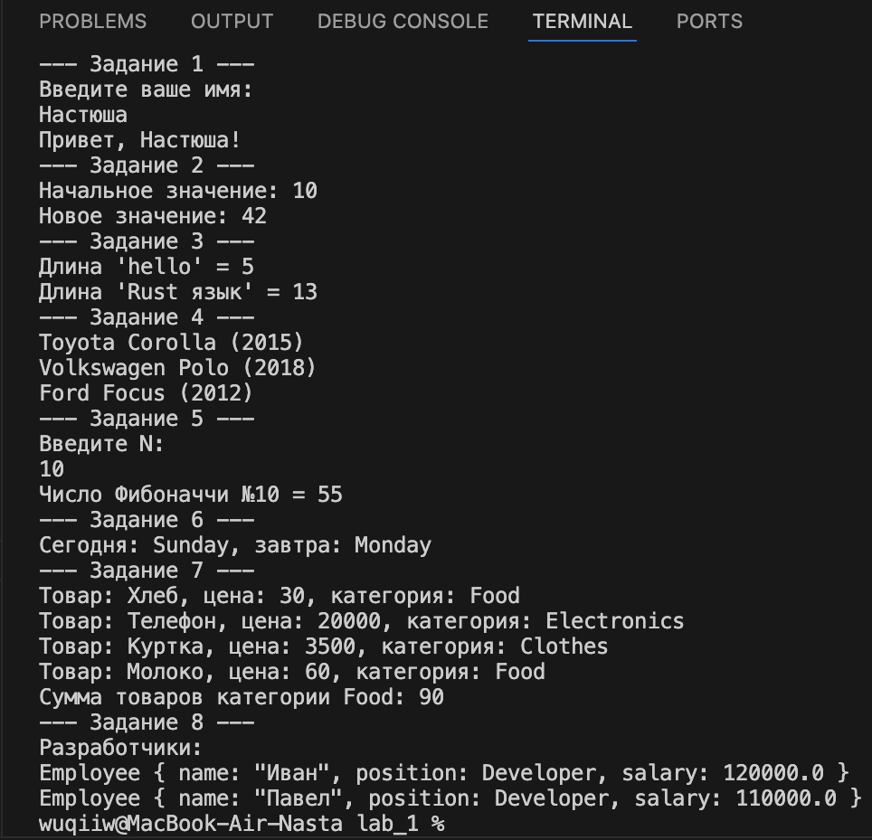

# Rust ­ Лабораторная работа #1
## Задача 1
### Постановка задачи 
 Напишите программу, которая запрашивает у пользователя имя и выводит на экран приветственное сообщение с использованием этого имени.

### Математическая модель 
Программа получает строку, введённую пользователем, и формирует приветственное сообщение.
Работа основана на чтении данных из стандартного ввода и последующем выводе текста на экран.
Основная логика заключается в обработке строки и её передаче в функцию вывода.

### Список идентификаторов

| Имя переменной | Тип данных | Описание                                       |
| -------------- | ---------- | ---------------------------------------------- |
| name           | String     | Строка, содержащая введённое пользователем имя |
| stdin          | io::Stdin  | Объект стандартного ввода                      |
| read_line      | функция    | Выполняет чтение строки из stdin               |
| println!       | макрос     | Выводит приветственное сообщение               |

### Код программы 

```c
fn task1() {
    println!("--- Задание 1 ---");
    println!("Введите ваше имя:");
    let mut name = String::new();
    io::stdin().read_line(&mut name).expect("Ошибка ввода");
    println!("Привет, {}!", name.trim());
}
```
--- 

### Постановка задачи
Создайте переменную типа целое беззнаковое число и выведите ее значение на экран. Явно
укажите тип переменной. Затем измените значение переменной и снова выведите его.

### Математическая модель
Программа использует изменяемую переменную целочисленного беззнакового типа.
Переменная инициализируется одним значением, затем изменяется и снова выводится.
Логика основана на демонстрации изменения состояния переменной во время выполнения программы.

### Список идентификаторов

| Имя переменной | Тип данных | Описание                                             |
| -------------- | ---------- | ---------------------------------------------------- |
| num            | u32        | Изменяемая переменная типа целого беззнакового числа |
| println!       | макрос     | Выводит текущее значение переменной                  |

### Код программы 

```c
fn task2() {
    println!("--- Задание 2 ---");
    let mut num: u32 = 10;
    println!("Начальное значение: {}", num);
    num = 42;
    println!("Новое значение: {}", num);
}
```
---

### Постановка задачи
Напишите функцию, которая принимает строку и возвращает ее длину (количество символов).
Затем вызовите эту функцию с различными строками.

### Математическая модель 
Функция принимает строку и возвращает количество символов в ней.
Работа основана на применении встроенного механизма вычисления длины строки.
Результат возвращается вызывающей стороне для дальнейшего использования.
### Список идентификаторов

| Имя переменной | Тип данных        | Описание                                  |
| -------------- | ----------------- | ----------------------------------------- |
| s              | &str              | Входная строка                            |
| string_length  | fn(&str) -> usize | Функция, возвращающая длину строки        |
| len            | метод             | Встроенный метод получения длины строки   |
| result         | usize             | Числовой результат, хранящий длину строки |

### Код программы 

```c
fn string_length(s: &str) -> usize {
    s.len()
}

fn task3() {
    println!("--- Задание 3 ---");
    println!("Длина 'hello' = {}", string_length("hello"));
    println!("Длина 'Rust язык' = {}", string_length("Rust язык"));
}
```
---

### Постановка задачи
Задайте структуру Car с полями brand, model и year, и создайте несколько экземпляров этой
структуры. Выведите информацию о каждой машине на экран.

### Математическая модель 
Структура представляет модель автомобиля, содержащую марку, модель и год выпуска.
Создаётся набор экземпляров структуры, после чего их данные выводятся на экран.
Работа основана на использовании пользовательских структур и коллекций.

### Список идентификаторов

| Имя переменной | Тип данных | Описание                          |
| -------------- | ---------- | --------------------------------- |
| Car            | struct     | Структура, описывающая автомобиль |
| brand          | String     | Марка автомобиля                  |
| model          | String     | Модель автомобиля                 |
| year           | u16        | Год выпуска автомобиля            |
| cars           | Vec<Car>   | Коллекция объектов Car            |
| println!       | макрос     | Выводит данные автомобиля         |

### Код программы 

```c
struct Car {
    brand: String,
    model: String,
    year: u16,
}

fn task4() {
    println!("--- Задание 4 ---");
    let cars = vec![
        Car { brand: "Toyota".into(), model: "Corolla".into(), year: 2015 },
        Car { brand: "Volkswagen".into(), model: "Polo".into(), year: 2018 },
        Car { brand: "Ford".into(), model: "Focus".into(), year: 2012 },
    ];

    for car in cars {
        println!("{} {} ({})", car.brand, car.model, car.year);
    }
}
```
---

### Постановка задачи
Напишите программу, которая запрашивает у пользователя число 𝑁 и выводит на экран 𝑁­ное
число Фибоначчи. Используйте рекурсию для решения этой задачи.

### Математическая модель 
Функция вычисляет N-й элемент последовательности Фибоначчи при помощи рекурсии.
Ввод числа производится пользователем, после чего результат выводится в стандартный поток.
Рекурсивный вызов продолжается до достижения базовых условий функции.

### Список идентификаторов

| Имя переменной | Тип данных     | Описание                                 |
| -------------- | -------------- | ---------------------------------------- |
| n              | u32            | Число, введённое пользователем           |
| fib            | fn(u32) -> u32 | Функция рекурсивного вычисления          |
| input          | String         | Строка, содержащая пользовательский ввод |
| println!       | макрос         | Выводит результат вычисления             |

### Код программы 

```c
fn fib(n: u32) -> u32 {
    if n <= 1 { n } else { fib(n - 1) + fib(n - 2) }
}

fn task5() {
    println!("--- Задание 5 ---");
    println!("Введите N:");
    let mut input = String::new();
    io::stdin().read_line(&mut input).expect("Ошибка ввода");

    let n: u32 = input.trim().parse().expect("Введите число!");
    println!("Число Фибоначчи №{} = {}", n, fib(n));
}
```
---

### Постановка задачи
Реализуйте перечисление DayOfWeek для дней недели. Напишите функцию, которая принимает
день недели и возвращает следующий день. Обработайте случаи перехода на следующий день
недели, если текущий день – воскресенье.

### Математическая модель 
Перечисление описывает набор значений, соответствующих дням недели.
Функция определяет следующий день недели с учётом цикличности.
Результат выводится в стандартный поток.

### Список идентификаторов

| Имя переменной | Тип данных                 | Описание                         |
| -------------- | -------------------------- | -------------------------------- |
| DayOfWeek      | enum                       | Перечисление дней недели         |
| today          | DayOfWeek                  | Текущий день                     |
| next_day       | fn(DayOfWeek) -> DayOfWeek | Функция получения следующего дня |
| println!       | макрос                     | Выводит текущий и следующий день |

### Код программы 

```c
#[derive(Debug, Copy, Clone)]
enum DayOfWeek {
    Monday, Tuesday, Wednesday, Thursday, Friday, Saturday, Sunday
}

fn next_day(day: DayOfWeek) -> DayOfWeek {
    match day {
        DayOfWeek::Monday    => DayOfWeek::Tuesday,
        DayOfWeek::Tuesday   => DayOfWeek::Wednesday,
        DayOfWeek::Wednesday => DayOfWeek::Thursday,
        DayOfWeek::Thursday  => DayOfWeek::Friday,
        DayOfWeek::Friday    => DayOfWeek::Saturday,
        DayOfWeek::Saturday  => DayOfWeek::Sunday,
        DayOfWeek::Sunday    => DayOfWeek::Monday,
    }
}

fn task6() {
    println!("--- Задание 6 ---");
    let today = DayOfWeek::Sunday;
    println!("Сегодня: {:?}, завтра: {:?}", today, next_day(today));
}
```
---

### Постановка задачи
Создайте структуру Product с полями name, price и category, а также перечисление (enum)
Category для категорий товаров. Напишите метод для вывода информации о продукте и
ассоциированную функцию для подсчета общей суммы товаров в заданной категории из
массива продуктов.

### Математическая модель 
Структура описывает товар, содержащий название, цену и категорию.
Категория реализована через перечисление.
Метод выводит данные о товаре, а функция подсчитывает суммарную стоимость товаров выбранной категории.

### Список идентификаторов

| Имя переменной    | Тип данных                       | Описание                              |
| ----------------- | -------------------------------- | ------------------------------------- |
| Product           | struct                           | Структура, содержащая данные о товаре |
| name              | String                           | Название товара                       |
| price             | f32                              | Цена товара                           |
| category          | Category                         | Категория товара                      |
| Category          | enum                             | Перечисление категорий товаров        |
| products          | Vec<Product>                     | Коллекция товаров                     |
| print_info        | метод                            | Выводит данные товара                 |
| total_by_category | fn(&[Product], &Category) -> f32 | Рассчитывает сумму цен по категории   |

### Код программы 

```c
fn task7() {
    println!("--- Задание 7 ---");
    let products = vec![
        Product { name: "Хлеб".into(), price: 30.0, category: Category::Food },
        Product { name: "Телефон".into(), price: 20000.0, category: Category::Electronics },
        Product { name: "Куртка".into(), price: 3500.0, category: Category::Clothes },
        Product { name: "Молоко".into(), price: 60.0, category: Category::Food },
    ];

    for p in &products {
        p.print_info();
    }

    let total = Product::total_by_category(&products, &Category::Food);
    println!("Сумма товаров категории Food: {}", total);
}
```
---

### Постановка задачи
Создайте структуру Employee с полями name, position, salary, а также перечисление
Position для должностей сотрудников. Напишите функцию, которая принимает вектор сотрудников и возвращает вектор сотрудников заданной должности.

### Математическая модель 
Каждый сотрудник представлен структурой с именем, должностью и зарплатой.
Функция фильтрует коллекцию сотрудников, выбирая тех, чья должность совпадает с указанной.
Результат возвращается в виде новой коллекции.

### Список идентификаторов

| Имя переменной     | Тип данных                                   | Описание                           |
| ------------------ | -------------------------------------------- | ---------------------------------- |
| Employee           | struct                                       | Структура, описывающая сотрудника  |
| name               | String                                       | Имя сотрудника                     |
| position           | Position                                     | Должность сотрудника               |
| salary             | f32                                          | Зарплата                           |
| Position           | enum                                         | Перечисление должностей            |
| staff              | Vec<Employee>                                | Коллекция сотрудников              |
| filter_by_position | fn(Vec<Employee>, Position) -> Vec<Employee> | Выбор сотрудников нужной должности |

### Код программы 

```c
#[derive(Debug, Clone, PartialEq)]
enum Position {
    Manager,
    Developer,
    Analyst,
}

#[derive(Debug, Clone)]
struct Employee {
    name: String,
    position: Position,
    salary: f32,
}

fn filter_by_position(employees: Vec<Employee>, pos: Position) -> Vec<Employee> {
    employees.into_iter().filter(|e| e.position == pos).collect()
}

fn task8() {
    println!("--- Задание 8 ---");
    let staff = vec![
        Employee { name: "Иван".into(), position: Position::Developer, salary: 120000.0 },
        Employee { name: "Анна".into(), position: Position::Manager, salary: 150000.0 },
        Employee { name: "Павел".into(), position: Position::Developer, salary: 110000.0 },
        Employee { name: "Ольга".into(), position: Position::Analyst, salary: 90000.0 },
    ];

    let devs = filter_by_position(staff, Position::Developer);

    println!("Разработчики:");
    for d in devs {
        println!("{:?}", d);
    }
}
```

### Результаты работы программы  

--- 

### Информация о студенте  
Полторацкая Анастасия, 1 курс, группа `1об_ПОО/25`